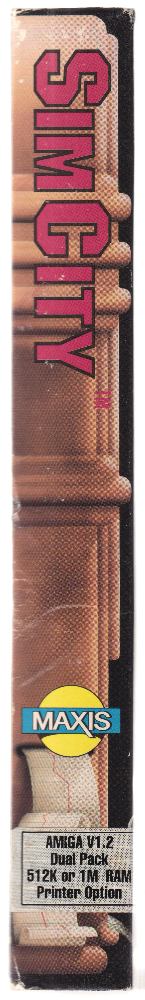
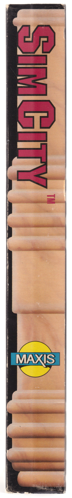
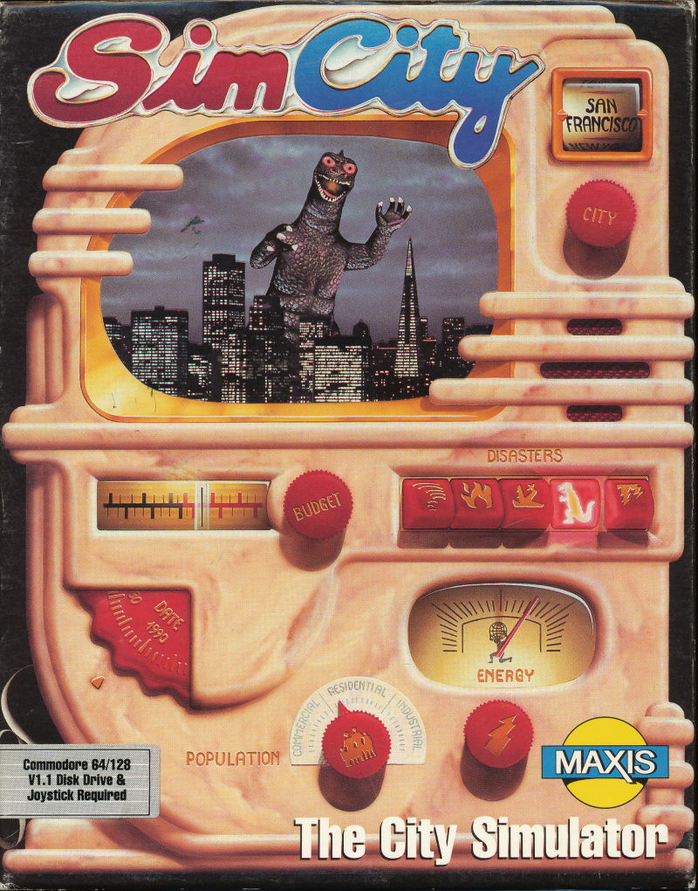
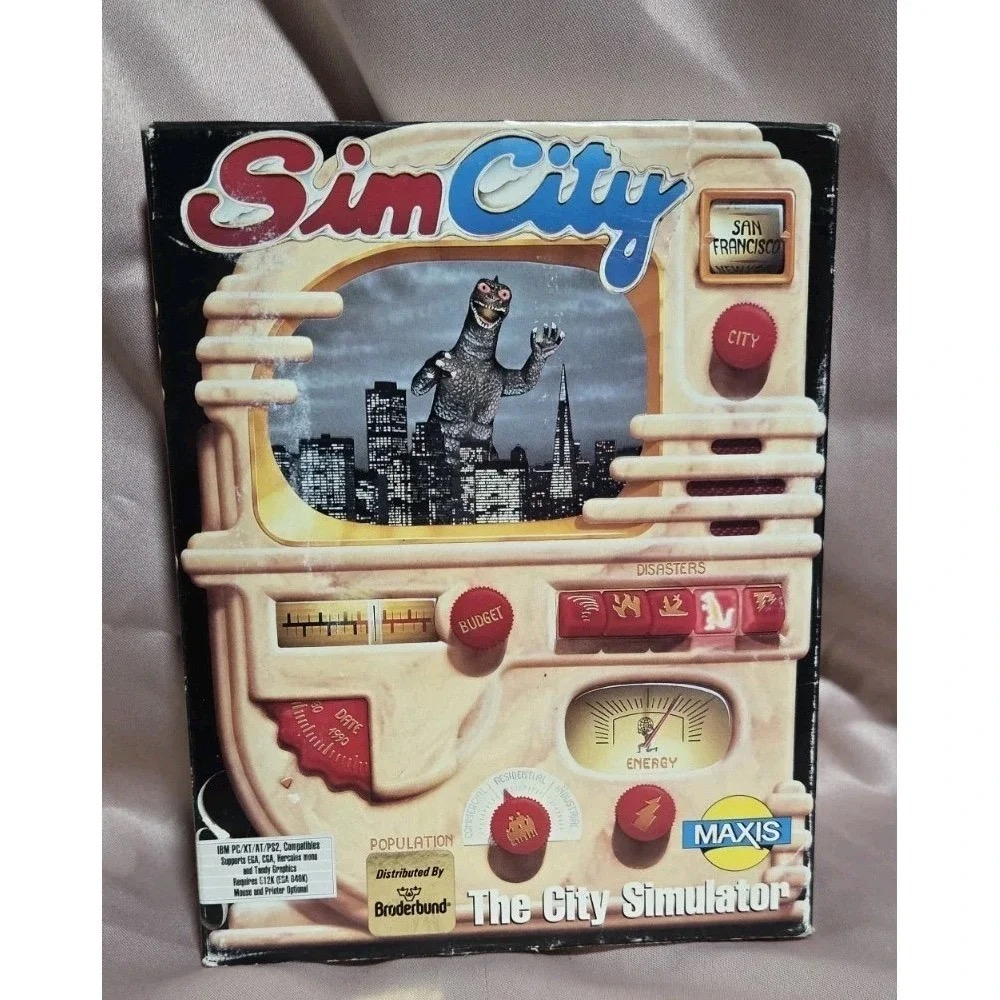

# SimCity box art

Scans and photos of the original 1989 SimCity retail boxes, archived here
because the cover monster is why Maxis got sued by Toho. Jeff Braun tells
the story in [the archived email thread](../designs/jeff-braun-toho-godzilla-email-2024-02-17.md):
Maxis never called the monster Godzilla, but magazine reviews did, Toho
claimed "confusion in the marketplace", and Maxis paid $50k to make it go
away. Later printings replaced the monster on the TV screen with a tornado.

The cover art is Bakelite-appliance style: a toy city simulator appliance
with a red MONSTER button in the DISASTERS row (the rightmost dinosaur-icon
button). The button survived the lawsuit; the monster on the screen did not.

## Original monster cover — front (Amiga Dual Pack)

Amiga Version 1.2 Dual Pack (512K or 1Meg), distributed by Broderbund. The
T-Rex-looking monster waves over the San Francisco skyline (Transamerica
Pyramid visible) on the appliance's TV screen. 4400 x 5600 scan.
Source: Internet Archive item
[simcity_amiga_gozilla-box](https://archive.org/details/simcity_amiga_gozilla-box),
retrieved 2026-08-20.

## Original monster cover — back (Amiga Dual Pack)

"Design and Build the City of Your Dreams." The disaster list literally
advertises "floods, earthquakes, fires, tornados, meltdowns and monsters."
Four platform screenshots: IBM EGA, Amiga, Color Macintosh II, Macintosh.
Copyright 1989, Will Wright and Maxis Software. 4400 x 5600 scan.
Source: same Internet Archive item, retrieved 2026-08-20.

## Original monster box — side panels (Amiga Dual Pack)

Side panels of the same box. 800 x 5500 scans.
Source: same Internet Archive item, retrieved 2026-08-20.

## Original monster cover — front (Commodore 64/128)

Commodore 64/128 version (V1.1 Disk Drive & Joystick Required). Same
artwork as the Amiga box. 800 x 1020 flat scan.
Source: https://i.imgur.com/OQ6RhdV.jpg (linked from r/SimCity),
retrieved 2026-08-20.

## Original monster cover — front (IBM PC, photo)

IBM PC/XT/AT/PS2 version, distributed by Broderbund. Photo of a physical
box rather than a flat scan, kept as evidence of the IBM variant.
1000 x 1000 photo. Source: resale listing photo (Poshmark CDN), converted
from webp, retrieved 2026-08-20.

## Revised tornado cover — front (Macintosh)

The post-lawsuit cover. The monster on the TV screen is replaced by a
tornado; the red MONSTER disaster button remains. Macintosh version,
800 x 1005 scan. Jimmy Maher shows this revised cover in
[The Life and Times of Maxis, Part 1](https://www.filfre.net/2026/07/the-life-and-times-of-maxis-part-1-simeverything/).
