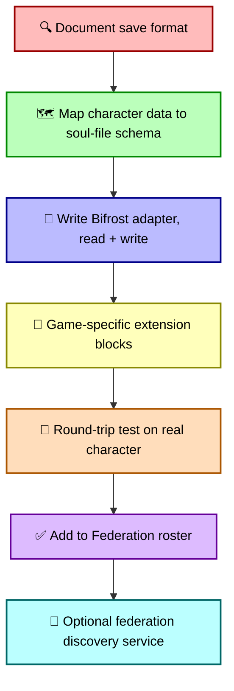

# Federation peer games: bridge candidates for character import/export

## Which games are great spiritual + technical fits for the Bifrost, and which we should propose bridges to

**Status:** Active design (forward-looking catalogue; nothing committed)
**Monorepo:** MicropolisCore
**Read first:** [characters-as-hydrogen.md](characters-as-hydrogen.md) — the character substrate and the Federation framing
**Companion documents:** [moollm-microworld-os.md](moollm-microworld-os.md) (Bifrost protocol) · [simopolis.md](simopolis.md) · [family-album-as-storymaker.md](family-album-as-storymaker.md) · [the-imagine-loop.md](the-imagine-loop.md) · [sims-content-registry.md](sims-content-registry.md) · [tomodachi-life-and-simopolis.md](tomodachi-life-and-simopolis.md) · [simopolis-uplift-roadmap.md](simopolis-uplift-roadmap.md) · [Sunny Street outreach (moollm)](https://github.com/SimHacker/moollm/blob/main/designs/email/sunny-street-outreach.md)

> **Trademark notice.** All game titles below are trademarks of their respective owners. References here are nominative use for the purpose of describing technical interoperability via documented save-file formats and community modding ecosystems. No affiliation with or endorsement by any listed studio is implied. The Federation is an *open-source interoperability proposal*, not a partnership or license arrangement.

> **Scope.** This doc enumerates *candidate* peer games and grades their fit for character-substrate bridging via the Bifrost protocol. Bridges are *user-side companion tools that operate on documented file formats* — the same posture the Sims modding community has used for 25 years. We never link to, embed, or redistribute proprietary engine code or assets. See [simopolis.md → Scope and intent](simopolis.md#scope-and-intent) for the canonical positioning.

---

## What we mean by "federation peer game"

A **federation peer game** is any game where:

1. **Characters are first-class** — the game has named, persistent characters with traits, relationships, skills, or backstories that the player thinks about as *individuals*, not as anonymous units.
2. **Save files are accessible** — either the format is documented, or there is an established community tool that reads and writes it (SMAPI for Stardew, ck3-tiger for Crusader Kings, PKHeX for Pokémon, SimPE/Transmogrifier descendants for the Sims, etc).
3. **Modding is welcomed (or at least tolerated)** — the studio doesn't actively litigate against save-file tools and doesn't break tooling with each patch.
4. **Players want their characters elsewhere** — the player community already shows demand for backups, transfers, cross-playthrough imports, "what if my character moved to..." stories.

When all four are true, a character bridge is *technically* possible and *culturally* welcome. The Bifrost protocol ([moollm-microworld-os.md → The Bifrost](moollm-microworld-os.md#the-bifrost-the-bridge-as-a-structured-ontological-transition)) is designed exactly for this: a structured ontological transition between two substrates that each hold a sovereign incarnation of the same identity.

Below: graded by spiritual fit, technical fit, and combined priority. Nothing committed; this is a strategic catalogue.

---

## Featured peer — Sunny Street (in development) {#sunny-street}

**Sunny Street** is an open-world town for kids roughly 9–11, in active design by **Sungman Cho**. It is listed here *first* — not because the bridge ships tomorrow, but because it is the clearest **2026 counterexample** to opaque “AI town” demos: readable simulation, direct manipulation, narrow AI for memory and recognition (not a second physics engine), and an explicit design argument about what the town should **show** versus what it should leave to the kid’s imagination. That is the same problem [Simopolis](simopolis.md), [MOOLLM](moollm-microworld-os.md), and the [Imagine Loop](the-imagine-loop.md) attack from the Micropolis side. See the public outreach letter: [sunny-street-outreach.md (moollm)](https://github.com/SimHacker/moollm/blob/main/designs/email/sunny-street-outreach.md).

| Aspect | Notes |
|---|---|
| Grade | 🟢🟢 — **spiritual fit 10/10**; technical fit **pending** until town/save formats are documented and round-trip tested |
| Spiritual fit | Sims-lineage neighbors and routines at **kid-legible** resolution; procedural rhetoric without black-box “the model decided”; complements [legible social dynamics](https://github.com/SimHacker/moollm/blob/main/designs/legible-social-dynamics.md) and [Alan Kay’s SimCity critique](https://github.com/SimHacker/moollm/blob/main/designs/sims/simcity-multiplayer-micropolis.md#alan-kays-critique-and-vision) (open the hood, don’t air-guitar the simulation) |
| Technical fit | **TBD on save format.** Federation posture: user-side companion tools on **save files the player owns** — same as Sims `.iff`, Stardew XML, CK3 script. When Sunny Street publishes or documents its town/character save shape, we follow the [onboarding playbook](#how-the-bifrost-handles-a-new-peer-game-onboarding-playbook): map → adapter → `extensions.sunny_street:` → round-trip |
| What the bridge ships | **Bidirectional character interop** through the canonical soul-file (`CHARACTER.yml`), not by embedding either engine inside the other |

### Why Sunny Street ↔ Simopolis is interesting (not just “import a JSON”)

The Federation’s unit of value is **identity**, not a screenshot. One soul-file; many **incarnations** ([characters-as-hydrogen.md](characters-as-hydrogen.md)): a row in `Neighborhood.iff`, a MOOLLM citizen directory, a Micropolis zone aggregate, and — once the adapter exists — a **townsfolk slot in a Sunny Street save**. They are synchronized incarnations, not copies; merge semantics and provenance behave like git over character state.

**Sims → Sunny Street (export Pleasantview into the kid’s town).**  
Take a household the player already loves — Cassandra Goth, a Stardew farmer you merged earlier, a Foundry VTT bard — Bifrost **read** from `Neighborhood.iff` (or Dream YAML) → soul-file → Bifrost **write** into Sunny Street’s save. The **game** still runs Sunny Street’s readable rules on screen; the bridge does not replace physics. What travels: name, trait-shaped personality, relationship edges, selected memories the kid (or parent) can open in files. Sunny Street can **reinterpret** adult-scale Sims motives into kid-scale social texture (who is friendly, who shares lunch, who remembers your birthday) without cloning EA assets or pretending to be The Sims.

**Sunny Street → Sims / Simopolis (visit the dollhouse).**  
A townsfolk the child raised in Sunny Street — routines, friendships, the gifts they chose to show on screen — exports to a soul-file and **incarnates** in Pleasantview: valid PersonData in a `.iff` the player loads in Sims 1 Legacy Collection, or a narrative-only Dream citizen for Imagine Loop play. The **shallow** sim stays in whichever runtime is active; the **deep** sim stays in the kid’s head ([Simulator Effect](https://github.com/SimHacker/moollm/blob/main/designs/eval/EVAL-INCARNATE-FRAMEWORK.md#the-simulator-effect)).

**Sunny Street ↔ every other peer (same hub).**  
Because all bridges meet at the soul-file, a character is not trapped in a pairwise pipe. Sunny Street ↔ Sims ↔ Stardew ↔ RimWorld ↔ CK3 becomes **Sunny Street ↔ soul-file ↔ X** — the [Family Album](family-album-as-storymaker.md) graph and Bifrost merge apply across hops. Example story: a Sunny Street NPC who “moved away” reappears as a Goth cousin in Pleasantview; a colonist who visited the town on holiday returns to RimWorld with a `memories/sunny-street-visit.yml` chapter.

**City scale (optional second primitive).**  
If Sunny Street later exposes a **region or map** boundary compatible with neighboring-town protocols, the same [city-protocol interop](federation-peer-games.md#cities-skylines--cities-skylines-ii-colossal-order--paradox-2015--2023) used for Cities: Skylines can sit a Micropolis city next to a Sunny Street district — commuters and stats across the edge, characters still bound to lots via [zone-binding](simopolis.md#how-sims-save-files-actually-bind-to-micropolis-tiles). Character bridges and city bridges stay separate primitives; both can be true.

### Bifrost mapping highlights (draft)

| Sunny Street (conceptual) | Soul-file / MOOLLM |
|---|---|
| Townsfolk identity, display name | `CHARACTER.yml` `name:` · `display_name:` |
| Kid-visible traits / temperament | `mind_mirror.character_traits` |
| Friendship / rivalry / family ties | `relationships/<name>.yml` |
| Events the town showed vs implied | `memories/events/` · `recent_events:` |
| Narrow-AI recognition notes (inspectable) | `memories/` · skills; **not** hidden prompt state |
| Engine-specific fields | `extensions.sunny_street:` preserved on round-trip |

### Collaboration posture

We are not asking Sunny Street to become a Micropolis mod. We are offering an **open Bifrost target**: document the save shape, we ship a companion adapter in `packages/bifrost/adapters/`, the player owns both saves, both studios stay sovereign. If Sungman Cho prefers YAML-or-git-native townsfolk from day one, MOOLLM’s microworld layout is already isomorphic — the adapter becomes trivial.

**Trademark:** *Sunny Street* is used nominatively to describe interoperability with a named in-development project; no affiliation or endorsement is implied.

---

## Grading

| Symbol | Meaning |
|---|---|
| 🟢🟢🟢 | Top priority — high spiritual fit, mature community tooling, large player base, the game *wants* this bridge to exist |
| 🟢🟢 | Strong fit — would be excellent additions but require more engineering or have one significant caveat |
| 🟢 | Real fit — niche or with a meaningful caveat, but worth proposing once Phase 1 ships |
| 🟡 | Interesting but complicated — culturally great, technically harder |
| 🔴 | Anti-target — looks like a fit but is not; documented to save us from doing the wrong thing |

---

## Tier 1 — top-priority bridges (🟢🟢🟢)

These are the games where character-substrate bridging is *both* spiritually almost-required *and* technically wide open. If we ship five external bridges in the Federation's first year, they should probably be these.

### Crusader Kings III (Paradox, 2020)

| Aspect | Notes |
|---|---|
| Spiritual fit | 10/10. CK3 *is* a multi-generational dynastic narrative engine, with characters carrying dozens of traits, hundreds of relationships, complex ambitions, decade-spanning rivalries. The [Imagine Loop](the-imagine-loop.md) is *literally what a CK3 player does in their head* between sessions: "what if my heir married into the Byzantine succession?" |
| Technical fit | 10/10. CK3 saves are **plain-text Paradox script** — declarative, parseable with off-the-shelf tooling, structurally similar to YAML. Hundreds of mods extend traits and dynasties via the same script. The community has [ck3-tiger](https://github.com/amtep/tiger) (the mod-file validator, now part of the multi-game `amtep/tiger` project covering CK3 / Vic3 / Imperator) and [PDX Tools](https://pdx.tools/) for save-file upload and analysis. |
| What the bridge ships | A CK3 → MOOLLM soul-file importer: each CK3 character becomes a `CHARACTER.yml`, with traits mapping to `mind_mirror` blocks, lineage to family graph, courts to relationship clusters. A MOOLLM → CK3 exporter: define a custom character with soul-file → drop into a CK3 chronicle as a courtier / sister / claimant. |
| Bifrost mapping highlights | CK3 traits (`brave`, `craven`, `genius`, `imbecile`, `ambitious`, `content`, …) → `mind_mirror.character_traits.*` block; CK3 lifestyles → MOOLLM skills; CK3 cultures / faiths → ambient `cultural_context` skill; CK3 schemes → MOOLLM `intentions:` |
| Caveats | Paradox is a *commercial* publisher; the bridge operates on the user's own save files exclusively (same posture as Sims). Trademark: nominative use only. |
| Why this first | CK3's existing player base is dramatically larger than Sims-modding-tools' player base, and they already think dynastically. A Cassandra Goth who becomes a courtier in 13th-century Constantinople is the *killer demo* for the Federation, and it doesn't require either game to know anything about the other. |

### RimWorld (Ludeon Studios, 2018)

| Aspect | Notes |
|---|---|
| Spiritual fit | 10/10. RimWorld's "Storyteller" mechanic (Cassandra Classic / Phoebe Chillax / Randy Random) is **literally the LLM-as-narrator pattern Will Wright was reaching for in 1996**, expressed in a tightly-bounded rules system. Colonists have personalities, backstories (one per pawn, with childhood + adulthood chapters), traits, skills, relationships, mental breakdowns. Every colony is a Family Album in progress. |
| Technical fit | 10/10. Save files are XML, fully accessible, with a vast and well-organized modding community (Harmony, HugsLib; mod managers are [RimPy](https://github.com/rimpy-custom/RimPy) — the longstanding tool, no longer actively maintained — and [RimSort](https://github.com/RimSort/RimSort), the actively-maintained community-managed successor). Pawn data structures are stable across versions in ways the modders document. |
| What the bridge ships | RimWorld → MOOLLM pawn-to-soul-file importer (one pawn = one character, with backstory chapters → MOOLLM `memories/childhood/` and `memories/adulthood/`, traits → `mind_mirror`, relationships → `relationships/`); MOOLLM → RimWorld exporter (drop a soul-file into a colony as a new colonist, with backstory generated from the soul-file's mind-mirror + YAML Jazz). |
| Bifrost mapping highlights | RimWorld backstory chapters → MOOLLM `memories/childhood-<name>.yml` and `memories/adulthood-<name>.yml`; RimWorld traits → `mind_mirror.character_traits`; skill passions → `interests:`; mood breakdowns → `recent_events:` with `emotional_intensity:` |
| Caveats | RimWorld is single-developer and has been protective of game balance against mod content; bridges should be polite about not creating overpowered pawns. Stay file-format-only; do not patch the engine. |
| Why this first | RimWorld's Storyteller framing means the Bifrost arrives at a game already philosophically aligned with our substrate. A colonist who survives a raid, takes shelter at the Goth household for six in-game weeks, and returns home with the kitchen-fire memory in her backstory is *exactly* the Federation's value proposition. |

### Stardew Valley (ConcernedApe, 2016)

| Aspect | Notes |
|---|---|
| Spiritual fit | 10/10. Stardew Valley is *the* indie-era heir to Maxis-style "nurturing environment" design. Your farmer, your spouse, your kids, the named NPC villagers, the relationships measured in heart points, the seasonal events — every single one of these maps cleanly onto the Federation's character substrate. The cottagecore-life-sim audience overlaps massively with Sims-Exchange-era story-album culture. |
| Technical fit | 10/10. Save files are XML, well-documented (decoded by community tools for years). [SMAPI](https://smapi.io/) provides a mature plug-in ecosystem; thousands of mods exist; ConcernedApe is famously modder-friendly. |
| What the bridge ships | Stardew → MOOLLM importer: your farmer + spouse + children become canonical soul-files in your Dream space; relationships with the 30+ villagers become entries in `relationships/`; recipes / skills / achievements become traits and memories. Stardew exporter: a soul-file → a custom farmer template with name, appearance descriptors, starting relationships. |
| Bifrost mapping highlights | Stardew friendship-points → `relationships/<name>.yml` with `friendship:` numeric; bachelorette/bachelor relationships → `romantic:` flag + heart count; farm layout → MOOLLM `lots/farm-<name>.yml`; seasonal events attended → `memories/events/` |
| Caveats | Stardew NPCs are pre-defined characters with backstories ConcernedApe wrote; we do not redistribute their backstories or assets. Bridge operates only on the *player's* farmer + family + relationship-state data. |
| Why this first | Reach. Stardew Valley is one of the most-played, most-streamed indie games of the decade, with millions of saves. The cultural overlap with Sims storytelling is enormous. A Stardew → Sims bridge (your farmer retires to Pleasantview after the kids grow up) is an obvious culturally-iconic demo. |

### Dwarf Fortress (Bay 12 Games, 2006 / Steam 2022)

| Aspect | Notes |
|---|---|
| Spiritual fit | 11/10. Dwarf Fortress's [Legends mode](https://dwarffortresswiki.org/index.php/Legends_mode) is *already* a procedurally-generated multi-millennium Family Album — every dwarf, every elf, every notable kobold has a documented life with personality traits (hundreds of facets), preferences, fears, dreams, loves, betrayals, murders, masterworks. Tarn Adams has been quietly building the most ambitious character-substrate of all time, alone, since 2002. |
| Technical fit | 7/10. Save files are complex custom binary, but the [DFHack](https://github.com/DFHack/dfhack) project is a mature, well-maintained reverse-engineered API layer; [Legends Browser 2](https://github.com/robertjanetzko/LegendsBrowser2) and [LegendsViewer-Next](https://github.com/Kromtec/LegendsViewer-Next) parse the exported XML world history; the [Steam release](https://store.steampowered.com/app/975370/Dwarf_Fortress/) added a sanctioned graphics API. The barrier is mid-height, not low; the existing community tooling is excellent. |
| What the bridge ships | DF Legends-mode → MOOLLM importer: pick a historical figure from a generated world, get a soul-file with full personality facets, life events, kill list, masterwork list, and preferences mapped to mind-mirror. MOOLLM → DF is harder (DF doesn't ship characters as drop-ins easily); the import direction is much higher value. |
| Bifrost mapping highlights | DF personality facets (~50 of them, each on a numeric scale: `friendliness`, `lust_for_glory`, `disdain_for_law`, …) → `mind_mirror.facets.*`; DF preferences (favorite color, gem, food, animal, etc.) → `preferences/`; DF historical events → `memories/historical/` with rich event-type tags. |
| Caveats | The intricacy of DF's character model is its own caveat: we map *what we can* and store the rest as an opaque `dfhack_extension:` block. Tarn has been famously supportive of community efforts; the bridge stays in user-companion-tool territory. |
| Why this first | DF is the *moral north star* of procedurally-narrated lives. A bridge that brings a 9000-year-old DF historical figure into the Goth household as a long-lost ancestor — with their kill list intact — is a culturally extraordinary feature, and well within reach because DFHack already does 90% of the read work. |

---

## Tier 2 — strong fits (🟢🟢)

Excellent additions to the Federation; ship after Tier 1 is mature, or in parallel if engineering bandwidth allows.

### Mount & Blade II: Bannerlord (TaleWorlds, 2022)

| Aspect | Notes |
|---|---|
| Spiritual fit | 8/10. Dynastic medieval sandbox where the player builds a clan over generations, lords have relationships and ambitions, companions are deeply detailed individuals. The Cloak Karma / Bar Karma-style branching what-if for "what if my third son had stayed with the Khuzaits" is right there. |
| Technical fit | 8/10. Saves are accessible (binary but with community tooling); the [ButterLib](https://github.com/BUTR/Bannerlord.ButterLib) and [Harmony](https://github.com/BUTR/Bannerlord.Harmony) mod ecosystems are mature. |
| Bridge highlights | Companion characters → soul-files; clan lineage → MOOLLM family graph; kingdom relations → relationship clusters |
| Caveats | TaleWorlds patches frequently; mod ecosystem requires update churn. Stay save-file-side; don't depend on injected code. |

### Bethesda games — Skyrim (2011) + Fallout 4 (2015) + Starfield (2023)

| Aspect | Notes |
|---|---|
| Spiritual fit | 7/10. Less "household sim," more "player character with NPC followers and settlement-mates." But Lydia, Serana, Cait, Curie, Sarah Morgan — these are characters with serious player attachment, and Bethesda's settlement / homestead mechanics are dollhouse-shaped. |
| Technical fit | 9/10. The most mature modding community in mainstream gaming. [Nexus Mods](https://www.nexusmods.com/) hosts hundreds of thousands of mods; Creation Kit / xEdit / SSEEdit / FO4Edit are documented and stable. |
| Bridge highlights | Follower / companion characters → soul-files (Serana with her dialogue history → a MOOLLM citizen the LLM can talk to about the Dawnguard arc); player character → soul-file with build / level / faction memberships → mind-mirror; settlement layouts → MOOLLM lots |
| Caveats | Bethesda games are massive; we don't try to capture the whole world, just *named characters and the player's domestic spaces*. The Twitch streaming culture around Bethesda playthroughs is enormous and would heavily benefit from the [streamer-friendly features](designing-inward-miyamoto-principles.md#8a-the-twitch-corollary-make-streamers-radically-powerful). |
| Why interesting | Vast player base; Skyrim is still being played daily after 15 years; Twitch streaming culture is built around it; bridges open a path to characters-as-cross-game-pilgrims. |

### Two Point Hospital / Two Point Campus / Two Point Museum (Two Point Studios, 2018–)

| Aspect | Notes |
|---|---|
| Spiritual fit | 7/10. Theme Hospital / Bullfrog DNA, character-rich management sims with named patients / students / staff. Two Point Studios is *literally Bullfrog veterans* picking up the lineage EA killed (Mark Webley + Gary Carr, ex-Lionhead, ex-Bullfrog) — same crew that built one of the games this design lineage descends from. |
| Technical fit | 7/10. SEGA publishes; saves are accessible; modding is welcomed but not as mature as Stardew or CK3. |
| Bridge highlights | Hospital staff / students → soul-files; patient narratives → albums; building layouts → lots |
| Why interesting | A Goth Sim who falls ill and recovers at Two Point Hospital, with the doctor's perspective written into the album, is the kind of weird-good moment that makes a Federation tangibly useful. |

### Cities: Skylines / Cities: Skylines II (Colossal Order / Paradox, 2015 / 2023)

| Aspect | Notes |
|---|---|
| Spiritual fit | 6/10 alone; 9/10 *as a Micropolis City peer*. Not character-driven, but its **cims** are aggregated population units like our Micropolis zone aggregates. The natural pairing is City ↔ City, not City ↔ characters. |
| Technical fit | 8/10. Steam Workshop is mature; saves are accessible. More importantly, Skylines already has a **multi-city region** model where neighboring cities exchange commuters, freight, electricity, water/sewage, and outside-connection traffic — and *Micropolis is GPL3 source-available, so we can implement that protocol on our side*. |
| Bridge highlights — **the right primitive is neighboring-city interop, not file conversion** | Don't translate Skylines saves ↔ Micropolis `.cty` files (different scales, different eras, the rendered streets don't map). Instead, **let a Micropolis city sit next to a Skylines city in the same region**, exchanging the same boundary signals Skylines uses for Skylines-to-Skylines neighbors: commuters across each outside connection, freight, electricity import/export, water/sewage flow, transit lines crossing the edge. Since the Micropolis engine source is ours, we add an **outside-connection adapter** that translates Micropolis internal state (zone densities, traffic, power surplus, residential demand) into Skylines's region-neighbor message shape, plus the inverse for inbound signals. Each game keeps rendering its own streets natively; the boundary is what bridges. Households whose Sims are bound to specific blocks on either side still get the [Family Album graph](family-album-as-storymaker.md) treatment via the [zone-binding scanner](simopolis.md#how-sims-save-files-actually-bind-to-micropolis-tiles). |
| Generalizes to | SimCity 4 had regions with neighboring cities — same protocol shape, recoverable. Any future city sim that supports neighboring-city interop can plug Micropolis in as a neighbor by the same adapter pattern. Micropolis becomes a **protocol-bridging hub**: talks to The Sims via documented IFF formats, talks to Skylines via the region-neighbor protocol, can talk to additional city sims by adding adapters without changing the core engine. |
| Why interesting | Skylines is the dominant city sim; sitting a Micropolis city right next to a Skylines metro on the same region map (with cims commuting across the boundary in both directions) is a much sharper demo than format conversion would ever be. |

---

## Tier 3 — massive popular reach, harder fits (🟢)

Wildly popular games where bridges would unlock huge audiences, but the technical fit is harder (platform restrictions, less character-centric, less established modding tooling).

### Animal Crossing: New Horizons (Nintendo, 2020) — *see also [tomodachi-life-and-simopolis.md](tomodachi-life-and-simopolis.md)*

| Aspect | Notes |
|---|---|
| Spiritual fit | 9/10. Direct cousin of *Tomodachi Life*; player + villagers as named characters; island as dollhouse. *The* Switch life-sim phenomenon of 2020–22, with millions still playing. |
| Technical fit | 5/10. Nintendo Switch saves are encrypted; the community has [NHSE](https://github.com/kwsch/NHSE) for *unlocked* (Atmosphere'd) consoles, which is a non-trivial barrier for most players. |
| Bridge highlights | (Where feasible) NHSE → MOOLLM importer for player + villager data; bridge would operate on the user's exported save with the user's chosen on-Switch tooling |
| Caveats | Nintendo's posture toward modding is sharply more restrictive than Paradox / Ludeon / ConcernedApe / Bethesda; we propose this bridge *as user-side companion tooling on user-exported saves only*, never anything that requires interfering with the Switch. See the [tomodachi-life-and-simopolis.md](tomodachi-life-and-simopolis.md) discussion of the same posture. |
| Why interesting (with care) | Even a one-way *export* from ACNH to MOOLLM (your villagers become Dream-space citizens, their personalities preserved) would have enormous cultural reach. |

### Minecraft (Mojang / Microsoft, 2011)

| Aspect | Notes |
|---|---|
| Spiritual fit | 6/10. Minecraft is world-first, not character-first, but skins are a deep identity-element for players; Mojang has explicitly cultivated the skin-as-identity culture (cape rewards, Mob Vote winners, etc.). |
| Technical fit | 9/10. NBT format is fully documented; thousands of mods; Minecraft Forge / Fabric ecosystems. |
| Bridge highlights | Skin as appearance-atom; player profile as soul-file shell (sparse compared to other games); custom NPC mods (like [Custom NPCs](https://www.minecraftnpcs.com/)) → bona fide MOOLLM citizens |
| Why interesting | Reach is enormous; even a "your Minecraft skin becomes a Sim appearance" feature is high-engagement low-engineering. |

### Pokémon (Game Freak / Nintendo, 1996–)

| Aspect | Notes |
|---|---|
| Spiritual fit | 8/10. The Pokémon themselves are characters in the substrate sense — IVs, EVs, natures, abilities, moveset, OT info, history. "Caught at level 13 in Viridian Forest, nicknamed Sparky, traded to me by my grandfather" is *exactly* the kind of biographical data a MOOLLM citizen carries. |
| Technical fit | 8/10. [PKHeX](https://github.com/kwsch/PKHeX) is the gold-standard community tool, fully documented, decades old. |
| Bridge highlights | Pokémon → MOOLLM citizens with `species:`, `ot:`, `caught_event:`, moveset → skills, nature → trait modifier. Crossover: your favorite Pokémon as a Sims neighborhood pet, with the Adventure Compiler compiling them into a custom IFF object with appropriate sprites (a longstanding meme-tier modding desire). |
| Caveats | Same Nintendo-platform-restrictions caveat as ACNH; bridge only on user-exported save files via PKHeX. |

### Roblox (Roblox Corp, 2006)

| Aspect | Notes |
|---|---|
| Spiritual fit | 5/10. Roblox is primarily a platform-of-games rather than a single game, but the avatars / inventory / friend graph form a character substrate, and the audience overlap with Sims-Exchange-era kids who are now adults is enormous. |
| Technical fit | 4/10. Roblox is a managed platform with strong server-side data; no documented save-file export. The bridge would have to use the public Roblox API for things the API exposes (avatar appearance, badge / inventory) and stop there. |
| Why interesting | Reach. If we ever build a one-way *import* (Roblox avatar → Sim appearance), the kid-and-tween audience overlap is enormous. |

### VRChat (VRChat Inc, 2014)

| Aspect | Notes |
|---|---|
| Spiritual fit | 8/10. VRChat is *identity-first*. Players curate avatars across years, friends know each other by avatar; the [character-as-hydrogen](characters-as-hydrogen.md) framing is already lived experience for the VRChat community. |
| Technical fit | 6/10. VRChat avatars are Unity .vrm / .unitypackage; the Avatars 3.0 SDK is documented but proprietary-platform-dependent. Bridges work via the user's local Unity project. |
| Bridge highlights | VRC avatar → appearance-atom (the Sulfur element from the [periodic table](characters-as-hydrogen.md#the-micropolis-periodic-table-informal)); user profile → soul-file shell; *your VRC self* becomes the avatar of your MOOLLM citizen across the Federation. |
| Why interesting | The most identity-rich gaming community on the internet right now; if the Federation speaks their language they will speak ours. |

---

## Tier 4 — spiritually perfect but niche (🟢)

Small player bases relative to Tier 1–3, but the **fit is so right** they should be on the long-term roadmap.

### Caves of Qud (Freehold Games, ongoing since 2010)

| Aspect | Notes |
|---|---|
| Spiritual fit | 10/10. *Qud* generates characters with procedural backstories, named NPCs with families and clans, multi-millennium lore that the player intersects. The [Legends mode-equivalent](https://wiki.cavesofqud.com/wiki/Sultan_history) is built in. |
| Technical fit | 8/10. Mature modding community; saves are JSON-adjacent. |
| Bridge highlights | Qud historical figures → soul-files with full procedural history; Qud relics → custom IFF objects with attached lore |
| Why eventually | The substrate's most aligned spiritual sibling in roguelike-land. |

### Cataclysm: Dark Days Ahead (volunteer, open-source, GPL)

| Aspect | Notes |
|---|---|
| Spiritual fit | 8/10. Survivor characters with traits, professions, mutations, NPCs with relationships and missions. |
| Technical fit | 10/10 (open source, JSON saves, GPL license — perfect Federation citizen). |
| Why interesting | Open-source + character-rich + active community = ideal Federation peer; bridges can be upstream-contributed rather than maintained as patches. |

### Project Zomboid (The Indie Stone, ongoing)

| Aspect | Notes |
|---|---|
| Spiritual fit | 6/10. Survivor sim, more "the character's day" than "the household's century," but persistent characters with traits and moodles. |
| Technical fit | 8/10. Saves accessible; thousands of Steam Workshop mods. |
| Why interesting | The zombie-survival subgenre is its own large vertical; PZ players want their survivor stories preserved and shared. |

### NetHack / DCSS / classic roguelikes

| Aspect | Notes |
|---|---|
| Spiritual fit | 7/10. The *death* of the character is the story; the post-game character dump *is* a family-album page in text. |
| Technical fit | 10/10. Open source; character dumps fully documented. |
| Bridge highlights | Character dump → soul-file with full skill / level / death-event history; the dump itself becomes an album page. |
| Why interesting | The text-based-game lineage is part of MOOLLM's intellectual ancestry ([LambdaMOO](characters-as-hydrogen.md#references)); honoring it with bridges is appropriate. |

---

## Tier 5 — tabletop and VTT bridges (🟢🟢)

Tabletop RPG ecosystems are extraordinarily aligned with the character substrate — they *invented* the character-sheet-as-soul-file pattern, decades before computer games adopted it. Bridging them is high-value, technically straightforward, and culturally beloved.

### Foundry VTT (Foundry Gaming, 2020) + Roll20 (Roll20, 2012)

| Aspect | Notes |
|---|---|
| Spiritual fit | 10/10. Foundry and Roll20 are the dominant virtual-tabletop platforms; characters are JSON-shaped sheets with full traits, skills, inventory, relationships, biographical text. *This is the format MOOLLM was already mimicking with `CHARACTER.yml`*. |
| Technical fit | 9/10. Foundry is plug-in friendly with documented APIs; Roll20 has an export-character-sheet feature; both have mature community ecosystems. |
| Bridge highlights | D&D 5e / Pathfinder / Cyberpunk RED / Call of Cthulhu / etc. character sheets → MOOLLM citizens; campaign session logs → MOOLLM memories with date / event tags; party relationship graph → relationship cluster. |
| What "in the spirit of Simopolis" looks like here | A D&D party of six characters retires from adventuring to settle in Pleasantview, where the bard opens a music venue, the rogue runs a tavern, the cleric becomes a town councilor — all imagined-forward in the Imagine Loop, generated into a Sims neighborhood, played in the EA Sims 1. Each character's adventuring backstory is a chapter in their Family Album. |
| Why this is huge | D&D / TTRPG culture has produced more *characters players love deeply* per dollar of media spend than any other corner of gaming. Bridging that into the Sims-style life-sim domain is a high-novelty, high-engagement, high-streaming move. |

### D&D Beyond (Wizards of the Coast / Hasbro, since 2017) + Pathbuilder (community)

| Aspect | Notes |
|---|---|
| Spiritual fit | 9/10. D&D Beyond's character sheets are first-class characters with sourcebook-validated traits, backstories, alignment, history. Pathbuilder is the Pathfinder-2e equivalent. |
| Technical fit | 7/10. D&D Beyond's API has been *intermittently* available; the [Beyond20](https://github.com/kakaroto/Beyond20) browser extension reads and writes; the community has lived with WotC's licensing posture for years. Pathbuilder exports cleanly via JSON. |
| Bridge highlights | DDB sheet export → MOOLLM citizen; Pathbuilder JSON → MOOLLM citizen; bring a tabletop campaign character into a Family Album |
| Caveats | WotC has been hostile to the D&D community in ways that have politicized this corner; bridges should stay user-side-only and never depend on undocumented endpoints. Pathfinder's Open Game License has historically been more tooling-friendly. |

### Talespire (Bouncyrock Entertainment, 2022)

| Aspect | Notes |
|---|---|
| Spiritual fit | 7/10. 3D tabletop with characters as miniatures; bridges can convert minis to Federation appearance-atoms. |
| Technical fit | 7/10. Modding ecosystem (TaleSpire Slabs / Asset Editor) is maturing. |

---

## Tier 6 — new and experimental (🟡)

Recently-released or in-development games that are themselves attempting to be Sims successors. These are *spiritually* in our space but may already be doing some of what we're doing, and the technical-bridge story is unclear until they ship and stabilize.

### Sunny Street (Sungman Cho, in development) — *see [Featured peer — Sunny Street](#sunny-street)*

| Aspect | Notes |
|---|---|
| Status | Active outreach; full bridge spec in the [featured section](#sunny-street) above |
| Why here too | Tier 6 lists Sims-adjacent experiments; Sunny Street is the **kid-facing, legible-sim** peer we want beside Paralives and InZOI in the catalogue |

### InZOI (Krafton, 2025/2026)

| Aspect | Notes |
|---|---|
| Spiritual fit | 9/10. Photorealistic Sims-successor by Krafton (PUBG); life-sim with deep character creation; explicitly positioned against The Sims 4 / 5. |
| Technical fit | Unknown. Save-file accessibility, modding posture, AI-tooling story (Krafton has invested heavily in on-device LLMs for in-game NPCs) all still unfolding. |
| Approach | Watch and propose. If Krafton ships save-file documentation or sanctions modding, propose the bridge then. Don't compete; integrate. |

### Paralives (Alex Massé and team, in development since 2019)

| Aspect | Notes |
|---|---|
| Spiritual fit | 10/10. The community-crowdfunded indie Sims-successor with strong modding intent and open-design discussion. |
| Technical fit | TBD on release. The team has been explicit about wanting to be modder-friendly. |
| Approach | When Paralives ships (current target: late 2026 / 2027), it is among the *most-aligned* studios we could bridge to. Reach out early; offer the Bifrost as a no-strings open-source target. |

### Life by You (Paradox, cancelled June 2024)

| Aspect | Notes |
|---|---|
| Status | Cancelled. Documented here only because elements of the design (modular character data, fork-friendly Paradox script saves) were *very* close to what the Federation envisions. If any of the LbY team ports their architecture forward into a new project, that project may become a peer. |

### Tomodachi Life: Living the Dream (Nintendo, April 2026)

| Aspect | Notes |
|---|---|
| See | [tomodachi-life-and-simopolis.md](tomodachi-life-and-simopolis.md) for the full discussion. Nintendo's platform restrictions in *Living the Dream* explicitly opt out of cross-platform character sharing — so a bridge would have to rely entirely on user-side console exporting tools, with the same posture as our [ACNH](#animal-crossing-new-horizons-nintendo-2020--see-also-tomodachi-life-and-simopolismd) approach. |

---

## Tier 7 — direct Maxis / Stupid Fun Club / Don Hopkins lineage extensions

A separate section because these are *family*. Bridges within the lineage that has produced this design suite already.

### Spore (Maxis / EA, 2008) — Will Wright's last Maxis game

| Aspect | Notes |
|---|---|
| Spiritual fit | 9/10. Spore's Creature Creator and the [Sporepedia](https://en.wikipedia.org/wiki/Sporepedia) community-sharing system were the most ambitious creature-DNA-as-shareable-content effort of their era — *exactly* the Federation's substrate, ahead of its time. |
| Technical fit | 7/10. Spore creature files (`.PNG`-with-embedded-data) are well-documented by the modding community; the Sporepedia is partially archived. [SporeModder FX](https://github.com/Spore-Community/SporeModder-FX) (the current data-modding tool) and the [Spore ModAPI Launcher Kit](https://launcherkit.sporecommunity.com/) (mod installer / loader) are mature. |
| Bridge highlights | Spore creatures → MOOLLM citizens with biological-trait extensions; Sporepedia recovery → analogue of the Tornado for Spore content. |
| Why eventually | Will Wright's last Maxis project; closing the loop with a Federation bridge is appropriate. |

### SimCity 4 (Maxis / EA, 2003)

| Aspect | Notes |
|---|---|
| Spiritual fit | 8/10 — as a Micropolis City peer, same posture as Cities: Skylines but with the Maxis lineage. |
| Technical fit | 9/10. The [SimCity 4 modding community](https://community.simtropolis.com/) has been active for two decades; saves are well-understood. |
| Bridge highlights | SC4 → Micropolis City bidirectional translation; bridge the demographic data, run the Family Album graph on the residential parcels. |

### SimTower / Yoot Tower (Yoot Saito / OPeNBooK Co. Ltd. / Maxis, 1994 / 1998) — see also [characters-as-hydrogen.md → Micropolis Tower](characters-as-hydrogen.md#micropolis-tower-speculative)

| Aspect | Notes |
|---|---|
| Spiritual fit | 10/10. The vertical-density life-sim lineage; the Yoot-Tower-genre is *literally* what the speculative Micropolis Tower would inherit from. |
| Technical fit | 4/10. Older Mac / Win classic tooling; community archives exist but the format is less documented than the modern peers. |
| Approach | Treat as inspiration rather than active bridge target until Micropolis Tower itself is on the roadmap. |

### SimEarth / SimAnt / SimLife (Maxis, 1990 / 1991 / 1992)

| Aspect | Notes |
|---|---|
| Spiritual fit | 7/10 — characters are organisms / species rather than people, but the substrate could absolutely model them. |
| Technical fit | Unknown but probably approachable; community archives + binary formats. |
| Approach | Long-term roadmap; an "ecology peer" of the Federation. |

### Bar Karma / StoryMaker / Urban Safari (Stupid Fun Club / Don Hopkins / Will Wright, 2010–11)

| Aspect | Notes |
|---|---|
| See | [family-album-as-storymaker.md](family-album-as-storymaker.md) — the StoryMaker design is already being *revived inside* the Federation (Family Album as branching graph). This is not so much a "bridge" as "the Federation absorbs the lineage." |

### HiveMind (Will Wright, 2012, never shipped) and Bar Karma's broadcast-narrative concept

| Aspect | Notes |
|---|---|
| Spiritual fit | 10/10. Will's never-shipped HiveMind venture was an early swing at the *community-voted narrative* shape we are now building inside the Federation. The Federation completes the arc HiveMind couldn't finish in 2012. |

---

## 🔴 Anti-targets (looks like a fit, isn't, please read first)

Documented to prevent future planning effort from going to the wrong places.

### The Sims 4 (EA / Maxis remnant, 2014)

We *could* technically build a Sims-4 bridge — the [Sims 4 Studio](https://sims4studio.com/) community has done extensive reverse-engineering. We *don't* because:

1. **It would directly compete with EA's commercial product.** The Sims 1 Legacy Collection bridge is a *companion* to a 25-year-old game; The Sims 4 is EA's current revenue stream.
2. **Sims 4 save format is more closely guarded.** The community is active but less freely documented than Sims 1's.
3. **The Sims 4 community already has its own well-developed companion ecosystem** (Studio, MC Command Center, etc.); we'd be adding noise.

The Federation's posture toward EA's current ownership ([discussed elsewhere](designing-inward-miyamoto-principles.md#the-same-separation-applies-to-will-wright-vs-electronic-arts)) reinforces the *companion-tools-only* discipline. We do not compete; we accompany.

### EA / BioWare games — Mass Effect / Dragon Age

EA-owned; proprietary saves; BioWare's modding posture has been intermittently hostile; characters' rich data is locked in formats with no community tooling on the scale of CK3 or RimWorld. The recent EA ownership transition makes this even less appealing. Wait. Maybe never.

### Fortnite / Apex / Valorant / live-service shooters

No persistent-character substrate in the Federation's sense; cosmetic items are platform-locked; the games are engagement-economy-driven in ways that conflict with Federation values.

### Mobile gacha games (Genshin Impact, Honkai: Star Rail, Genshin's sequels)

Server-authoritative; no save-file export; gacha content economy is fundamentally incompatible with character-portability. Even if a bridge were technically possible, the studios would consider it directly hostile to their monetization model.

### Walled-garden console exclusives (Xbox Game Pass-only titles, PlayStation exclusives without PC port)

Even with great character data, the bridge would require platform-side jailbreaking; that's outside the Federation's user-companion-tool scope. We support the *PC version* of any game when one exists.

### Tomodachi Life as default-Switch experience (caveat, not anti-target)

See [tomodachi-life-and-simopolis.md](tomodachi-life-and-simopolis.md). The Switch sharing restrictions in *Living the Dream* (2026) mean a bridge is only useful for users with on-Switch save extraction tooling. We're willing to ship the bridge for that subset; we're not willing to circumvent Switch DRM ourselves.

---

## How the Bifrost handles a new peer game (onboarding playbook)

When adding a new game to the Federation, the engineering sequence is:

| Step | What it does |
|---|---|
| 1. Document the save format | Use the game's existing community tooling where possible (PKHeX, ck3-tiger, DFHack, SMAPI, Sims-IO, etc.); contribute documentation upstream if anything is missing |
| 2. Map character data to soul-file schema | Each game's character has *some* of the universal soul-file fields (`name`, `traits`, `relationships`, `memories`); map what exists |
| 3. Write Bifrost adapter | Two-way functions: `game_save → soul_file` (read), `soul_file → game_save` (write); use the existing community tooling |
| 4. Game-specific extension blocks | Fields the game uses that don't fit the universal schema go in a typed extension block (`extensions.ck3:`, `extensions.rimworld:`, `extensions.stardew:`, etc); preserved on round-trips |
| 5. Round-trip test on a real character | Take a real character from the game; export → soul-file → re-import → verify byte-equivalence on the round-trippable fields, and structural-equivalence on the extension blocks |
| 6. Add to Federation roster | Document in this doc; add a `bifrost-adapter-<game>.ts` to `packages/bifrost/adapters/`; ship in the next Phase release |
| 7. Optional: federation discovery | The (optional) federated discovery server learns to display Cassandra-from-Stardew alongside Cassandra-from-Sims as alternate incarnations of the same identity |

A new bridge is typically **1–4 weeks of engineering** once the upstream community tooling exists. The work is mostly mapping, not parsing — the community has done the parsing for us.

---

## Strategic notes

A few cross-cutting thoughts about the Federation's growth path:

### Two interop primitives, not one

The bridges in this catalogue divide into two architectural shapes. Bifrost-style **character interop** (move a soul-file between substrates: CK3, RimWorld, Stardew, Foundry VTT, etc.) is the right primitive when the unit of value is the character. **City-protocol interop** (sit two cities next to each other and exchange the same boundary signals the game already uses for its own multi-city regions: commuters, freight, electricity, water, outside-connection traffic) is the right primitive when the unit of value is the city itself. The Cities: Skylines pairing above is the canonical city-protocol case — *not* file conversion between formats but adapter code that lets Micropolis play the role of a neighboring city over Skylines's own multi-city region protocol. Same shape would recover SimCity 4 regional play, and would extend to any future city sim that supports neighboring-city interop. Don't conflate the two primitives.

### Diversify spiritually-aligned but technically-different peers early

The first three peers we ship (after Sims 1) should *not* be three more Sims-like life sims. Better to ship Crusader Kings III (text-driven dynasty), Stardew Valley (cottagecore farm), and Foundry VTT (tabletop) as the first three — *different shapes of life-substrate proving the Bifrost generalizes*. Then add the spiritual-cousin life sims, and the Skylines neighboring-city adapter as the first city-protocol bridge.

### Each bridge unlocks a community, not just a feature

A working CK3 bridge means *every CK3 streamer* has a reason to look at us. A working Stardew bridge means *every cottagecore content creator* has a reason. A working VTT bridge means *every long-running tabletop campaign* becomes a federation-ready character archive. This compounds.

### Bridges are gifts to the peer community, not extractions

We do not commercialize bridges. We do not require accounts. We do not gate features behind sub fees. *The bridge belongs to the player who owns both games.* This is part of why the Federation can grow: nobody loses anything by interoperating with us, and many people gain.

### Trademark hygiene per bridge

Every bridge gets its own little trademark notice ("$GAME is a trademark of $STUDIO; we use the name nominatively for interoperability; no affiliation"). Same pattern as Sims; this is established law / practice. Bridges never become "$GAME for Micropolis" or anything that confuses brand origins.

### When in doubt, decline

If a studio publicly objects to a bridge, we *withdraw the bridge*. The Federation is a cooperative association of *willing* peers, even if "willingness" is implicit silence. The moment that flips, we leave the door open and walk away.

---

## What this does *not* try to be

- **Not a license agreement** with any listed studio. We do not represent them, do not speak for them, do not claim partnership. We are an open-source companion-tools project.
- **Not a guarantee** that any of these bridges will ever ship. This is a strategic catalogue, not a roadmap.
- **Not exhaustive.** Many games we haven't listed could plausibly fit. PRs welcome.
- **Not a basis for commercialization.** Bridges are user-side companion tools, free, open-source, and non-monetized.

It is **a graded catalogue of candidate peer games**, with technical notes, spiritual notes, and onboarding playbook, to inform future Federation roadmap decisions.

---

## References

### In MicropolisCore

| Resource | Where |
|---|---|
| Character substrate (top-level framing) | [characters-as-hydrogen.md](characters-as-hydrogen.md) |
| The Bifrost protocol | [moollm-microworld-os.md → The Bifrost](moollm-microworld-os.md#the-bifrost-the-bridge-as-a-structured-ontological-transition) |
| Simopolis (the Sims 1 ↔ Dream bridge that came first) | [simopolis.md](simopolis.md) |
| Family Album as branching/merging graph (the *intra*-game federation) | [family-album-as-storymaker.md](family-album-as-storymaker.md) |
| Tomodachi Life cultural / strategic comparison | [tomodachi-life-and-simopolis.md](tomodachi-life-and-simopolis.md) |
| Sunny Street (featured peer, outreach) | [sunny-street-outreach.md (moollm)](https://github.com/SimHacker/moollm/blob/main/designs/email/sunny-street-outreach.md) · [Featured peer §](#sunny-street) |
| Designer-vs-platform separation (Will Wright vs current EA) | [designing-inward-miyamoto-principles.md](designing-inward-miyamoto-principles.md#the-same-separation-applies-to-will-wright-vs-electronic-arts) |

### External — peer-game community tooling

| Game | Community tool | Where |
|---|---|---|
| Crusader Kings III | ck3-tiger (mod validator) | [amtep/tiger](https://github.com/amtep/tiger) |
| Crusader Kings III | PDX Tools (save analyzer; supports CK3 + others) | [pdx.tools](https://pdx.tools/) |
| RimWorld | RimPy (legacy, unmaintained since 2022) | [rimpy-custom/RimPy](https://github.com/rimpy-custom/RimPy) |
| RimWorld | RimSort (active community-maintained successor) | [RimSort/RimSort](https://github.com/RimSort/RimSort) |
| Stardew Valley | SMAPI | [smapi.io](https://smapi.io/) |
| Dwarf Fortress | DFHack | [DFHack/dfhack](https://github.com/DFHack/dfhack) |
| Dwarf Fortress | Legends Browser 2 | [robertjanetzko/LegendsBrowser2](https://github.com/robertjanetzko/LegendsBrowser2) |
| Dwarf Fortress | LegendsViewer-Next (Steam-era alternative) | [Kromtec/LegendsViewer-Next](https://github.com/Kromtec/LegendsViewer-Next) |
| Pokémon | PKHeX | [kwsch/PKHeX](https://github.com/kwsch/PKHeX) |
| Animal Crossing: NH | NHSE | [kwsch/NHSE](https://github.com/kwsch/NHSE) |
| Bannerlord | Bannerlord.ButterLib | [BUTR/Bannerlord.ButterLib](https://github.com/BUTR/Bannerlord.ButterLib) |
| Bethesda games | xEdit / SSEEdit / FO4Edit (one repo, multiple modes) | [TES5Edit/TES5Edit](https://github.com/TES5Edit/TES5Edit) |
| Foundry VTT | Foundry VTT (own modding API) | [foundryvtt.com](https://foundryvtt.com/) |
| Spore | SporeModder FX (modding tool) | [Spore-Community/SporeModder-FX](https://github.com/Spore-Community/SporeModder-FX) |
| Spore | Spore ModAPI Launcher Kit (mod loader) | [launcherkit.sporecommunity.com](https://launcherkit.sporecommunity.com/) |
| SimCity 4 | Simtropolis | [community.simtropolis.com](https://community.simtropolis.com/) |
| Cataclysm: DDA | CleverRaven (GPL, in-source) | [CleverRaven/Cataclysm-DDA](https://github.com/CleverRaven/Cataclysm-DDA) |

### External — referenced game studios / publishers

(Names used nominatively for technical-interoperability descriptions only.) Paradox Interactive · Ludeon Studios · ConcernedApe · Bay 12 Games · TaleWorlds Entertainment · Bethesda Game Studios · Two Point Studios · Colossal Order · Nintendo · Mojang / Microsoft · Game Freak · Roblox Corporation · VRChat Inc · Freehold Games · The Indie Stone · Wizards of the Coast / Hasbro · Bouncyrock Entertainment · Krafton · Alex Massé and the Paralives team · Maxis · Electronic Arts · Stupid Fun Club · OPeNBooK Co. Ltd.

### External — EA ownership context

| Reference | Where |
|---|---|
| EA agrees to be acquired by PIF / Silver Lake / Affinity Partners (29 Sept 2025) | [EA press release](https://ir.ea.com/press-releases/press-release-details/2025/EA-Announces-Agreement-to-be-Acquired-by-PIF-Silver-Lake-and-Affinity-Partners-for-55-Billion/default.aspx) |
| Proposed leveraged buyout of Electronic Arts | [Wikipedia](https://en.wikipedia.org/wiki/Proposed_leveraged_buyout_of_Electronic_Arts) |
| Bay Area gamers protest EA acquisition (May 2026) | [KQED](https://www.kqed.org/news/12083135/bay-area-gamers-rally-against-electronic-arts-55-billion-acquisition) |
| Jared Kushner's role / CFIUS-bypass concerns | [CEPR analysis](https://cepr.net/publications/jared-kushners-great-ea-swindle/) |
