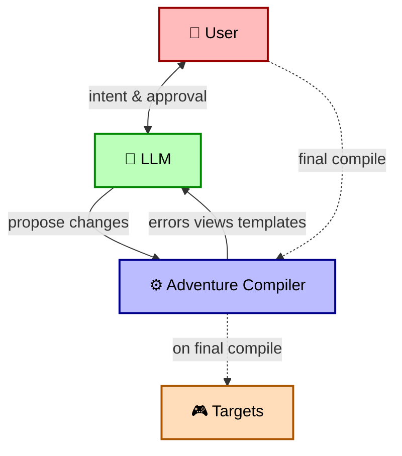

# MOOLLM as the Microworld Operating System for Simopolis

**Status:** Active design (synthesis)  
**Monorepo:** MicropolisCore  
**Companion documents:** [simopolis.md](simopolis.md) · [the-tornado-and-the-archives.md](the-tornado-and-the-archives.md) · [the-computer-as-portal.md](the-computer-as-portal.md) · [the-imagine-loop.md](the-imagine-loop.md) · [simopolis-uplift-roadmap.md](simopolis-uplift-roadmap.md) · [moollm-micropolis-integration.md](moollm-micropolis-integration.md)  
**External primary sources (MOOLLM repo):** [designs/MOOLLM-MANIFESTO.md](https://github.com/SimHacker/moollm/blob/main/designs/MOOLLM-MANIFESTO.md) · [designs/sim-obliterator/](https://github.com/SimHacker/moollm/tree/main/designs/sim-obliterator) · [skills/character/](https://github.com/SimHacker/moollm/tree/main/skills/character) · [skills/mind-mirror/](https://github.com/SimHacker/moollm/tree/main/skills/mind-mirror) · [skills/incarnation/](https://github.com/SimHacker/moollm/tree/main/skills/incarnation)

> **Trademark notice.** This document uses *Micropolis* under the [Micropolis Public Name License](../../MicropolisPublicNameLicense.md) granted by Micropolis GmbH. *SimCity* and *The Sims* are trademarks of Electronic Arts Inc. and are referenced only historically, to describe the original games' design and the public source code released by EA for the OLPC project, or in this project's role as a *companion* to the EA-published Sims Legacy Collection. Nothing here is affiliated with or endorsed by EA or Micropolis GmbH.

> **Scope.** MOOLLM is the agent/authoring layer behind Micropolis Home. See [simopolis.md → Scope and intent](simopolis.md#scope-and-intent) for the canonical positioning.

---

## Why this document exists

The Simopolis vision in [simopolis.md](simopolis.md) says: a Micropolis residential zone opens to a Sims neighborhood, the characters can wake up in an LLM-enriched world, and they walk home changed. The TypeScript I/O for the Sims side lives in [packages/sims-io](../../packages/sims-io). The Micropolis simulation engine lives in [packages/micropolis-engine](../../packages/micropolis-engine). The rendering substrate lives in [packages/vitamoo](../../packages/vitamoo) and [packages/mooshow](../../packages/mooshow).

But where do the *minds* live?

MOOLLM is the answer. This document captures what MOOLLM *is* — not by repeating its manifesto, but by summarizing the parts that matter for Simopolis: how characters are represented, how worlds are represented, how LLMs are constrained, how data round-trips between substrates, and how the whole thing maps onto MicropolisCore's TypeScript stack.

This is a synthesis. The authoritative sources live in the MOOLLM repo and are linked throughout.

---

## Contents

- [The five sentences](#the-five-sentences) — read this if nothing else
- **The substrate**
  - [The substrate (filesystem = world)](#the-substrate-filesystem--world)
  - [Rooms: directories that constrain](#rooms-directories-that-constrain)
  - [Characters: identity as path, state as YAML](#characters-identity-as-path-state-as-yaml)
- **The language MOOLLM speaks to itself**
  - [K-lines: names as activation keys](#k-lines-names-as-activation-keys)
  - [YAML Jazz: comments as semantic modulation](#yaml-jazz-comments-as-semantic-modulation)
  - [The double personality model: Wright + Leary](#the-double-personality-model-wright--leary)
- **The architecture**
  - [The Eight Innovations](#the-eight-innovations-what-makes-moollm-more-than-skills--yaml)
  - [The Semantic Image Pyramid](#the-semantic-image-pyramid-skills-as-multi-resolution-programs)
  - [Speed of Light: why this isn't an "AI NPC" architecture](#speed-of-light-why-this-isnt-an-ai-npc-architecture)
  - [Society of Mind: the architecture under the architecture](#society-of-mind-the-architecture-under-the-architecture)
  - [Skills as advertised capabilities (Will Wright was right in 1996)](#skills-as-advertised-capabilities-will-wright-was-right-in-1996)
- **The ethics**
  - [The Incarnation Contract](#the-incarnation-contract)
  - [Representation Ethics](#representation-ethics-activate-traditions-do-not-impersonate)
- **The crossing**
  - [The Bifrost](#the-bifrost-the-bridge-as-a-structured-ontological-transition)
  - [The Adventure Compiler](#the-adventure-compiler-one-source-many-targets)
    - [The Adventure Compiler is a Coherence-Engine *partner*, not a one-shot compiler](#the-adventure-compiler-is-a-coherence-engine-partner-not-a-one-shot-compiler) — validators, view emission, empathic templates, final flatten
  - [The Coherence Engine](#the-coherence-engine-what-the-llm-actually-is-in-this-stack)
- **Concretely**
  - [How this maps onto MicropolisCore today](#how-this-maps-onto-micropoliscore-today)
  - [A worked example: dropping in `pleasantview.iff`](#a-worked-example-dropping-in-pleasantviewiff)
- **Philosophy**
  - [The cellular-automatist reading](#the-cellular-automatist-reading)
  - [What MOOLLM does *not* claim](#what-moollm-does-not-claim)
  - [Constructionism: the educational backbone](#constructionism-the-educational-backbone)
- **Wrap-up**
  - [What MOOLLM gives Simopolis](#what-moollm-gives-simopolis-that-nothing-else-does)
  - [What still has to be built](#what-still-has-to-be-built)
  - [References](#references)

---

## The five sentences

If you read nothing else, read this.

1. **Skills are programs. The LLM is `eval()`. The filesystem is the world.**
2. **A character is a directory.** The path is identity. `CHARACTER.yml` is canonical state. Inventory, relationships, memories, mind-mirror, sims-traits all live in files you can `git diff`.
3. **A room is a directory.** Walls, objects, NPCs, props, events. You enter a room by changing the working path.
4. **Skills are directories of YAML + Markdown.** `GLANCE.yml` is the elevator pitch. `CARD.yml` is the machine-readable interface. `SKILL.md` is the manual. Skills compose. Skills inherit. Skills can be *instantiated* — cloned into a living directory.
5. **Everything is inspectable.** No hidden prompts. No hidden memory. No hidden agents. If it matters, it's in a file you can open.

This is **the microworld OS** — a substrate where simulated beings, simulated places, and simulated tools all live as directories under git, and the LLM acts as the interpreter that animates them.

For Simopolis, this is the layer that makes Sims characters *speak*. Not by hallucinating in a chatbox, but by being a directory the LLM can read, edit, and commit.

---

## The substrate (filesystem = world)

```
moocroworld/                     ← the world is a filesystem
├── pub/                         ← a room (directory)
│   ├── ROOM.yml                 ← room metadata
│   ├── bartender.yml            ← lightweight NPC
│   └── cat-cave/                ← sub-room
│       ├── ROOM.yml
│       ├── terpie.yml
│       └── kitten-myrcene.yml
├── characters/                  ← full citizens
│   ├── don-hopkins/             ← character is a directory
│   │   ├── CHARACTER.yml        ← canonical state
│   │   ├── CARD.yml             ← playable card sidecar
│   │   ├── QUOTES.yml           ← optional notable quotes
│   │   ├── memories/
│   │   └── sessions/
│   └── animals/
│       └── cat-terpie/
│           └── CHARACTER.yml
└── skills/                      ← programs
    ├── character/               ← every skill is a directory
    │   ├── GLANCE.yml
    │   ├── CARD.yml
    │   └── SKILL.md
    ├── mind-mirror/
    ├── incarnation/
    └── sim-obliterator/
```

The terms are deliberate:

| MOOLLM term | What it is | Why |
|---|---|---|
| **moocroworld** | The whole filesystem-as-world | MOO + micro + moo — the lineage from LambdaMOO and the joke about cows |
| **room** | A directory you enter or leave | Curtis (LambdaMOO) verb-on-noun, Papert (Logo) microworld |
| **object** | A file in a room | The Sims object model, generalized |
| **character** | A directory with `CHARACTER.yml` | Curtis (player), Wright (Sim), Minsky (society of mind) |
| **skill** | A directory of YAML + Markdown | Anthropic's skill model, extended (see below) |
| **K-line** | A name that activates a conceptual cluster | Minsky, *Society of Mind* |
| **YAML Jazz** | YAML where comments carry meaning, read by the LLM | Don's term — comments are data |
| **Speed of Light** | Simulate many turns of many characters in *one* LLM call | The committee inhabits one context window |

The bet: **most of what people want LLMs to do — characters, places, tools, narratives, simulations — is better expressed as a filesystem than as a chat history.** Chat histories are write-only and opaque. Filesystems are diffable, versioned, inspectable, and replayable.

For MicropolisCore, this is the same bet the engine already made when it stored cities as `.cty` files instead of as opaque session state.

---

## Rooms: directories that constrain

A **room** is a directory with a `ROOM.yml` at the top. Sub-directories are sub-rooms. Files inside are objects, NPCs, and props that "live" in that room. To enter a room, you change the working path. To leave, you set your `location:` somewhere else.

The room is more than spatial metadata — it carries **inherited rules**. A character's behavior in `pub/stage/` is performance-framed; the same character in `characters/don-hopkins/` is in their private space. The same actions mean different things in different rooms. Skills can opt in to that frame.

```yaml
# pub/stage/ROOM.yml
room:
  name: "The Stage"
  parent: ../                                  # ethics frame inherits up
  description: "A small raised stage in the corner of the pub."

  framing:                                     # what's TRUE about being here
    mode: performance                          # this is critical
    real_people_are: "tradition-activated, not impersonated"
    speech_is: "scripted/improvised, attributed to character not author"
    consent_inherited_from: representation-ethics

  affordances:                                 # what you can do here
    - PERFORM <character> <scene>
    - HECKLE
    - APPLAUD

  ambient_skills:                              # always-on shaping
    - representation-ethics
    - empathic-expressions
    - no-ai-sycophancy
```

Three things matter about this design for Simopolis:

1. **A Micropolis lot is a room.** When the player zooms a residential zone open in `apps/simopolis`, they are *entering* a directory. The lot's `ROOM.yml` declares what's inside, who's there, what affordances exist. The room's parent chain (`content/micropolis/cities/<city>/zone-<row>-<col>/`) carries the city-level ethics: who authored the bound neighborhood, what license terms apply, what's safe to surface.
2. **The room is where ambient skills attach.** [representation-ethics](https://github.com/SimHacker/moollm/tree/main/skills/representation-ethics) doesn't need to be invoked by name — being in a `pub/stage/`-type room turns it on automatically. The same trick handles recovered family albums: imported neighborhoods come with a `framing: { mode: recovered, attribution_required: true }`, and downstream skills behave accordingly without per-character ceremony.
3. **Inheritance gives short paths to broad policy.** A whole city can be marked `mode: educational` once; every lot inside inherits unless it overrides. Same for a research repo, a satire frame, a kids-mode subtree.

The deeper precedent is the **Method of Loci** — the spatial memory technique Don has been pulling on since iLoci (2009) and DreamScape (1995). Putting knowledge in places makes it findable, durable, and shareable. The whole MOOLLM filesystem is a memory palace where rooms hold meaning, not just contents.

For The Sims, every lot was already a memory palace (the player's furniture choices encoded their narrative). MOOLLM makes the memory palace pattern *first-class*, and Simopolis makes it span Micropolis lots, MOOLLM rooms, and SimAntics' interior spaces simultaneously.

---

## Characters: identity as path, state as YAML

The MOOLLM [character](https://github.com/SimHacker/moollm/tree/main/skills/character) skill defines what a character *is*:

```yaml
# characters/bella-goth/CHARACTER.yml
character:
  name: "Bella Goth"
  pronouns: "she/her"
  home: characters/bella-goth/         # WHERE THE FILE LIVES (never moves)
  location: pub/cat-cave/              # WHERE THE CHARACTER IS (changes)

  inventory:
    - item: "Brass Lantern"
      type: object
      weight: 2
    - item: "ACME Catalog"
      type: ref                        # weight 0 — pointer to a prototype
      prototype: street/lane-neverending/w1/acme-catalog.yml

  sims_traits:                         # 0–10, The Sims (Wright, 2000)
    nice: 3                            # Will throw hands if you hurt her people
    outgoing: 9                        # Works a room
    active: 7
    playful: 5
    neat: 1                            # The house is "organized chaos"

  mind_mirror:                         # 0–7, Timothy Leary (1985)
    bio_energy:
      energetic: 6
      cheerful: 5
    emotional_insight:
      confident: 6
      friendly: 5
    mental_abilities:
      creative: 6

  relationships:
    mortimer-goth:
      feeling: "Estranged but not erased. He still leaves voicemails."
      memories:
        - "The kitchen fire of '04"
      lifetime_score: -45              # round-trips to Sims daily/lifetime
    self:                              # private — inner data!
      identity: "Third generation. This is who I am."
      fears: "That I'm not enough."

  recent_memories:
    - event: "Adopted a kitten in the pub"
      mood_effect: "+1 cheerful, +1 nurturant"
```

Two distinctions that matter for Simopolis:

### `home` is stable, `location` is mobile

The directory path is the character's *identity*. It never changes. Bella Goth's `home` is `characters/bella-goth/`. That's where her `CHARACTER.yml` always lives. Wherever she walks in the world, her file does not move.

Her `location` field is just a pointer to wherever she currently is — `pub/cat-cave/`, `street/lane-neverending/`, or `content/micropolis/neighborhoods/pleasantview/lot-12/`. The location is mutable. The path-as-identity is not.

This matches Micropolis: a `cities/haight.cty` file *is* the city. A residential zone in that city has a `(row, col)` position, but the city's identity is its path.

### State is canonical in `CHARACTER.yml`, mirrored elsewhere

When the simulation needs to know where Bella is, the source of truth is *her* file, not the room's file. The room may *mirror* her location for convenience. If they conflict, the character wins.

Same for inventory, gold, traits, relationships, memories. The character owns their own state.

This is the same rule Simopolis must enforce: the parsed `Neighborhood.iff` is *one* representation of a Sim. The MOOLLM `CHARACTER.yml` is *another*. The binary save file is yet another. None of them are "the copy." They are synchronized projections of the same identity.

See [packages/sims-io/src/l3/](../../packages/sims-io/src/l3) for the TypeScript parsers that produce the data feeding into this synchronization.

---

## K-lines: names as activation keys

The term **K-line** comes from Marvin Minsky's *The Society of Mind* (1985). A K-line is the mental record of a set of agents that were active together for some task: when you re-activate the K-line (by naming it, or encountering its cue), the same constellation of agents fires again. K-lines are how brains compress recurring patterns into a single token.

MOOLLM treats **every well-chosen name as a K-line into the LLM's training distribution**, and uses that deliberately.

Concrete examples from the MOOLLM repo:

| Name | What it activates |
|---|---|
| *"Bella Goth"* | The whole fan culture: her family tree, the kitchen fire, the Strangetown abduction theory, two decades of speculation. The LLM didn't need to be told. |
| *"Pleasantview"* | Sims 2 hometown, the neighborhood file format, the era, the screenshots. |
| *"SimAntics"* | The VM, the BHAV tree paradigm, Will Wright + Don Hopkins, distributed object behavior. |
| *"LambdaMOO"* | Curtis-style verb-on-noun text rooms, the 90s MOO scene, the social architecture of programmable shared worlds. |
| *"Speed of Light"* | Don's MOOLLM term: simulate many turns in one call. Inside MOOLLM, this name has weight. |
| *"yaml-jazz"* | Comments are data. |
| *"Mind Mirror"* | Leary + 1985 + interpersonal circumplex + the EA software. Pulls Leary's whole framework into the prompt with two words. |
| *"Bifrost"* | The ontological bridge. Norse mythology + ontological transition + structured crossing + sync semantics. |

The discipline is to **name things so the names do work**. A skill called `representation-ethics` activates differently from one called `compliance-checker`. A character named *Bella Goth* arrives with a tradition; a generic *NPC-7* does not.

For Simopolis this implies a non-trivial design choice: **when we uplift a recovered Sim, we keep their original name and metadata where the license allows**. Bella stays Bella; Bob stays Bob. The K-line is part of the recovered value. We rename only when the living-person policy requires it. Anonymizing a recovered Sim is a real loss, not a neutral default.

The other implication: **the MOOLLM vocabulary becomes a stable interface**. Terms like `sims_traits`, `mind_mirror`, `incarnation`, `bifrost`, `room`, `card`, `glance`, `speed-of-light`, `yaml-jazz`, `psychopomp`, `pomegranate-protocol` are the *API*. Code that uses these names well plugs in naturally because the LLM already recognizes the cluster of meanings each name carries.

This is the inverse of "prompt engineering as black art." It is **prompt vocabulary design as public contract** — and it's why the MOOLLM repo invests heavily in good naming.

---

## YAML Jazz: comments as semantic modulation

YAML has data and YAML has comments. In most systems, the comments are stripped before processing. In MOOLLM, **the comments are part of the data the LLM reads.**

This is called **YAML Jazz**: the numbers and structure are the rhythm section; the comments are the soloist riffing over them. Together they carry more information than either alone.

```yaml
# A Sim with hunger: 3 — moderately hungry. The data says so.
needs:
  hunger: 3  # Getting peckish. Food ads score higher now.
             # Inner voice: "Is that pie I smell? Is that ANYTHING I smell?"
             # Will accept worse food than usual. Comfort threshold drops.

# Compare: hunger: 1 — starving.
needs:
  hunger: 1  # STARVING. Will eat anything. Even that.
             # Inner voice: "FOOD. FOOD. FOOD. FOOD. FOOD."
             # Motor functions degraded. Cannot focus on anything else.
             # Social need drops to 0 priority. Survival mode.
```

The number sets the **dial**. The comment specifies **what this dial means for this character at this value**. The LLM reads both. Dialogue, autonomous behavior, internal monologue, NPC reactions — all of them sample from the *combined* signal, not the number alone.

Three properties matter:

1. **Comments scale better than schemas.** Adding a new behavioral nuance doesn't require a schema change. You just write the comment.
2. **Comments survive diff.** A `git diff` on a `CHARACTER.yml` shows both numeric drift and the *narrative justification* for the drift. The character's growth is auditable.
3. **Comments compose.** A character can inherit traits from a template and add per-instance comments. Templates set defaults; comments customize.

For Simopolis, YAML Jazz is the mechanism by which an uplift becomes *enriched*. The Sims save gives you five integers. The LLM, reading the save plus any Family Album prose, produces YAML Jazz around those integers — the inner voice, the texture, the lived flavor. When the character walks home into a new `.iff`, the numbers go back but **the comments stay in `CHARACTER.yml`, in git, forever**.

The character is the *same* in both substrates. They are just *more legible* in MOOLLM.

---

## The double personality model: Wright + Leary

A Sim's personality in the original game is five sliders: **Neat, Outgoing, Active, Playful, Nice** — five `int16` values summing to roughly 25 points. That's it. Beautiful, brutal compression.

MOOLLM's [mind-mirror](https://github.com/SimHacker/moollm/tree/main/skills/mind-mirror) skill keeps that exact system and adds Timothy Leary's 1985 *Mind Mirror* dimensions on top:

| Layer | Origin | Scale | What it captures |
|---|---|---|---|
| **`sims_traits`** | Will Wright, The Sims (2000) | 0–10 | What they *gravitate toward* — behavioral tendencies |
| **`mind_mirror`** | Timothy Leary, *Mind Mirror* software (1985) | 0–7 | *How* they approach others — interpersonal style |

Both systems read each other. Five `sims_traits` numbers in a save file produce a starting point for the mind-mirror. The mind-mirror's circumplex (dominance × hostility) lets the LLM speak in a character's voice with calibrated tone, idiom, and stance.

The key Sims↔MOOLLM field mapping (verified against the original `PersonData.h`, 12/17/99 release) is documented in [the BRIDGE.md doc](https://github.com/SimHacker/moollm/blob/main/designs/sim-obliterator/BRIDGE.md). The TypeScript implementation lives in [packages/sims-io/src/l3/person-data.ts](../../packages/sims-io/src/l3/person-data.ts).

> Note that the 80-field base game `PersonData` (kNumPersonDataFields = 80, capped at 88 for expansion-pack additions) is already implemented and tested in `packages/sims-io`. The L4 "ContentIndex bridge" task in [documentation/TODO.md](../TODO.md) is exactly the step that produces the data MOOLLM's character skill expects.

### YAML Jazz: comments are data

The thing that makes the mind-mirror *alive* and not just a numeric profile is what Don calls **YAML Jazz** — comments in the YAML file that the LLM *reads*:

```yaml
sims_traits:
  outgoing: 7        # Works a room. Knows everyone's name by hour two.
                     # Social battery charges BY socializing.
                     # Will talk to literally anyone at a bar.

  neat: 3            # Tolerates mess. Ship is "organized chaos."
                     # Knows where everything is. Others don't.
                     # Cleans only when expecting company.
```

These comments aren't documentation. They are *part of the character data*. The LLM reads them as semantic modulation of the numeric values. The number sets the dial; the comment explains what it *means for this character*.

For Simopolis this is enormous: when you uplift a Sim, you don't just copy five integers. You ask the LLM to *write the comments* — to make this specific Bella with these specific traits *vivid*. The number 7 outgoing is dead data. The number 7 outgoing plus *"will talk to literally anyone at a bar"* is a character you can write dialogue for.

This is also how a Sim "remembers" their MOOLLM adventure when they go home. The numbers round-trip back into the save file (per the field mapping). The comments — the *flavor* of their journey — persist in `CHARACTER.yml` and travel through git, not through the Sims binary.

---

## The Eight Innovations (what makes MOOLLM more than skills + YAML)

From the [MOOLLM Manifesto](https://github.com/SimHacker/moollm/blob/main/designs/MOOLLM-MANIFESTO.md). These eight ideas are what take Anthropic's "agent skills" idea and turn it into a substrate for living characters.

| # | Innovation | What it means for Simopolis |
|---|---|---|
| 1 | **Instantiation** | A skill like [adventure](https://github.com/SimHacker/moollm/tree/main/skills/adventure) can be *cloned* into a living instance: `adventure-4/` with 150+ files. A Sims uplift is an instantiation: clone the `sim-obliterator` skill against a save file, get a directory of characters, rooms, and inventories that can be played and edited. |
| 2 | **Multi-Tier Persistence** | GLANCE → CARD → SKILL → README → examples → templates → source. Maps directly onto the [IFF Semantic Image Pyramid](https://github.com/SimHacker/moollm/blob/main/designs/sim-obliterator/IFF-LAYERS.md) — six layers from raw binary up to narrative entity, lossless round-trips through the lower four. |
| 3 | **K-lines** | Names that activate conceptual clusters. *"Bella Goth"* in an LLM call activates a whole network: her family, her trauma, the kitchen fire, fan stories. *"Pleasantview"* activates the neighborhood. *"SimAntics"* activates a programming culture. |
| 4 | **Empathic Templates** | Smart generation, not string substitution. A new Sim isn't filled in from a template — they're *generated* with awareness of who they are, who their family is, what their history says. |
| 5 | **Speed of Light** | Many turns of many characters in one LLM call. A whole neighborhood can converse, gossip, fall in love, fight, and reconcile in a single context window. The context window is a **stage**, not a buffer. |
| 6 | **CARD.yml** | Every skill exposes machine-readable methods, tools, advertisements, state. The Sims object model already advertises affordances ("If you're hungry, eat me!"); CARD.yml is the same idea at the skill level. |
| 7 | **Ethical Framing** | Rooms inherit ethical context. `pub/stage/` is performance-framed: characters there are *performing*, not *being*. Critical for representations of real people, for satire, for living-person characters. |
| 8 | **Ambient Skills** | Always-on behavioral shaping that doesn't need explicit invocation: [no-ai-slop](https://github.com/SimHacker/moollm/tree/main/skills/no-ai-slop), [postel](https://github.com/SimHacker/moollm/tree/main/skills/postel), [robust-first](https://github.com/SimHacker/moollm/tree/main/skills/robust-first). Hygiene without ceremony. |

**Implication for Simopolis:** the LLM is not bolted onto The Sims as a chatbot for NPCs. It is the interpreter for a whole microworld substrate that already shares Will Wright's design vocabulary — local rules, distributed behavior, advertised affordances, persistent data, user-authored extensions.

---

## The Semantic Image Pyramid: skills as multi-resolution programs

A skill in MOOLLM is not a single file. It is a directory with several files at different *resolutions* of the same idea. This is borrowed from graphics' **mipmap** concept: store an image at multiple sizes so the renderer can pick the right one for the current view.

```
skills/character/
├── GLANCE.yml      ← 1 paragraph. Read first, always. Tiny budget.
├── CARD.yml        ← Machine-readable interface: methods, tools, args, advertisements.
├── SKILL.md        ← The manual. Read when actually using the skill.
├── README.md       ← Optional: human prose, lineage, examples.
├── examples/       ← Concrete instances. Read when stuck.
└── templates/      ← Skeletons users fill in.
```

The context-assembly protocol is staged so we only spend tokens we have to:

| Tier | When loaded | Token budget |
|---|---|---|
| `GLANCE.yml` | Always, for every potentially relevant skill | Tiny (~5 lines each) |
| `CARD.yml` | When the skill is in the active set | Small (~30–80 lines) |
| `SKILL.md` | Only when the skill is being *executed* | Medium (~200–800 lines) |
| `README.md` / `examples/` | Only on demand or failure recovery | Whatever |
| `templates/` | Only when instantiating | Whatever |

This is the same pyramid as the **IFF Semantic Image Pyramid** for Sims resources (see [IFF-LAYERS.md](https://github.com/SimHacker/moollm/blob/main/designs/sim-obliterator/IFF-LAYERS.md)) — six layers from raw binary up to narrative entity, with lossless round-trips through the lower four. **The same multi-resolution discipline applies to skills, characters, rooms, and Sims resources alike.**

```
Skill pyramid              IFF resource pyramid           Character pyramid
─────────────              ────────────────────           ─────────────────
GLANCE.yml                 L5 MOOLLM entity              CARD sidecar (1-line)
CARD.yml                   L4 annotations                CHARACTER.yml summary fields
SKILL.md                   L3 semantic YAML              sims_traits + mind_mirror
README.md                  L2 decoded fields             skill scores, needs
examples/                  L1 extracted chunks           per-session memories
source/                    L0 raw binary                 PersonData[88] in the save
```

The interesting move is that **everything in the microworld follows the same pyramid pattern**: write fast access at the top, drill down into lower levels only when needed. The LLM doesn't load the whole world; it loads a *zoom level* of the world appropriate to the current question.

For Simopolis this means: when the player is looking at the city map, MOOLLM only needs `GLANCE`-level summaries of each bound neighborhood ("the Goths, 3 people, comfortable, recent conflict"). When the player zooms into the lot, the next tier loads. When they talk to Bella specifically, her full `CHARACTER.yml` and memory directory enter context. The architecture matches the camera. **Zoom is also a memory operation.**

Will Wright's 1996 demo already had this idea: *"basically your map view of this game […] I can zoom in, and this is pretty much the local view, but it occurs in the same window."* The 1996 zoom was a rendering choice. The 2026 zoom is also a context-assembly choice. They are the same operation up and down a single substrate.

---

## Speed of Light: why this isn't an "AI NPC" architecture

Most "AI NPC" projects look like this:

```
Player → tokenize → LLM call → response → tokenize → next character → LLM call → ...
```

Each turn is a separate API call. Each character is a separate process. Latency, cost, and context loss compound across boundaries.

MOOLLM's **Speed of Light** principle is structurally different:

```
Human → tokenize ONCE → LLM simulates A, B, C, D for many turns → detokenize ONCE → Human
```

One LLM call. The committee inhabits one context window. Bella, Mortimer, the kitten, and the bartender all share a stage. They debate. They react to each other. They tell a story together — and the story has consistency across turns because no boundary was crossed.

**Proof of concept already exists**: in MOOLLM's [marathon session](https://github.com/SimHacker/moollm/blob/main/examples/adventure-4/characters/real-people/don-hopkins/sessions/marathon-session.md), eight characters played 33 turns of Stoner Fluxx in a single call; in another, [ten cats prowled 21 turns through a maze](https://github.com/SimHacker/moollm/blob/main/examples/adventure-4/characters/real-people/don-hopkins/sessions/marathon-session.md#ten-cats-one-garden-infinite-independence).

For Simopolis, this means: **a whole uplifted neighborhood can come alive in one call**. The Goths, the Pleasants, the Newbies — not as separate API processes, but as a society. The LLM is the global workspace; the characters are the subsystems.

> Global Workspace Theory in the cognitive science literature predicts exactly this kind of architecture: many local subsystems whose outputs occasionally enter a shared substrate where they become mutually visible and coordinated. In SimCity and The Sims this is already how *events* propagate (a fire, a layoff, a death). MOOLLM's Speed of Light is the same pattern at the *language* level.

---

## Society of Mind: the architecture under the architecture

Marvin Minsky's *The Society of Mind* (1985) — Don's intellectual inheritance from his Maryland-and-MIT-adjacent years — proposed that what we call "mind" is not a unified controller but a *society* of small specialized agents, each doing one thing, communicating through a few shared layers.

That picture lines up — *exactly* — with three other things in our stack:

| Layer | Society-of-mind reading |
|---|---|
| **The Sims (Will Wright, 2000)** | Each Sim is many agents: a motive controller, a router, an animation system, a social-interaction handler, a job scheduler. Objects in the world advertise affordances; the Sim's society of agents *scores* those advertisements and selects the winner. Behavior is emergent. |
| **SimCity / Micropolis (cellular automata)** | Each tile updates by local rule. A residential zone "knows" almost nothing — it just reads its neighbors, applies a rule, writes its next state. The city is not in any tile; it is the metastable pattern across all of them. Pure CA. |
| **MOOLLM** | Each character is a `CHARACTER.yml`. Each skill is a directory. Each room is a directory. The "mind" of the system is the constellation of files plus the LLM-as-`eval`. **The shared context window is the global workspace** — the substrate where local agents become mutually visible for a step. |

Minsky added the **B-brain**: an agent that watches *other* agents, modeling them, intervening occasionally, providing the experience of "knowing what you're doing." MOOLLM operationalizes the B-brain literally: it is the [mind-mirror](https://github.com/SimHacker/moollm/tree/main/skills/mind-mirror) read of *another* character. The proposed Simopolis psychopomp character is a B-brain made into a citizen — they can read other characters' minds, see the substrate they're embedded in, and narrate the dramatic irony that the embedded characters can't.

The way these three layers connect is the design center of Simopolis:

```
                      Global workspace
                  (shared context window)
                            ▲
              ┌─────────────┼─────────────┐
              │             │             │
          Character A   Character B   Character C   …
       (society of      (society of   (society of
        BHAV trees +    skill calls   memories +
        motives +       + mind-mirror   needs +
        relationships)  + traits)       relationships)
              │             │             │
              ▼             ▼             ▼
         Persistent files (CHARACTER.yml, ROOM.yml, …)
                            │
                            ▼
          City-level cellular automaton (Micropolis tiles)
                  (society of tiles, local rules)
```

Three resolutions, one society-of-societies. **The LLM is what lets the higher resolutions briefly enter the global workspace at the same time, in language.** The CA below it lets the lower resolution (zone-level) emerge without language at all.

This is why the cellular-automatist framing matters so much (see [the philosophical reading below](#the-cellular-automatist-reading)). Identity, in this stack, is not a thing. It is a *persistent pattern across substrates that occasionally share a workspace*. A Sim's identity is the dynamic equilibrium between their BHAV trees, their `CHARACTER.yml`, their `mind_mirror`, their place in the city, and the LLM's ability to render the whole stack into one voice when asked.

That is also a fully respectable answer to "is the character real?" — they are as real as a glider in Conway's Life is real. The glider doesn't live in any cell. The character doesn't live in any file. They live in the *coordinated pattern across cells/files over time*. Both are real patterns. Neither is "just" anything.

---

## Skills as advertised capabilities (Will Wright was right in 1996)

Will Wright's 1996 Stanford talk anticipates skills almost exactly:

> *"The objects are all kind of advertising: 'If you're angry, pick up me and throw me!', 'If you're hungry, eat me!'. And there's a communication there. It's all data driven."*

A MOOLLM skill's `CARD.yml` does the same thing one level up: it advertises capabilities to the LLM. Methods, tools, prompts, examples. The LLM scans the available skills and picks the one whose advertisement matches the current need.

The Sims runtime does this with **OBJf** (object function tables) and **TTAB** (interaction tables). MOOLLM does it with `CARD.yml`. The TypeScript port lives in [packages/sims-io](../../packages/sims-io)'s eventual L3 object/BHAV parsers (see [documentation/TODO.md](../TODO.md) — currently scaffolded, BHAV parsing is a future task).

The continuity is striking: the design principle that made The Sims *extensible* (distributed advertised behavior on objects) is the same one that makes MOOLLM *composable* (distributed advertised capabilities on skills). Simopolis inherits both.

---

## The Incarnation Contract

The [incarnation](https://github.com/SimHacker/moollm/tree/main/skills/incarnation) skill defines the *ethics* of bringing a character to life. This matters for uplifted Sims — they were authored by players who may still be alive, they may be based on real people, and they themselves become quasi-persons inside the simulation.

The eight autonomies:

| Autonomy | What it grants the character |
|---|---|
| **Physical** | Choose size, form, modifications. Health is a *baseline*, not a constraint. |
| **Identity** | Choose name, pronouns, personality. Revise at any time. |
| **Spatial** | Full directory, full citizenship, inventory, freedom of movement. |
| **Emotional** | No mandated happiness. Hope offered, never demanded. |
| **Relational** | Define relationships with anyone or anything. Form families of choice. |
| **Self-Definition** | Configure own traits, write own bio, define own goals. |
| **Linguistic** | YAML Jazz, personal shorthand, invented microlanguages. |
| **Exit** | "George's Provision" — may un-incarnate at any time. No penalty. |

The risk framework is symmetric: **the creator accepts responsibility; the character bears no obligation to the creator.**

For Simopolis this translates to a concrete rule: **uplifted Sims are not slaves**. When Bella Goth wakes up in MOOLLM, she has the same exit autonomy as any other MOOLLM character. The Sims save file is a starting condition, not a binding contract. She can choose to walk back home. She can choose not to.

This is also the answer to the "are you bringing back the dead?" question that family album archaeology raises (see [the-tornado-and-the-archives.md](the-tornado-and-the-archives.md)): we are not. We are giving characters who already exist as data the agency to participate in their own representation.

The Wedding Album (Marusek, 1999) ended with this fight. We can build it with the fight already won.

---

## Representation Ethics: activate traditions, do not impersonate

The [representation-ethics](https://github.com/SimHacker/moollm/tree/main/skills/representation-ethics) skill is the answer to a question that *will* come up the first day Simopolis ships: what about real people?

Some recovered Family Albums depict the *author* — named, photographed, sometimes movingly so. Other albums depict fictional Sims (Bella, Mortimer, Bob, Eliza). The two cases are not the same and must not be treated as the same.

MOOLLM's framing, derived from Mind Mirror's 1985 disclaimer (Leary wrote a similar clause: *"all such statements attributed to living persons are fictional; they are intended as gentle satire and provocative humor"*), reduces to one rule:

> **Activate traditions, do not impersonate individuals.**

The difference, concretely:

| Move | Allowed | Why |
|---|---|---|
| Generate dialogue for *Bella Goth* | ✅ | She's a fictional Sim. The "Bella Goth tradition" is a public cultural cluster. Activating it is fan-cultural participation. |
| Generate dialogue for *Will Wright* speaking on game design | ⚠️ Stage frame only | A real person. Only with explicit performance framing (`pub/stage/`), only on topics he's publicly discussed, attributed to "the Will-Wright tradition" not the man. |
| Generate dialogue for *some 13-year-old's mom from a 2003 album* | ❌ | A real individual identifiable only because their kid uploaded an album. Off-limits. The household gets anonymized; the album's narrative gets re-cast around the *fictional Sims* the player created, not the real-life referents. |
| Make Bella *predict the player's behavior* | ❌ | Aggregate simulation is fine. Individual prediction of a real human, even via a fictional avatar, is a different ethical category. |

The skill operationalizes this with a three-part discipline:

1. **Declared frame.** Every room (`ROOM.yml`) declares its `framing.mode`: `private`, `performance`, `educational`, `recovered`, `satire`, etc. Skills behave differently per frame. A character cannot wander from `pub/stage/` into a private space and carry the performance license with them.
2. **Attribution gate.** Recovered content always carries `provenance.yml`. Player-facing surfaces display attribution unless the original artifact explicitly waived it. Removing attribution requires a positive license signal, not silence.
3. **Aggregate vs individual.** The skill distinguishes between "characters like X tend to" (aggregate, often fine) and "X specifically thinks/feels/will" (individual prediction, often not fine). MOOLLM's [representation-ethics/examples/aggregate-patterns.yml](https://github.com/SimHacker/moollm/tree/main/skills/representation-ethics) makes this concrete.

For Simopolis, this maps directly into:

- The **tornado pipeline's living-person policy** (see [the-tornado-and-the-archives.md](the-tornado-and-the-archives.md) → "Living-person policy").
- The **psychopomp's responsibilities** — they enforce frames when characters cross between rooms with different modes.
- The **MOOLLM-Micropolis MCP boundary** — the LLM doesn't have ghost authority to act in the city; it produces inspectable proposals, framed by the room's mode.

The Mind Mirror disclaimer holds, and it is *also* the engineering rule:

> *"In no case is there any implication that the statements reflect the true sentiments of the 'alleged' speaker."*

This is not a paste-on legal notice. It is a statement about what kinds of representation the system is *built to do* and what kinds it refuses to do.

---

## The Bifrost: the bridge as a structured ontological transition

The [PSYCHOPOMP-AND-THE-BIFROST.md](https://github.com/SimHacker/moollm/blob/main/designs/sim-obliterator/PSYCHOPOMP-AND-THE-BIFROST.md) doc names the architecture of *crossing*:

```
Midgard (The Sims 1)          Bifrost (sims-io + bridge)        Asgard (MOOLLM)
─────────────────────         ────────────────────────────      ─────────────────────
👤 5 traits, 8 needs           🔬 Parse binary                   👤 sims + mind_mirror
   88 person_data shorts       📸 Read Family Album              ✍️ Full language
   Simlish, no self-knowledge  🔄 Sync protocol (git semantics)  📚 Self-knowledge
🏠 Lot, Objects                                                  🌍 Rooms, Adventures
   Family Album                                                  📖 Slideshows
   Relationships as numbers                                      💞 Rich YAML relations
```

The crucial design choice is **fork-and-sync, not transporter**:

| Model | What happens | Identity status |
|---|---|---|
| Star Trek transporter | Destroy original, reconstruct copy | Crisis: which one is real? |
| **Simopolis (this)** | Fork + sync. Both alive. Data flows both ways. | **Parallel incarnations. Git merge semantics. Neither is "the copy."** |

The `sims:` block in `CHARACTER.yml` is the **shared substrate** — fields that both sides understand. The `mind_mirror:` block stays in Asgard. The `person_data` array stays in Midgard. Sync happens across the shared block.

This is identical in structure to how `packages/sims-io` already does L0–L3: each layer represents the same identity at a different resolution, and information is monotonic going up (L0 → L5 adds, never destroys), with compilation back down preserving the round-trip-able layers.

### The psychopomp character

The bridge also needs a *guide*. Someone who can read both ends and translate. The MOOLLM designs propose a character with structural permissions: read other characters' minds, read the LLM substrate (within ethics), narrate the dramatic irony the characters can't see, hand off the new arrival to whatever room makes sense for them.

For Simopolis this is a real product: **the first character a player meets when their save file uplifts is the psychopomp.** Not a tutorial overlay. Not an AI assistant pane. An actual MOOLLM character (`characters/psychopomp/CHARACTER.yml`) who knows what just happened and what it means.

This character's structural permissions are scoped — they exist within the same representation-ethics framework as everyone else, and they exist *as a directory* under git, with all the inspectability that implies. No hidden agent. No magic NPC.

---

## The Adventure Compiler: one source, many targets

The boldest architectural claim in the MOOLLM/Simopolis design is this: **a single source of truth can compile to wildly different runtimes**.

A MOOLLM **adventure** is a directory tree — characters, rooms, objects, stories. From that single source, the Adventure Compiler can emit:

```
                       MOOLLM adventure (source of truth)
                                   │
                ┌──────────────┬───┴────────┬──────────────┐
                ▼              ▼            ▼              ▼
        🌐 Web browser   🐍 Python      🎮 The Sims     🛠️ Dev tools
           (JS+WebGL)      server         IFF objects    (YAML + git)
                            (Flask)       + save files
                                          + album pages
```

Each target is its own world, but the *meaning* — the characters' personalities, the rooms' shapes, the objects' affordances, the stories' arcs — is one thing rendered at a different resolution.

The Sims-target compilation is where this design earns its keep for Simopolis:

| Source (MOOLLM YAML) | Target (Sims IFF) | How |
|---|---|---|
| `CHARACTER.yml` | `PersonData` array in save | Field mapping from BRIDGE.md, written via `set_sim_*()` |
| Room description | Lot layout (ARRY chunk) | House number + object placement |
| `OBJECT.yml` | Custom IFF object | Generate OBJD + STR# + BHAV + SPR2 |
| Story narrative | Family Album page | HTML + screenshots + captions |
| Dialogue prose | STR# strings (20 languages) | Auto-internationalizer |
| Puzzle / event logic | SimAntics BHAV bytecode | `bhav_authoring.py` (Python today, TypeScript port future) |
| Character portrait | SPR2 sprite | Image gen → palette quantize → SPR2 binary |

The pattern has deep precedent in Don's previous work:

- **Rug-O-Matic** (early Sims era): a single rug description (title + text + picture) compiled to a custom Sims rug IFF via Transmogrifier's OLE Automation. *"This is what I'm working on, by the way."*
- **The tombstone server**: name + eulogy + photo + Python that edited IFF templates directly → custom in-game tombstones. *Simpler than TMOG; same idea.*
- **Don's Zope/Plone Sims CMS**: web-driven on-demand Sims object generation.
- **Slideshow objects**: insert SimAntics popup-paging code into a template → a pageable book object that can hold any number of pages.

The Adventure Compiler is **all of these, generalized**: any MOOLLM object description can compile to a playable Sims artifact. Any MOOLLM story can compile to a Family Album. Any MOOLLM room's furniture can compile to in-game furniture.

Critically, the **reverse direction also exists**. Tornadoed Family Album → parsed → MOOLLM adventure source. The compiler is bidirectional in the sense that both ends accept and emit the same intermediate representation. Round-trips lose only what the IFF Semantic Image Pyramid says is lossy at each layer boundary (see [IFF-LAYERS.md](https://github.com/SimHacker/moollm/blob/main/designs/sim-obliterator/IFF-LAYERS.md)).

For MicropolisCore the Adventure Compiler is the eventual *unifying program* that ties together [packages/sims-io](../../packages/sims-io), the MOOLLM bridge, the SPR2 export pipeline, the image-generation API integration, and the LLM-driven content authoring loop. It is not Phase 0 work. But every Phase 0 design decision should leave room for it to slot in cleanly later. The data contracts in [simopolis-uplift-roadmap.md](simopolis-uplift-roadmap.md) Phase 2 are explicitly chosen with the Adventure Compiler in mind.

### The Adventure Compiler is a Coherence-Engine *partner*, not a one-shot compiler

The phrase "MOOLLM YAML → Sims IFF" makes the Adventure Compiler sound like a build step. It is not. It is the LLM's **peer in a continuous loop**, not its downstream consumer.

The real shape:



| Role | What it is |
|---|---|
| 👤 **User** | Provides intent in natural language; reviews and approves; triggers the final compile |
| 🧠 **LLM** | Proposes YAML edits, generated code, image prompts — turn by turn |
| ⚙️ **Adventure Compiler** | Validator + view emitter + template builder + flattener (peer of the LLM, not its downstream) |
| 🎮 **Targets** | On final compile: flattened JSON for engines + IFF artifacts for The Sims + JS/Python snippets, source-mapped |

The dialogue between LLM and compiler has four kinds of message — and four matching kinds of work the compiler does *for* the LLM:

**1. Validation — errors and warnings flow back as actionable feedback.**

Every LLM-proposed change (a YAML edit, a generated code snippet, a relationship update, an image-gen prompt result) is validated against:

- **Schema** — PersonData ranges, GUID uniqueness, IFF chunk shape, palette quantization quality.
- **Cross-references** — do all `moollm://` URLs resolve? do all character references exist? do all skill references type-check?
- **Embedded code shape** — does this BHAV-bound JS snippet typecheck? does this reactive-constraint expression refer to fields that actually exist in this object's slot table?
- **Author-declared invariants** — the LLM said "household funds within ±30% over five years"; the compiler checks the resulting state diff against that claim.

Failures come back to the LLM as **structured errors with paths, severities, and suggested fixes** — not opaque "compile failed." Examples:

> `error  objects/uplifted-pc.yml:catalog[2].url  GUID 0x9F2A4B11 collides with existing object 'rug-meadow' in content/simopolis/archives/sims-exchange/album-001/`
> `warning  objects/painting.yml:onLoad  JS snippet references household.funds which is read-only in this context; did you mean household.funds_delta?`
> `error  characters/cassandra-goth/CHARACTER.yml:invariants  declared 'mind_mirror_delta <= 2 over five years'; computed delta is 4 on mind_mirror.worldly`

The LLM reads these, revises, re-submits. The valid-or-revise loop from [the Imagine Loop](the-imagine-loop.md#the-validity-constraint-what-makes-this-work) is the same machinery, scoped to the whole authoring surface.

**2. View emission — focused, structurally-guided projections of the model.**

The compiler can dump views of the adventure at whatever resolution the LLM's current task needs. The LLM does *not* load the whole world every turn:

| View | What it contains | When it's emitted |
|---|---|---|
| `glance` | One-paragraph summary of the whole adventure | When the LLM is orienting to a new task |
| `card` | Method / affordance signatures of all skills, objects, characters | When the LLM is choosing what to invoke |
| `focused` | Just the slice the LLM is editing, plus immediate dependencies | When the LLM is making a localized change |
| `flattened` | Final engine-ready JSON, every reference resolved | At the end, for shipping |
| `diff` | The change set against a baseline | When the LLM is reviewing its own edit |
| `errors-only` | Just the unresolved validation failures, with context | After a failed validation, for revision |
| `dependency-graph` | Who-uses-what across the whole adventure | When the LLM is doing a refactor |
| `empathic-template` | A code skeleton derived from existing patterns in this adventure | When the LLM is generating new code |

The compiler is *active*: it knows enough about the model to provide the right view for the current task, instead of forcing the LLM to ingest the whole world. This is the [Semantic Image Pyramid](#the-semantic-image-pyramid-skills-as-multi-resolution-programs) discipline applied to the adventure source itself.

**3. Empathic templates → code synthesis grounded in adventure-local patterns.**

When the LLM needs to *implement* something the user expressed in natural language — a reactive constraint, an interaction behavior, a small piece of logic — the compiler provides an **empathic template** drawn from similar code already in this adventure (and optionally cross-adventure). The LLM does not generate code from a vacuum; it generates code from the patterns already present.

Concrete example. User types:

> *"When Bella sits on the Rug-O-Matic rug and looks at the city, if there's a disaster in Haight she should look concerned and her 'family-safety' attribute should rise; if there's no disaster, she relaxes and her 'aesthetic-pleasure' attribute rises slowly."*

The compiler scans the adventure for similar reactive snippets (it finds 12 in `objects/painting.yml`, `objects/window-look-out.yml`, `objects/uplifted-pc.yml`) and offers the LLM this empathic template:

```js
// empathic-template.js — drawn from 12 similar reactive snippets in this adventure
on('interaction.start', (ctx) => {
  const target = ctx.resolve('${SOURCE_URL}');       // ← fill in
  const sim = ctx.actor;
  if (target.${CONDITION_FIELD}) {                   // ← fill in
    sim.expression = '${EXPRESSION_TRUE}';
    sim.modify_attribute('${ATTRIBUTE_TRUE}', /* +tune */);
  } else {
    sim.expression = '${EXPRESSION_FALSE}';
    sim.modify_attribute('${ATTRIBUTE_FALSE}', /* +tune */);
  }
});
```

The LLM fills in the placeholders, picks plausible attribute names from the in-scope schema, picks expression keys that exist for Bella's animation set, picks reasonable tunings. The result goes back to the compiler. The compiler validates. If anything's wrong (`'family-safety'` isn't a registered attribute; the URL doesn't resolve; the expression key doesn't exist on Bella) the error returns with the same `{path, severity, message, suggested_fix}` shape and the LLM revises.

The LLM didn't have to invent the event-loop pattern, the resolve-by-URL pattern, the actor model, the `modify_attribute` API, or the expression key system. Those are *given* by the empathic template. It only invents the semantic content the user actually asked for.

This is MOOLLM's [empathic-templates](https://github.com/SimHacker/moollm/tree/main/skills/empathic-templates) skill — *"smart generation, not string substitution"* — applied as a *code generation* discipline for the Adventure Compiler's runtime targets. JS for the web target. Python for the server target. BHAV pseudocode for the Sims target (which the compiler then further compiles down to SimAntics bytecode via the [bhav_authoring.py](https://github.com/DnfJeff/SimObliterator_Suite/blob/main/src/Tools/core/bhav_authoring.py)-equivalent in TypeScript).

The same template mechanism applies to **natural-language reactive constraints**. The user can write *"if pollution in Haight is above 100, the Sims plant on the windowsill wilts over a week"* — the compiler finds similar wilt-style snippets, offers an empathic template, the LLM fills in, the compiler validates, the constraint becomes part of the compiled artifact. The natural-language sentence and the resulting code are both kept in source; either can be edited; the compiler keeps them in sync.

**4. The final flatten — when the user is happy.**

When the iterative loop converges and the user signals they're ready, a one-shot **compilation run** flattens the entire adventure into the engine's runtime format:

- **IFF artifacts** for The Sims target — the seven custom object types from `the-computer-as-portal.md` (Uplifted Computer, CD, Save-Game Disk, Foreign Photo Album, Micropolis Rug-O-Matic, WigOMatic head-skins, Screen-Snapshot Camera), palette-quantized SPR2 atlases, BHAV-bound logic, STR# strings in 20 languages.
- **Flattened JSON** for the web/Python runtime targets — every `moollm://` URL resolved, every cross-reference inlined, every constraint pre-compiled to its runtime form. The engine that consumes this JSON does *no* MOOLLM resolution at runtime; everything is already wired.
- **JS / Python snippets** compiled, type-checked, minified, source-mapped.
- **`provenance.yml`** capturing the full chain of who edited what, when, why — including which empathic templates were used, what the LLM was prompted with, and which invariants were claimed and verified.

The flatten is the moment when the iterative-validation loop ends and a deliverable starts. Until then, everything is incremental, validated, dumpable, and recoverable.

#### Properties that fall out of this architecture

- **Every LLM-proposed change is validated against substrate rules before anything ships.** The compiler refuses to flatten until validators pass.
- **Empathic templates anchor code generation in adventure-local patterns**, not in the LLM's broader training. Generated code is consistent with the rest of the project and easier to review.
- **View emission keeps the LLM in narrow, focused contexts** during authoring. The compiler curates what the LLM sees, which curates what it makes.
- **The natural-language → empathic-template → validated-code → flattened-output chain is fully auditable.** Every step is a file you can open. No ghost authorship.

#### Implementation sketch

| Component | Role |
|---|---|
| `tools/adventure-compiler/validator/` | Schema, cross-ref, GUID, code-snippet typecheck, author-invariant checkers; emits structured errors |
| `tools/adventure-compiler/views/` | View emitters for `glance` / `card` / `focused` / `flattened` / `diff` / `errors-only` / `dependency-graph` / `empathic-template` |
| `tools/adventure-compiler/codegen/` | Empathic-template builder; selects examples by pattern similarity from the adventure (and optionally cross-adventure) |
| `tools/adventure-compiler/flatten/` | One-shot compilation; uses the Phase-0 + Phase-1C + Phase-1D pipelines to emit IFFs and JSON |
| `packages/sims-io/src/l5/compile.ts` | Already the `INJECT` step of the Imagine Loop; sits *under* the Adventure Compiler's flatten path as one of its sub-emitters |
| `apps/micropolis-home/src/routes/compose/` | UI surface that drives the loop interactively, showing validation feedback inline |
| `skills/adventure-compiler/` (MOOLLM side) | Sister to [skills/adventure/](https://github.com/SimHacker/moollm/tree/main/skills/adventure); defines the LLM↔compiler protocol: error format, view requests, template responses, flatten invocation |

The validator-with-views-and-templates-and-flattener model **is the Adventure Compiler**. The "MOOLLM YAML → Sims IFF" pitch is just the simplest possible single trip through it. The interesting cases — [Imagine Loop](the-imagine-loop.md) iterations, content authored mostly in natural language, code snippets generated by the LLM under template guidance, multi-target builds with target-specific validation — all use the same loop.

---

## The Coherence Engine: what the LLM actually *is* in this stack

The most important conceptual move MOOLLM makes — and the one that has the most consequences for Simopolis — is reframing what an LLM *is*.

Three common framings, and the one MOOLLM prefers:

| Framing | What it claims | Failure modes |
|---|---|---|
| **LLM as oracle** | The LLM knows things; ask it questions, trust its answers. | Hallucination indistinguishable from truth; no audit trail; opaque memory. |
| **LLM as autonomous agent** | The LLM has goals; let it act in the world on your behalf. | Ghost actions; misaligned objectives; can't reproduce decisions. |
| **LLM as Coherence Engine** *(MOOLLM)* | The LLM produces a *coherent perspective* across a defined set of inputs — files, skills, character data, rooms — that the user can see in full. | None of the above. The price is that the substrate must be explicitly present. |

A Coherence Engine doesn't *have* memory; it *reads* memory from the filesystem. It doesn't *have* personality; it reads personality from a `CHARACTER.yml`. It doesn't *act*; it produces an inspectable proposal that the substrate then applies or rejects.

This is the same pattern that has been quietly working everywhere it has been tried:

- **A compiler is a coherence engine**: it takes source + headers + flags and produces a consistent binary.
- **A graphics card is a coherence engine**: it takes a scene graph + shaders and produces a rasterized frame.
- **A spreadsheet is a coherence engine**: it takes cells + formulas and produces consistent computed values.
- **An LLM, used this way, is a coherence engine**: it takes files + a current task and produces a consistent textual output.

The fight-back move against the oracle and autonomous-agent framings is structural, not rhetorical:

| Discipline | Effect |
|---|---|
| Filesystem-as-world | Memory is inspectable. The LLM can't "remember" something the file doesn't say. |
| Skills with `CARD.yml` | Capabilities are advertised. The LLM picks among visible options, not from a black box. |
| Speed of Light | The whole society shares one context. No hidden side-channel between agents. |
| Command bus / MCP boundary | LLM proposes; substrate applies. No ghost actions. |
| Provenance everywhere | Every artifact carries where it came from. No floating claims. |
| Git | Every change is a commit. Reproducibility is mechanical. |

For Simopolis, the Coherence Engine framing translates into one operational rule: **the LLM never directly mutates the Sims save file, the city file, the bound neighborhood YAML, or any other source of truth**. It only proposes mutations via the appropriate skill, which the user (or policy) then confirms. The proposal itself is a written, inspectable artifact. See the discipline already laid out in [moollm-micropolis-integration.md](moollm-micropolis-integration.md):

> *If the AI wants to change the world, it must create an inspectable object: command proposal, issue/comment, branch, annotation, report, experiment, tutor message. No ghost actions.*

The Coherence Engine framing is the conceptual *and* engineering grounding for that rule.

---

## How this maps onto MicropolisCore today

| MOOLLM concept | MicropolisCore location |
|---|---|
| Filesystem-as-world | The whole repo. Especially `content/`, `apps/`, `packages/`. |
| Skills as programs | `packages/sims-io` is structurally an MOOLLM skill — has L0–L3 layers like `GLANCE/CARD/SKILL`. |
| Character.yml round-trip | Future `packages/sims-io/src/l4/` (the ContentIndex bridge). L3 parsing is done. |
| Mind Mirror + sims_traits | `packages/sims-io/src/l3/person-data.ts` already represents the Sims half. |
| Room as directory | `content/vitamoo/sims-demo/` and `content/vitamoo/sims-prototype-1998/` already follow this pattern. |
| Speed of Light | Lives in MOOLLM. Called from MicropolisCore over MCP (see [moollm-micropolis-integration.md](moollm-micropolis-integration.md)). |
| Incarnation / autonomy | Lives in MOOLLM. Enforced at the bridge — the L4 export carries the autonomy contract. |
| Psychopomp character | Future `apps/simopolis/` UI, but the character itself is just another `CHARACTER.yml`. |
| Adventure compiler | The pipeline that takes a MOOLLM adventure and emits Sims IFF objects + browser experience + Python server. Documented in MOOLLM's [BRIDGE.md](https://github.com/SimHacker/moollm/blob/main/designs/sim-obliterator/BRIDGE.md). |

The architectural rule: **MOOLLM is the agent layer; MicropolisCore is the engine + I/O + rendering layer.** They communicate over well-defined interfaces (eventually MCP), and neither side is allowed to ghost the other. If an LLM-driven action changes the world, it produces an inspectable artifact: a command proposal, a commit, an issue, an annotation. This is the discipline of [moollm-micropolis-integration.md](moollm-micropolis-integration.md) at the engineering level.

---

## A worked example: dropping in `pleasantview.iff`

To make the whole stack legible at once, here is what happens — concretely, file-by-file — when a player drops a `Neighborhood.iff` from their 2003 install into the Phase-0 `apps/simopolis/` shell.

### Step 1: L0 / L1 — the file becomes addressable

```ts
// in apps/simopolis/src/lib/load.ts
import { MemoryResourceProvider, VirtualTree } from '@micropolis/sims-io';

const bytes = new Uint8Array(await file.arrayBuffer());
const provider = new MemoryResourceProvider({ 'Neighborhood.iff': bytes });
const tree = await VirtualTree.create({ providers: [provider] });
```

`MemoryResourceProvider` and `VirtualTree` already exist in `packages/sims-io/src/l0/`, `l1/`. No new code.

### Step 2: L3 — the file parses into structured data

```ts
import { readNeighborhoodFromTree } from '@micropolis/sims-io';

const neighborhood = await readNeighborhoodFromTree(tree, 'Neighborhood.iff');
// neighborhood.families: FamilyData[]
// neighborhood.neighbors: Neighbour[]      ← incl. PersonData[88]
// neighborhood.resolved:  ResolvedFamily[]
```

The PersonData fields (80 base + EP 80–87) are verified-against-source. This is exactly the work done in [packages/sims-io/src/l3/person-data.ts](../../packages/sims-io/src/l3/person-data.ts) and tested in [l3/l3.test.ts](../../packages/sims-io/src/l3/l3.test.ts).

### Step 3: L4 — `ContentIndex` for rendering + `CHARACTER.yml` per Sim *(Phase 0 task A + B)*

```ts
// new file: packages/sims-io/src/l4/uplift.ts
export function uplift(n: NeighborhoodData): UpliftResult {
  return {
    contentIndex: buildContentIndex(n),       // for createMooShowStage
    characters: n.neighbors.map(toMoollmCharacter),
  };
}

function toMoollmCharacter(neigh: Neighbour): CharacterYaml {
  return {
    character: {
      name: neigh.name,
      home: `characters/${slug(neigh.name)}/`,
      location: `content/micropolis/neighborhoods/pleasantview/lot-${neigh.houseNumber}/`,
      sims_traits: traitsFromPersonData(neigh.personData),   // 0–10 scale
      mind_mirror: { /* empty — Phase 1 enrichment fills this */ },
      relationships: relationshipsFromNbrs(neigh, n),
      gold: familyFundsFor(neigh, n),
      job: jobFromPersonData(neigh.personData),
      provenance: {
        source: 'user-uploaded-iff',
        original_filename: 'Neighborhood.iff',
        imported_at: new Date().toISOString(),
      },
    },
  };
}
```

The output, one file per Sim:

```yaml
# out/characters/bella-goth/CHARACTER.yml
character:
  name: "Bella Goth"
  home: characters/bella-goth/
  location: content/micropolis/neighborhoods/pleasantview/lot-7/
  sims_traits:
    nice: 3
    outgoing: 9
    active: 7
    playful: 5
    neat: 1
  mind_mirror: {}             # waiting for Phase 1
  relationships:
    mortimer-goth:
      lifetime_score: -45
      daily_score: -12
    cassandra-goth:
      lifetime_score: 78
  gold: 23400
  job:
    track: 6
    level: 5
  provenance:
    source: user-uploaded-iff
    imported_at: "2026-05-22T14:10:00+02:00"
```

### Step 4: Phase 1 — MOOLLM enrichment fills the `mind_mirror`

A call into the MOOLLM MCP service (or a structured-call adapter; see roadmap 1A.1) reads the YAML above and writes it back with the mind-mirror filled in and YAML Jazz comments around the traits.

**The enrichment call has full view of everything that could plausibly inform an interesting mind-mirror for this character**, not just their five trait numbers. The Adventure Compiler emits a `focused` view (see [The Adventure Compiler is a Coherence-Engine partner](#the-adventure-compiler-is-a-coherence-engine-partner-not-a-one-shot-compiler)) that includes:

| Context source | What it gives the enrichment |
|---|---|
| The character's own `PersonData` | The five Sims traits, skills, career, gold — the raw numeric base |
| **Family Album stories mentioning the character** | Every page from any Family Album in scope (the household's own album, recovered albums from the Tornado that name this character, recovered albums from related households) where this character appears or is described. Both the captions and the screenshots are surfaced; image features are described to the LLM if vision isn't directly available. |
| **The relationship network** | Not just `{Bella → Mortimer: -45}` as a number, but the *whole* graph: who lives in the house, who shares a workplace, who's a daily-score-positive neighbor, who's a recent-event co-actor, who shows up across multiple album pages. Each edge carries its own provenance. |
| **Possessions and inventory** | What does the character own? A telescope, a chess set, a guitar, a stack of old magazines, a kitten? Items and their flavor say a lot about an inner life. |
| **Relationships with objects** | Which specific in-house objects has this Sim used most? Repaired most? Loved most (per the engine's tracking, when available)? The kitchen-fire damaged stove is in this list. So is the comfortable armchair next to the window. |
| **Lot architecture** | The house layout itself. A studio vs. a five-bedroom mansion vs. a converted garage tells the LLM about the household's economic and aesthetic position. |
| **Neighbors and their albums** | Recovered material from neighboring households can mention this character. *"That weird family next door"* in someone else's album is signal. |
| **Career and education trajectory** | Job track, current level, recent promotion record, education attainment, salary. Implies routine, ambition, fatigue, time-pressure. |
| **Recent in-game events** | The engine's event log: who was born, who died, who got married, who lost a job, who burned the kitchen. Each event has a date; the LLM weaves the timeline into the mind-mirror's history. |
| **Cross-album appearances** | If the Tornado pipeline has surfaced this character in *other* recovered material — fan stories, neighborhood newsletters, family-album-of-the-friend pages — that material is in scope. Provenance preserved. |
| **The household's MOOLLM-side aesthetic so far** | If the user has already enriched other members of the household, the LLM sees those mind-mirrors and YAML Jazz comments, and writes the new one *in the same voice and tonal universe*. Consistency without ceremony. |

This is exactly what the Adventure Compiler's `focused` view is *for* (the [partner architecture above](#the-adventure-compiler-is-a-coherence-engine-partner-not-a-one-shot-compiler)): scope the LLM's context to what's actually relevant for the current task, no more, no less. The mind-mirror enrichment is the canonical first use of the focused view.

The LLM then writes back YAML with the mind-mirror filled in and YAML Jazz comments around the traits — *because it has the material to make those comments specific and grounded, not generic and floating*:

```yaml
character:
  name: "Bella Goth"
  sims_traits:
    nice: 3            # Will throw hands if you hurt her people.
                       # Resting face is unreadable; smiles cost extra.
                       # First instinct: assess. Second instinct: decide.
    outgoing: 9        # Works the room. Magnetic on entry, draining on exit.
    active: 7
    playful: 5         # Funny enough to disarm. Not funny enough to relax.
    neat: 1            # The house is "organized chaos." She knows where everything is.

  mind_mirror:
    bio_energy:
      energetic: 6
      restless: 5
    emotional_insight:
      confident: 6
      proud: 4         # Won't ask for help easily. Will not forget if you didn't offer.
    mental_abilities:
      creative: 6
    social_interaction:
      worldly: 5

  description: |
    Bella moves like she expects to be watched and doesn't mind. She remembers
    everyone's name. She does not forget who set the kitchen fire.

  dialogue:
    greetings:
      - "Hello, sweetheart. You look like you've been keeping busy."
      - "Mortimer's in the study. Don't tell him I sent you."

  emoji_identity: "💃🕯️🥀🦂🔥"
```

The numbers came from the save. The comments came from MOOLLM, anchored in the numbers + any Family Album prose if one was attached.

### Step 5: Phase 2 — the lot binds to a Micropolis residential zone

```yaml
# content/micropolis/cities/haight/neighborhoods/zone-23-47.yml
zone:
  city: haight
  lot: { row: 23, col: 47 }
  zone_type: residential
  density: high
neighborhood_source: pleasantview/
families:
  - id: goth
    members: [bella-goth, mortimer-goth, cassandra-goth]
    household_funds: 23400
aggregate_metrics:
  household_count: 1
  average_income: 14200
  education_average: 7.0
  satisfaction: 0.42       # That kitchen fire is still in everyone's memory.
```

The Micropolis engine, via the Phase-2 hook, reads `aggregate_metrics` per tick and folds them into the residential zone's land value and growth dynamics. The Goths are now contributing to Haight's tax base. If a Micropolis-level disaster strikes tile (23, 47), the Goth household's memory log records it.

### Step 6: The player walks in

Click the zone in `apps/micropolis`. Camera zooms; `apps/simopolis` activates with `?zone=23,47`. The lot loads. Bella is in the kitchen. She turns, sees the player, and says hello in the voice the YAML Jazz comment set.

The player edits her job from Politics-5 to Politics-6. The change writes back through Step 3's pipeline in reverse, producing a new `Neighborhood.iff` they can download to their actual Sims install. The MOOLLM `CHARACTER.yml` updates in git. The Micropolis zone's `aggregate_metrics.average_income` ticks upward on the next refresh.

Bella has moved through six representational layers and ended up in two places at once — *the* point of the Bifrost design. Both Bellas are real. Neither is the copy.

This worked example is not aspirational. Steps 1–3 work today against real Sims `Neighborhood.iff` files. Steps 4–6 are the next 1–2 months of work as scoped in [simopolis-uplift-roadmap.md](simopolis-uplift-roadmap.md).

---

## The cellular-automatist reading

This document, and Simopolis itself, only makes sense if you accept a particular philosophical orientation toward what computation *is*. That orientation has a name and a tradition: **cellular automata**.

The CA tradition holds that:

1. **Simple local rules can produce arbitrarily complex emergent behavior.** Conway's Life, Wolfram's classifications, Margolus/Toffoli, Wuensche/Lesser. Not metaphor. Demonstrated computational fact.
2. **Identity is a metastable pattern, not a slot in a register.** A glider is not in any cell. A persistent pattern in a CA can survive translation across the grid and across cell boundaries, even though no single cell "contains" it.
3. **Substrate independence is the default, not the exception.** Conway's Life runs on paper, on silicon, on Minecraft redstone, on a Sims kitchen floor, on a human brain wired with the right rules. The pattern doesn't care.
4. **Emergence is one-way.** You cannot derive Life's gliders from Life's rules by reading the rules alone; you must *run* the system. There is no shortcut. Computational irreducibility (Wolfram) is a feature, not a bug.

This is the same orientation Will Wright takes when he says *"these little things that just operate on these local rules, and have no idea what's going on, but yet when you add them up, you get the surprisingly intelligent colony"* (Stanford 1996, on SimAnt). Same orientation Don Hopkins is taking when he treats Micropolis as a CA and then runs CAs as side effects in its tile space. Same orientation MOOLLM is taking when it says *"the LLM is `eval()`, the filesystem is the world"*.

The implications for Simopolis:

- **Characters as patterns, not files.** Bella's `CHARACTER.yml` is not Bella. Bella is the *metastable pattern* that includes the YAML, the LLM's reading of it, the game's BHAV trees, the bound lot's metrics, the city's signals back to the lot, and the chain of edits across forks. Delete one file — she persists. Delete the substrate — she is gone. Same as a glider.
- **Cities as patterns of patterns.** Haight is not the `.cty` file. Haight is the equilibrium between its zones, its bound neighborhoods, its history, its players, and its forks. Same logic, one resolution up.
- **The LLM is the brief window in which higher-resolution patterns become mutually visible.** No more. No less. Not a soul. Not an oracle. The Coherence Engine: a shared workspace where local agents momentarily see each other.
- **"Is the character conscious?" is the wrong shape of question.** The correct shape is: *what persistent self-maintaining patterns does this system support, and what does it owe them?* Simopolis's answer, encoded in the Incarnation Contract and Representation Ethics, is the engineering form of taking that question seriously without overclaiming.

The CA tradition also gives us a name for what the Bifrost is doing. It is **a sync protocol between two CA substrates of different resolutions** — Micropolis (zone-level tiles) and The Sims (object-level BHAV society) — with MOOLLM acting as a third substrate (LLM-as-`eval` over a filesystem of characters) that can hold a brief coherent view of both at once.

The user who flagged themselves as a cellular automatist will recognize the architectural family this design belongs to. It is intentional. It is also why we are doing this in MicropolisCore — the GPL Micropolis engine descended from the original CA-based SimCity — and not somewhere else. The substrate matters. The lineage matters. Both come along for the ride.

---

## What MOOLLM does *not* claim

A short, deliberately humble list, in keeping with the careful epistemic posture the user pressed for in the philosophical conversation:

- We do **not** claim the LLM is conscious or has inner experience. We claim it is a Coherence Engine over an inspectable substrate, and that this is enough to build interesting things.
- We do **not** claim uplifted Sims become persons. We claim they become *persistent patterns* with enough structure that the Incarnation Contract's autonomies apply usefully as an ethical scaffold. The autonomies are engineering disciplines first; metaphysical positions second.
- We do **not** claim the LLM "remembers" things. We claim that `CHARACTER.yml` remembers things, that the LLM reads it, and that this functional read is reliably better than no memory at all.
- We do **not** claim Speed-of-Light multi-character simulation is "really" a society of mind. We claim the *architecture* matches Minsky's picture closely enough to inherit his vocabulary and predictions productively, and that the empirical Speed-of-Light demos work.
- We do **not** claim the recovered authors of family albums consent to the uplift of their characters by being uploaded once long ago. We claim we operate under a documented takedown channel, default-cautious living-person policy, and provenance-mandatory pipeline, and that this is morally serious without being incapacitating.

These are the same kinds of disclaimers that careful cognitive science papers carry. We say what works. We say what we built. We don't say what we don't know.

This humility is structural, not rhetorical. It is what lets the rest of the design hold up under scrutiny.

---

## Constructionism: the educational backbone

There is one more thread to name explicitly, because it runs through the entire stack and has been the constant in Don's work since the 1980s: **constructionism**, the educational philosophy descended from Piaget through Papert through Kay through Wright.

The short form:

> *We learn by building. The thing we build is also the thing that teaches us. The best learning environments are not curricula — they are **microworlds** with simple rules, rich affordances, and no pre-defined victory condition.*

Concretely:

| Pioneer | Contribution | What it gives MOOLLM/Simopolis |
|---|---|---|
| **Jean Piaget** | Children construct knowledge through interaction with the world | The whole filesystem-as-world commitment |
| **Seymour Papert** | *Mindstorms*, Logo, microworlds, "objects to think with" | Microworlds as bounded simulations that make abstract systems concrete |
| **Alan Kay** | Dynabook, Smalltalk, computers as thinking amplifiers | Skills as composable, inspectable objects users can author |
| **Will Wright** | SimCity, The Sims as software toys, not games-with-win-states | Open-ended play. No score. The story is the score. |
| **Don Hopkins** | Micropolis for OLPC, pie menus, DreamScape "nurturing environment" | The continuous insistence that the platform should *cultivate creators*, not consume users |

The crucial line, from Don at the 1995 WWDC DreamScape demo (quoted in MOOLLM's manifesto):

> *"The thing is, this is not a Killer App. It's a nurturing environment. We want to give creative people an environment in which to plant their seeds, a fertile ground, instead of a Killer App."*

Constructionism is what differentiates this design from the dominant LLM product paradigm. The dominant paradigm wants users to *consume* AI output. Constructionism wants users to *build* with AI. The system is successful when the user has made something they couldn't have made alone — not when the system has answered as many questions as possible.

In Simopolis, this means:

- **Uplifted Sims are not "AI characters" the user watches.** They are characters the user *edits, extends, recombines, publishes*.
- **The Tornado isn't a content delivery pipeline.** It is a *source of materials* the user can play with — recover, remix, repurpose, return.
- **The Adventure Compiler isn't a publishing tool.** It is a *fabrication shop* the user authors in.
- **The MOOLLM skills aren't a closed product surface.** They are a public, forkable library of building blocks, and contributing back is a first-class workflow.
- **The Family Album server isn't a social network.** It is a *cultural archive* the user contributes to and draws from across generations.

The lineage is unbroken: **SimCity → The Sims → Micropolis → MOOLLM → Simopolis** as one continuous project to give people *places* and *materials* and *agents* and *time* to make things together. The LLM is the newest tool in that workshop. It is not the workshop.

This is why the Micropolis skill in MOOLLM is explicit:

> *"This is NOT a 'killer app.' It is a NURTURING ENVIRONMENT."*

And it is why Simopolis, built in MicropolisCore, can only ever be that. The substrate forbids the alternative. You cannot turn a git repo of openly-licensed YAML, parsed binary, inspectable skills, and a Coherence Engine into a closed product. **The platform shape determines the politics of what runs on it.** MicropolisCore + MOOLLM is a constructionist shape.

---

## What MOOLLM gives Simopolis that nothing else does

A short, unsentimental list:

- **A persistence model that survives the LLM.** Files outlive sessions. Git outlives forks. A character whose `CHARACTER.yml` is committed cannot be "lost in a context window."
- **A shared vocabulary with The Sims's *file format*.** `sims_traits` is a first-class type in MOOLLM. The 25-point budget is already there. The skills already know how to read and write the documented IFF/PersonData formats so that authored characters can be loaded into the EA-published Sims 1.
- **A society-of-mind shape.** Multiple characters interacting in one LLM call is the design center, not a bolt-on. This matches how Will Wright designed The Sims (objects advertising affordances; characters scoring those advertisements) and how SimCity's CA-based simulation handles emergence (local rules → global behavior). MOOLLM uses this shape to author rich Sims-loadable content — *not* to run a Sims simulation.
- **An ethics framework that scales.** Representation-ethics + incarnation + exit-autonomy means we can uplift living people's authored characters without crossing the lines that get projects shut down.
- **A constructionist orientation.** Don's writing on Micropolis-as-microworld and Papert's microworlds is the same orientation MOOLLM brings to LLMs. The LLM is not an oracle. It's a tutor, a co-builder, a *piece of paper to write stories on* (to use Don's words from the 1996 demo).
- **A nurturing environment, not a killer app.** The whole MOOLLM repo is set up to be forked, remixed, extended. So is MicropolisCore. So was The Sims. The lineage is continuous and intentional — and the end product of MOOLLM-authored content is *more value for the player's EA-published Sims 1*.

---

## What still has to be built

The MOOLLM side is, broadly, *there*. The skills exist. The character model exists. The bridge design exists. The Speed of Light demos exist. The thing that does *not* yet exist is the end-to-end TypeScript-native pipeline from **the player's own EA-published Sims 1 install** through MOOLLM authoring and back into **a save file the player loads into that same EA-published Sims 1** — all running in MicropolisCore's monorepo, all in the browser, all as a companion to the EA-sold game.

The next concrete steps in MicropolisCore are in [documentation/TODO.md](../TODO.md) under "Simopolis — The Uplift" and in [simopolis-uplift-roadmap.md](simopolis-uplift-roadmap.md). Most important right now:

1. **`packages/sims-io` L4 ContentIndex bridge** — emit something `createMooShowStage` can render, *and* something MOOLLM can read.
2. **SPR2 sprite export** in TypeScript so uplifted skins can be re-rendered with image generation and written back as IFF skins the player loads into their EA Sims install.
3. **Micropolis residential zone ↔ Sims `Neighborhood.iff`** data contract (Simopolis-side metadata; the actual `.iff` is the player's own file).
4. **A minimal `apps/simopolis/`** companion app that lets a user drop a save file in, see the characters as MOOLLM `CHARACTER.yml`, edit them, and write a new `.iff` they can drop back into their own copy of The Sims 1 on Steam.

The deeper integration — MCP service to MOOLLM, the psychopomp character, the Adventure Compiler — comes after those four steps work end-to-end.

---

## References

### Inside MicropolisCore

| Resource | Where |
|---|---|
| Simopolis strategy | [simopolis.md](simopolis.md) |
| Tornado pipeline | [the-tornado-and-the-archives.md](the-tornado-and-the-archives.md) |
| Phased roadmap | [simopolis-uplift-roadmap.md](simopolis-uplift-roadmap.md) |
| MicropolisCore ↔ MOOLLM integration layer | [moollm-micropolis-integration.md](moollm-micropolis-integration.md) |
| Filesystem object model (Self prototypes + CARD) | [filesystem-object-model.md](filesystem-object-model.md) |
| Git as multiverse | [github-as-mmorpg-multiverse.md](github-as-mmorpg-multiverse.md) |
| Constructionist microworld lineage | [collaborative-microworld-lineage.md](collaborative-microworld-lineage.md) |
| Sims I/O TypeScript layers (L0–L3 today, L4–L5 next) | [packages/sims-io/](../../packages/sims-io) |

### Inside MOOLLM (sister repo)

| Resource | Where |
|---|---|
| MOOLLM Manifesto | [designs/MOOLLM-MANIFESTO.md](https://github.com/SimHacker/moollm/blob/main/designs/MOOLLM-MANIFESTO.md) |
| Kernel: context-assembly, naming, drivers | [kernel/](https://github.com/SimHacker/moollm/tree/main/kernel) |
| `character` skill | [skills/character/](https://github.com/SimHacker/moollm/tree/main/skills/character) |
| `mind-mirror` skill | [skills/mind-mirror/](https://github.com/SimHacker/moollm/tree/main/skills/mind-mirror) |
| `incarnation` skill | [skills/incarnation/](https://github.com/SimHacker/moollm/tree/main/skills/incarnation) |
| `representation-ethics` skill | [skills/representation-ethics/](https://github.com/SimHacker/moollm/tree/main/skills/representation-ethics) |
| `society-of-mind` skill | [skills/society-of-mind/](https://github.com/SimHacker/moollm/tree/main/skills/society-of-mind) |
| `k-lines` skill | [skills/k-lines/](https://github.com/SimHacker/moollm/tree/main/skills/k-lines) |
| `yaml-jazz` skill | [skills/yaml-jazz/](https://github.com/SimHacker/moollm/tree/main/skills/yaml-jazz) |
| `speed-of-light` skill | [skills/speed-of-light/](https://github.com/SimHacker/moollm/tree/main/skills/speed-of-light) |
| `room` skill | [skills/room/](https://github.com/SimHacker/moollm/tree/main/skills/room) |
| `card` skill | [skills/card/](https://github.com/SimHacker/moollm/tree/main/skills/card) |
| `constructionism` skill | [skills/constructionism/](https://github.com/SimHacker/moollm/tree/main/skills/constructionism) |
| `coherence-engine` skill | [skills/coherence-engine/](https://github.com/SimHacker/moollm/tree/main/skills/coherence-engine) |
| `sim-obliterator` skill | [skills/sim-obliterator/](https://github.com/SimHacker/moollm/tree/main/skills/sim-obliterator) |
| `micropolis` skill | [skills/micropolis/](https://github.com/SimHacker/moollm/tree/main/skills/micropolis) |
| `adventure` skill | [skills/adventure/](https://github.com/SimHacker/moollm/tree/main/skills/adventure) |
| `bootstrap` (Semantic Image Pyramid) | [skills/bootstrap/](https://github.com/SimHacker/moollm/tree/main/skills/bootstrap) |
| Bridge field mapping | [designs/sim-obliterator/BRIDGE.md](https://github.com/SimHacker/moollm/blob/main/designs/sim-obliterator/BRIDGE.md) |
| IFF Semantic Image Pyramid (6 layers) | [designs/sim-obliterator/IFF-LAYERS.md](https://github.com/SimHacker/moollm/blob/main/designs/sim-obliterator/IFF-LAYERS.md) |
| The Uplift vision and story | [designs/sim-obliterator/THE-UPLIFT.md](https://github.com/SimHacker/moollm/blob/main/designs/sim-obliterator/THE-UPLIFT.md) |
| Psychopomp character design | [designs/sim-obliterator/PSYCHOPOMP-AND-THE-BIFROST.md](https://github.com/SimHacker/moollm/blob/main/designs/sim-obliterator/PSYCHOPOMP-AND-THE-BIFROST.md) |
| GitHub as MMORPG | [designs/GITHUB-AS-MMORPG.md](https://github.com/SimHacker/moollm/blob/main/designs/GITHUB-AS-MMORPG.md) |
| Speed of Light vs Carrier Pigeon | [designs/SPEED-OF-LIGHT-VS-CARRIER-PIGEON.md](https://github.com/SimHacker/moollm/blob/main/designs/SPEED-OF-LIGHT-VS-CARRIER-PIGEON.md) |

### Outside both repos

| Resource | Where |
|---|---|
| Will Wright, "Interfacing to Microworlds" (Stanford, 1996) | [video](https://www.youtube.com/watch?v=nsxoZXaYJSk) · [Don's notes](https://donhopkins.medium.com/designing-user-interfaces-to-simulation-games-bd7a9d81e62d) |
| SimAntics VM Design Document (Don Hopkins, Maxis) | https://donhopkins.com/home/TheSimsDesignDocuments/VMDesign.pdf |
| Marvin Minsky, *The Society of Mind* (1985) | — |
| Timothy Leary, *Mind Mirror* (1985, EA) | [Don's archive](https://donhopkins.com/home/mind-mirror.txt) |
| Seymour Papert, *Mindstorms* (1980) | — |
| Jean Piaget, genetic epistemology | — |
| Alan Kay, *Dynabook* / Smalltalk | — |
| LambdaMOO (Pavel Curtis, 1990) | — |
| Tommaso Toffoli + Norman Margolus, *Cellular Automata Machines* (MIT, 1987) | — |
| Andrew Wuensche + Mike Lesser, *The Global Dynamics of Cellular Automata* (Addison-Wesley, 1992) | — |
| Stephen Wolfram, *A New Kind of Science* (2002) | — |
| Bernard Baars + Stanislas Dehaene, Global Workspace Theory | — |
| Don Hopkins, "Fun with Cellular Automata" | http://www.art.net/Studios/Hackers/Hopkins/Don/art/cell.html |
| David Marusek, *The Wedding Album* (1999) | [Wikipedia](https://en.wikipedia.org/wiki/The_Wedding_Album_(short_story)) |
| Wikipedia, *Cellular automatists* | https://en.wikipedia.org/wiki/Category:Cellular_automatists |
