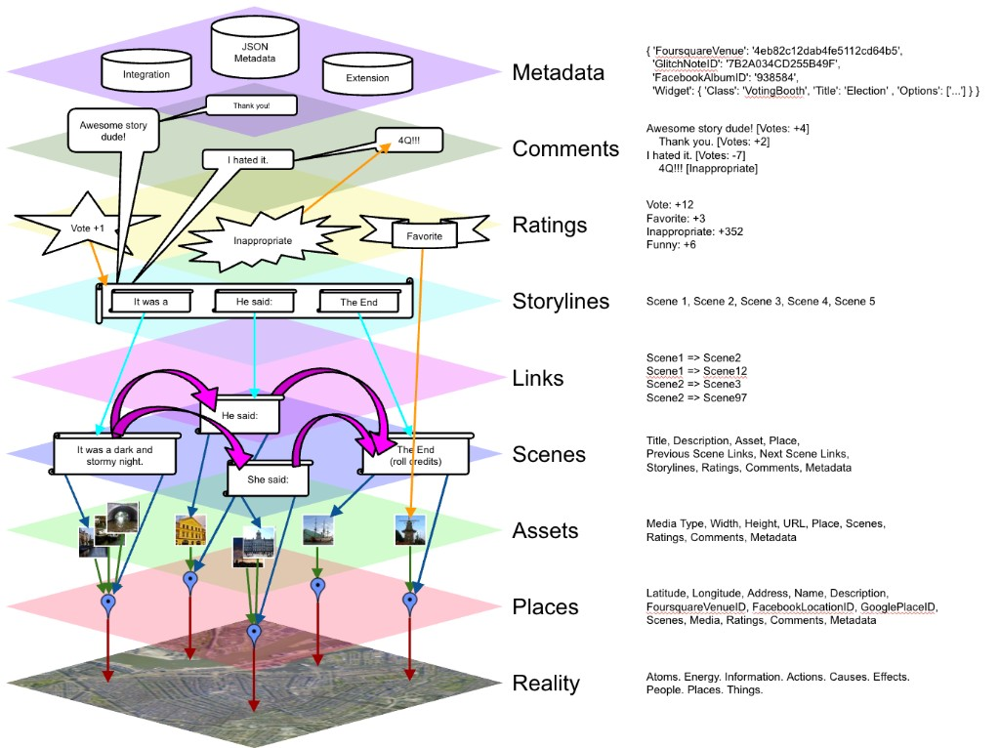

# StoryMaker — Architectural Overview

**Status:** Historical design (Stupid Fun Club, ~2010–2011)
**Revival:** [family-album-as-storymaker.md](../family-album-as-storymaker.md) — same graph primitives in Micropolis Home
**Companion:** [maxis-ea-shutdown-hn-2015.md](../maxis-ea-shutdown-hn-2015.md) · [phoneloper-sfc-speech-toy.md](../phoneloper-sfc-speech-toy.md)

> **StoryMaker: An Open, Collaborative, Geo-Social Narrative Engine** — SFC slides by Don Hopkins.

---

## Diagram



*StoryMaker: Architectural Overview.* Layers (bottom to top): **Reality** → **Places** → **Assets** → **Scenes** → **Links** → **Storylines** → **Ratings** → **Comments** → **Metadata**.

---

## Branching story structure

Stories are told with **Scenes**.

Each scene may be followed by any number of other possible scenes. Scenes form a **branching tree of possibilities**.

**Storylines** are sequences of scenes. A storyline is a sequential walk through the tree of branching possibilities.

---

## Layer reference (from SFC slides)

### Reality

What more can be said about reality that hasn't already been said?

Atoms. Energy. Information. Actions. Causes. Effects. People. Places. Things.

### Places

Places represent a location on the map of the Earth. Latitude, longitude, optional address, references to associate them to other databases of places (Foursquare Venues, Google Places, Facebook Locations, etc.). Also elevation and layer name (not currently used). Places could refer to other and virtual worlds — the Moon, Mars, Minecraft maps, Glitch streets, etc. Users may rate and comment on places. Places have a list of scenes and assets that refer to them.

### Assets

Assets represent media like pictures (and eventually video, audio, etc.). An asset may be referred to by zero or more scenes. Assets may have an optional location. The system renders icons, thumbnails and atlases for previewing and level-of-detail management. Users may rate and comment on assets.

### Scenes

Scenes have a text title and description (title not currently used or exposed; may be useful later). Scenes can be rated and commented on. Scenes can have zero or more media assets (currently only one). Scenes can have an optional place. Scenes have zero or more incoming and outgoing links to other scenes. Scenes have a list of zero or more storylines (and index within the storyline) in which they occur.

Example beats from the diagram: *It was a dark and stormy night.* · *He said:* · *She said:* · *The End (roll credits)*

### Links

Links connect scenes. A link has a "from" scene and a "to" scene; scenes can have any number of incoming and outgoing links. The graph is arbitrary — loops are possible.

Examples: `Scene1 => Scene2` · `Scene1 => Scene12` · `Scene2 => Scene3` · `Scene2 => Scene97`

### Storylines

Storylines list a sequence of scenes. A storyline can represent a possible walk through the scene graph, but adjacent scenes in a storyline don't necessarily have to be linked in the graph. A storyline can be submitted to create links between subsequent frames. Success may be subject to constraints: privacy permissions, editorial controls, sandbox state, storyline length limits, etc. Users can rate and comment on storylines. Storylines can have title and description (not currently used or exposed).

Example: Scene 1, Scene 2, Scene 3, Scene 4, Scene 5

### Ratings

Everything can have ratings. Ratings have user-adjustable parameters (numeric values, text descriptions). Many rating types: voting, reporting inappropriate content, flagging favorites, tagging content.

Example tallies from the diagram: Vote +12 · Favorite +3 · Inappropriate +352 · Funny +6

### Comments

Everything can have comments, including comments on comments — a discussion tree. Comments can have ratings too.

Examples: *Awesome story dude! [Votes: +4]* · *Thank you. [Votes: +2]* · *I hated it. [Votes: -7]* · *4Q!!! [Inappropriate]*

### Metadata

Everything can have metadata: structured JSON (arrays, dictionaries, numbers, strings, booleans). Useful for integrating with outside systems (external identifiers) and extending objects (persisting parameters for embedded widgets, games, and special-purpose presentations and editors).

Example from the diagram:

```json
{
  "FoursquareVenue": "4eb82c12dab4fe5112cd64b5",
  "GlitchNoteID": "7B2A034CD255B49F",
  "FacebookAlbumID": "938584",
  "Widget": {
    "Class": "VotingBooth",
    "Title": "Election",
    "Options": ["..."]
  }
}
```

Integration / JSON Metadata / Extension cylinders in the diagram label the three metadata channels.

---

## Relation to MicropolisCore

| SFC StoryMaker | Micropolis Home revival |
|---|---|
| Scene graph + storylines | [family-album-as-storymaker.md](../family-album-as-storymaker.md) `scene.yml` / `storyline.yml` |
| Places (geo + virtual) | `place.yml` — lot, geo, fictional, micropolis-zone |
| Ratings + comments | Append-only `vote.yml` / `comment.yml` |
| Metadata / widgets | Scene `source` + embedded widgets; federation via git |
| Pie-menu + map + road views | Five navigation views (Map / Road / Pie / Album / Branching Story) |
| Bar Karma / Urban Safari | [designing-inward-miyamoto-principles.md](../designing-inward-miyamoto-principles.md) lineage |

---

## References

- [family-album-as-storymaker.md](../family-album-as-storymaker.md)
- [federation-peer-games.md](../federation-peer-games.md) — Bar Karma / StoryMaker / Urban Safari
- [playable-pie-publishing-cauldron/GATHERING.md](../playable-pie-publishing-cauldron/GATHERING.md) — MediaGraph / iLoci map editing lineage
