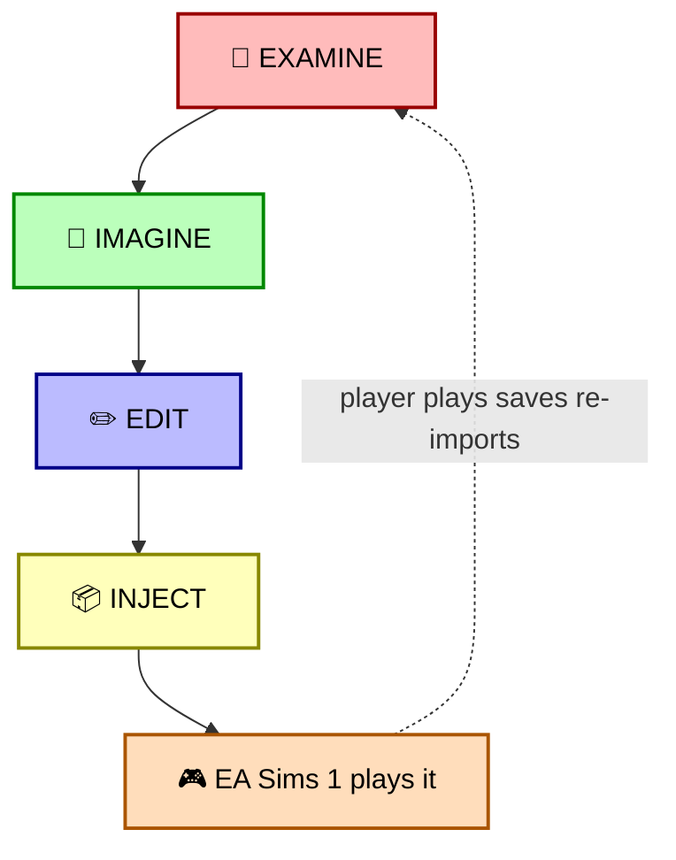

# The Imagine Loop: LLM-as-Simulator for The Sims

## Examine → Imagine → Edit → Inject — without reimplementing the runtime

**Status:** Active design  
**Monorepo:** MicropolisCore  
**Companion documents:** [simopolis.md](simopolis.md) · [moollm-microworld-os.md](moollm-microworld-os.md) · [the-computer-as-portal.md](the-computer-as-portal.md) · [the-tornado-and-the-archives.md](the-tornado-and-the-archives.md) · [family-album-as-storymaker.md](family-album-as-storymaker.md) · [simopolis-uplift-roadmap.md](simopolis-uplift-roadmap.md)

> **Trademark notice.** *Micropolis* is used under license from Micropolis GmbH. *SimCity* and *The Sims* are EA Inc. trademarks; references are historical or made in this project's role as a *companion* to the EA-published Sims Legacy Collection. No affiliation with or endorsement by EA or Micropolis GmbH is implied.

> **Scope.** Imagine Loop is a narrative-simulation companion; it produces valid `.iff` save files; the Sims engine remains the runtime. See [simopolis.md → Scope and intent](simopolis.md#scope-and-intent) for the canonical positioning.

---

## The big idea, in one paragraph

We do not need to reimplement The Sims simulator. Far more exciting: **let an LLM EXAMINE the state of the world** (house, people, objects, relationships, history) parsed from a real save file, **IMAGINE** what might happen — at whatever timescale and under whatever rules, constraints, or cheats the player chooses — **EDIT the high-level YAML representations** to reflect the imagined outcome, **RETAIN the narrative** in those representations (mind-mirror nuance, YAML Jazz comments, family album pages, generated or WebGPU-rendered images), **COMPILE the YAML back down into a valid `.iff` save file**, and **INJECT it into the player's EA-published game so the official Sims simulator can take it from there**. The LLM is the *narrator the Sims never had* — not the *simulator the Sims already is*. The two roles complement each other; they do not compete.

This is the **Imagine Loop**. It is the single most important architectural commitment in the whole Simopolis design after the trademark scope statement.

---

## Why this is dramatically better than reimplementing the Sims engine

The instinctive ask, when someone hears "Sims content tools with an LLM," is: *write a Sims clone in the browser, hook the LLM into the motive engine, have the AI play the game.* Don't.

| Approach | What it requires | What it gives you | Failure modes |
|---|---|---|---|
| Reimplement the Sims simulator | Port SimAntics VM, motive system, BHAV interpreter, animation system, routing — into a browser. Years. Legal exposure (Maxis runtime is EA's). | A second-rate copy of a game EA already sells on Steam. | Engine drift; subtle behavioral differences; trademark/copyright fights; competitive product with EA. |
| LLM drives a real Sims runtime | A way to make the EA game accept LLM input mid-play. Mostly impossible without modding the EA binary. | Live LLM-driven Sims gameplay. | Modding the EA binary; instability; not a thing the EA game supports. |
| **The Imagine Loop *(this)*** | A parser that reads `.iff`. A YAML representation. An LLM that edits the YAML coherently. A writer that emits `.iff`. **All of which we already have or will have by Phase 0.** | Narrative simulation at any timescale, what-if branching, retroactive backstory, dream sequences, multi-generation arcs — *and* the result is a save file the player loads into the EA-published Sims 1 (which runs the moment-to-moment simulation natively). | None of the above. The only constraint is "must emit valid `.iff` the game accepts," and we already write to that constraint in `packages/sims-io`. |

Every reason to reimplement disappears under closer inspection. Every reason to use the Imagine Loop is structural.

### What the LLM can simulate that the Sims engine genuinely can't (or does poorly)

The Sims engine excels at moment-to-moment motive-driven simulation. It is terrible at, or simply does not support:

| What | Engine capability | Imagine-Loop capability |
|---|---|---|
| **Long time skips ("ten years pass")** | None. Game time advances at one of three speeds. | Trivial. LLM narrates a decade of household events; outputs final state. |
| **What-if branching** | None. Save/reload approximates this clumsily. | Native. Fork a household, imagine the divergent timeline, keep both, merge later. |
| **Retroactive backstory** | None. New families start with empty memories. | Native. Generate a coherent backstory consistent with current trait values. |
| **Dream sequences / POV imagination** | None. Sims dream icons are decorative. | Native. Generate a Family Album page that *is* the dream, hand it back as content. |
| **Multi-generation inheritance arcs** | The engine has aging; it has no coherent inheritance of *narrative*. | Native. Grandchild inherits mind-mirror traits + family memories from grandparent's `CHARACTER.yml`. |
| **Cross-household plotting** | Limited. Each household sims independently. | Native. LLM holds multiple households in one Speed-of-Light context and synchronizes events between them. |
| **Cheats with narrative justification** | Cheat codes exist but flatten narrative. | The cheat *is* a narrative event ("a windfall," "a long-lost relative," "a fire that took everything"). The YAML records why. |
| **Coherent memories of off-screen events** | The Sims has memories but only of in-game events. | The Sims comes home knowing what happened while it was away in MOOLLM, with album pages to prove it. |
| **Style transfer / re-renders** | None. Sprites are fixed. | Image-gen regenerates skins, paintings, album photos in any style, palette-quantized back to SPR2. |

These are not minor edge cases. They are the *long-narrative* dimensions of household simulation that the original Sims engine was never designed to express. The Imagine Loop makes them computable for the first time, while keeping the EA-published game as the moment-to-moment runtime.

This is also why it is fundamentally EA-friendly: it produces **more reasons to launch the EA-sold game more often**, not fewer.

---

## The four stages



| Stage | What it does |
|---|---|
| 🔬 **EXAMINE** | Parse `.iff` via `packages/sims-io`; surface as typed YAML |
| 🧠 **IMAGINE** | LLM Speed-of-Light call with the household as a society; narrative outcome |
| ✏️ **EDIT** | Write back YAML: traits, `mind_mirror`, memories, family events |
| 📦 **INJECT** | Compile YAML → `.iff` via the L3 setters + generated album pages |
| 🎮 **EA Sims 1 plays it** | The Legacy Collection plays the result. *The runtime is theirs, the save state is ours.* |
| ⟲ Round-trip | Player plays, saves, re-imports into Micropolis Home → back to EXAMINE |

Each stage is a well-defined transform with a strict invariant.

### Stage 1 — EXAMINE: `.iff` → typed YAML

This is `packages/sims-io` L0–L3 *as it exists today*. We already do this end-to-end:

```ts
const tree = await VirtualTree.create({ providers: [provider] });
const neighborhood = await readNeighborhoodFromTree(tree, 'Neighborhood.iff');
// neighborhood.families: FamilyData[]
// neighborhood.neighbors: Neighbour[]  (incl. PersonData[88])
// neighborhood.resolved: ResolvedFamily[]
```

The L4 `uplift()` function in [the worked example](moollm-microworld-os.md#a-worked-example-dropping-in-pleasantviewiff) then converts each Sim to a `CHARACTER.yml`. The output of EXAMINE is a directory of YAML files representing the *entire current state* of the household: traits, relationships, gold, jobs, lot layout, recent in-game events. Plus the family album so far.

```yaml
# out/snapshot/CHARACTER.yml (one per Sim)
character:
  name: "Bella Goth"
  sims_traits: { nice: 3, outgoing: 9, active: 7, playful: 5, neat: 1 }
  mind_mirror: { … }
  skills: { cooking: 8, charisma: 6, … }
  relationships:
    mortimer-goth: { lifetime: -45, daily: -12 }
    cassandra-goth: { lifetime: 78, daily: 31 }
  gold: 23400
  job: { track: 6, level: 5 }
  memories:
    - "The kitchen fire of '04"
  recent_events:
    - { day: 12, type: 'kitchen_fire' }
```

The EXAMINE output is the *full* current state, deterministic, round-trippable. No information loss versus the binary save (the source-of-truth `.iff` is preserved in `provenance`).

### Stage 2 — IMAGINE: the LLM is the narrator the Sims never had

The LLM reads the EXAMINE output. The whole household enters one Speed-of-Light context (see [moollm-microworld-os.md → Speed of Light](moollm-microworld-os.md#speed-of-light-why-this-isnt-an-ai-npc-architecture)). The user provides an *intent*: a timescale, a constraint, a cheat, a what-if, a scenario, a dream.

```yaml
# user-intent.yml
intent: "Five years pass. Cassandra goes to college, becomes a scientist.
         Bella and Mortimer reconcile but it is fragile. The kitchen fire
         is finally drywall-and-paint forgiven, but not forgotten.
         New family member: Alexander, age 4 at end of skip.
         Constraint: household funds remain plausible — no windfall.
         Cheat: Bella's career advances faster than the engine would allow.
         Style: literary, not soap-opera."
```

The LLM, with all character `CHARACTER.yml`s in shared context, *narrates* the five years. It outputs:

- **New trait values** (Cassandra's intelligence climbs, Bella's mind-mirror `worldly` ticks up, Mortimer's `proud` softens by 1).
- **New relationships** (Cassandra meets a roommate; Alexander is born; a deceased grandparent enters memory as `historical`).
- **New skills** (Cassandra's logic skill maxes; Bella's cooking finally reaches 10).
- **New memories** with YAML Jazz comments preserving voice: *"the day Cassandra brought home a meteorite she'd cataloged."*
- **A Family Album page** for each significant event, captioned in the household's voice, image-gen-or-WebGPU rendered.
- **A revised lot layout** if appropriate (new bedroom for Alexander; the study becomes a nursery for two years and then a study again).

Speed-of-Light keeps the whole household in one LLM call so the narrative is internally consistent — no "Cassandra in the kitchen at midnight" turn coexisting with "Cassandra at college finals" turn from a different call.

The IMAGINE stage is also where the **society-of-mind** architecture pays off. Each Sim's `CHARACTER.yml` is read as an agent in the shared workspace. They react to each other. The LLM doesn't tell a story *about* them; it tells the story *as* the society they form. See [moollm-microworld-os.md → Society of Mind](moollm-microworld-os.md#society-of-mind-the-architecture-under-the-architecture).

### Stage 3 — EDIT: write back to YAML coherently

The LLM's narrative output is structured. It is not free-text. Specifically:

- It produces **diff-shaped output** per character (which fields to change, by how much, with which comment).
- It produces **album page descriptors** (text + image prompt + provenance — image-gen happens here).
- It produces **family events** with type tags (`birth`, `death`, `move`, `promote`, `marry`, `divorce`, `friendship`, `fire`, `windfall`, `loss`).
- It produces **invariants it claims to have preserved** (e.g. "funds in plausible range," "no character's mind-mirror moved by more than ±2 in five years") which a validator can check.

A small TypeScript module — `packages/sims-io/src/l5/imagine-apply.ts` — applies the diffs to the YAML files. Each file is written with provenance:

```yaml
character:
  name: "Cassandra Goth"
  sims_traits: { nice: 6, outgoing: 5, active: 7, playful: 4, neat: 7 }
  mind_mirror:
    mental_abilities:
      creative: 7         # Five years at university.
      innovative: 6       # Her thesis on meteorite mineralogy.
  skills: { logic: 10, cooking: 4, body: 6, mechanical: 5 }
  memories:
    - day: 312
      event: "Brought home a meteorite she'd cataloged."
      mood_effect: "+2 proud, +1 confident"
      album_page: family-album/cassandra-meteorite.yml
  provenance:
    imagined_by: openai-gpt-5.5-medium
    intent_ref: ./user-intent.yml
    imagined_at: "2026-05-23T16:30:00+02:00"
    invariants_claimed:
      - "mind_mirror_delta <= 2 over the period"
      - "household_funds within ±30%"
```

### Stage 4 — INJECT: YAML → `.iff` → loaded into the EA game

The compiler runs the YAML through the *inverse* of the EXAMINE pipeline:

- Each character's trait/skill/job fields are written back into PersonData via the L3 setters that already exist in `packages/sims-io` (Phase 0 work).
- New family members get new PersonData arrays and Neighbor records.
- Lot architecture changes get written into the lot IFF (Phase 2 work).
- Generated Family Album pages get composed into a custom *pageable album book* IFF object via the Adventure Compiler pattern (see [the-computer-as-portal.md → Foreign Photo Album](the-computer-as-portal.md#4-the-photo-album-with-foreign-pages)).
- The result is a new `Neighborhood.iff` (or a delta against the original) the player drops into their EA Sims 1 install.

**The EA-published Sims 1 plays the result normally.** No modding. No code injection. The save file is just a save file. The custom album book is just a custom object. Both use documented Maxis mechanisms.

The player launches their game. Five years have passed. Cassandra is a scientist. Alexander is a small child. The kitchen has been remodeled (the smoke damage finally addressed). A book on the shelf contains the five years' Family Album, in 20 languages. The Sim picks up where the engine left off, simulating moment-to-moment what happens *next* with all the engine's native fidelity.

---

## The validity constraint: what makes this work

The whole loop only earns its keep if the OUTPUT is a valid save file the EA-published game accepts unchanged. That constraint is what differentiates the Imagine Loop from "an LLM hallucinating about The Sims."

Concretely:

| Invariant | How we enforce it |
|---|---|
| Every PersonData field in valid range | Schema validators in `packages/sims-io/src/l3/person-data.ts` (already exist) |
| GUIDs do not collide | The existing GUID-collision scanner ([packages/vitamoo/vitamoo/io/guid-collision.ts](../../packages/vitamoo/vitamoo/io/guid-collision.ts)) runs over each emitted IFF |
| Relationships are mutually consistent | A second pass validates: if A→B is "spouse" then B→A is "spouse"; if A→B lifetime is positive, B→A is correlated |
| Lot/family/zone references resolve | Cross-table scan as a final compile step |
| Round-trip determinism | The new `.iff` parses back through the same L0–L3 pipeline and matches the YAML; otherwise the compile fails |
| Memory references resolve | If a memory references an album page, the album page exists; if it references a Sim by ID, that Sim exists |
| LLM-claimed invariants hold | Each invariant the LLM asserted ("funds within ±30%") is checked against the actual diff. Failed invariants block the compile and ask the LLM to revise. |

The loop has a **"valid or revise"** discipline: if the LLM's IMAGINE output doesn't produce a valid INJECT, the compiler hands the LLM the failure and asks for a corrected diff. This is the Coherence Engine framing applied at the file-format level: the LLM produces a coherent perspective *constrained by the substrate's invariants*. The substrate is the IFF format and the documented Sims save schema.

This is also why we are not running The Sims simulation: **the validation is shape, not behavior**. We don't need to know that "if Bella's hunger is 0, she will go cook" (that's behavior — the engine knows it). We only need to know that "Bella's hunger is in the range -100..100" (that's shape — we know it).

---

## Rendering the narrative: Family Album pages

Every imagined event optionally produces a Family Album page. The page has:

```yaml
# family-album/cassandra-meteorite.yml
page:
  caption_en: "Cassandra came home with a meteorite she'd been cataloging since spring."
  caption_de: …  # 20 languages, auto-internationalized
  household: goth
  household_member: cassandra-goth
  day_in_household_calendar: 312
  source_event: { type: skill_milestone, skill: logic, value: 10 }
  image:
    method: webgpu   # or: imagegen, hybrid
    prompt: "Cassandra Goth at a study desk, meteorite on a velvet cloth, lamplight, 1990s PC visible, color palette muted greens and browns, painterly style consistent with Sims 1 album screenshots."
    palette_constraint: sims-1-album-palette
    render_target: spr2_album_page
```

Two rendering paths, picked per-page:

1. **Image-gen** — call an external image generator with the structured prompt. Result is a PNG. Palette-quantize to the Sims-1 album palette via the SPR2 writer (Phase 1C). Embed.
2. **WebGPU procedural render** — use `packages/mooshow` to render the actual Sims characters (the L4 `ContentIndex` was built for this) in a stage configured to mimic the source-event scene. The result is a "real" Sims screenshot, not a generated one. Same palette path.

Either output is structurally identical: an SPR2-quantized PNG that goes into a pageable album book IFF that the EA Sims 1 displays through documented mechanisms.

The two paths are not exclusive. A *hybrid* page renders the actor characters via WebGPU and uses image-gen for the background. The chooser is per-page metadata.

---

## Use cases (concrete)

### A. Five-year time skip

> "Skip ahead five Sim years for the Goth household. Keep it plausible. No major catastrophes."

Single LLM call. Output: revised state for all members, ~30–50 album pages, possibly one or two new family members. INJECT produces a new save. Player launches the EA Sims 1; the Goths are five years older with five years of memories.

### B. What-if branching

> "What if Bella had married Don Lothario in 2003 instead of Mortimer? Fork the household; keep the original; play forward five years."

Two LLM calls (one per branch) or one call producing both branches in shared context. Two INJECT outputs. The player can install either, or both as separate neighborhoods.

### C. Retroactive backstory

> "Cassandra's traits and skills suggest a particular childhood. Generate a plausible 0–13 timeline that lands at her current state."

LLM produces a backstory consistent with current data. Result is an additional Family Album appended to Cassandra's record, with imagined photos. PersonData remains current; the *past* is the new content.

### D. Cheat mode with narrative justification

> "Bella needs §50,000 immediately. Justify it narratively. No deus ex machina."

LLM might produce: *Bella's late great-aunt's estate finally cleared probate*. The family album gets a page about the great-aunt (image-gen of an old photograph). Funds rise. The narrative explains the rise. The Sims engine, when the player launches, sees the gold and the game proceeds.

### E. Dream sequence

> "Bella's dream tonight: that the kitchen fire never happened."

The LLM produces an alternate-reality album page from Bella's POV. The page goes into her *personal* album, marked `dream: true`. No state changes. The Sims engine plays normally; the dream is a souvenir.

### F. Multi-generation inheritance arc

> "Three generations forward. Cassandra has kids; her kids have kids. Each generation inherits some mind-mirror traits and family memories."

The Imagine Loop runs three times in sequence (or once with three sub-narratives in one call). Output: nine to fifteen characters, a multi-generation `Neighborhood.iff`, three Family Albums, an inheritance graph. Player installs.

### G. Cross-household plotting

> "The Goths and the Pleasants are next-door neighbors. Generate a year of inter-household interactions: friendships, rivalries, a wedding."

Both households in shared LLM context. The output edits both households' YAMLs; both `Neighborhood.iff`s are written; events appear in both family albums. Engine plays normally.

### H. Living-author-respecting biography

> "Recover the [name]-album from archive.org; generate a coherent five-year arc that matches the album's tone."

The Tornado-recovered album seeds the LLM; the imagined arc is the contemporary narrative the original author *might* have written. Respecting living-person policy (see [the-tornado-and-the-archives.md → Ethics](the-tornado-and-the-archives.md#ethics)): if real people are depicted, the LLM operates under the recovered mode's framing constraints and never makes individual predictions about the real referents.

### I. Off-screen job & school narration (the rabbit-hole problem, solved)

> "Bella's at the office (Politics, level 5). Tell me what happened today."  
> "Alexander's at elementary school. What did he do?"

The Sims has always had a *rabbit-hole problem*: the carpool picks Sims up, they vanish for hours, they come back with a promotion or a demotion or a skill bump — but the player has no narrative for what actually happened off-screen. The Sims 2 added chance cards as a partial fix; The Sims 3 made the rabbit holes literal; none of them ever *showed* what happened in the office or the classroom.

The Imagine Loop fills the hole. Each off-screen workday or schoolday is a small IMAGINE call with the character's current job/school context, their personality, their recent in-game events, and any career-relevant relationships in scope. Output: a generated image + a caption written in the household's voice, appended to the Family Album. Two examples:

- *"Bella narrowly avoided a kitchen-fire-related ethics inquiry at the office today. Cassandra Pleasant from Accounting was sympathetic. There was burnt coffee at the meeting."*
- *"Alexander made a friend named Beatrice today. They traded sandwiches. His sandwich was better. He has decided he will be a chef."*

These are content-only artifacts — they do not alter PersonData beyond what the engine's own promotion/skill mechanics already do. They are *narrative coverage* of in-game time that was previously opaque. The pages compile into pageable Family Album books (the same mechanism as [§4 Foreign Photo Album](the-computer-as-portal.md#4-the-photo-album-with-foreign-pages)) that show up on the Sim's bookshelf when they come home. The player picks up the book, pages through, finds out what happened.

This is one of the most player-visible uses of the loop — the kind of thing where someone launches their EA Sims 1 specifically *to see what Bella did at work today*. Auto-internationalized into 20 languages on compile, like every other STR# in the pipeline.

### J. Branching and merging Family Album narratives (Bar Karma / Urban Safari / StoryMaker lineage)

> *"Two authors. One shared character. One geo-pin. Three storylines that fork, cross, and merge."*

The Imagine Loop produces single-author single-household state transitions. The [family-album-as-storymaker.md](family-album-as-storymaker.md) design extends the output into a **branching, merging, geo-tagged graph of scenes** — every scene from every Imagine call is a node, and authors can cross-link, branch, vote, and curate storylines through each other's scenes, in the lineage of Will Wright, Don Hopkins, and the Stupid Fun Club's 2010–11 [Bar Karma](https://en.wikipedia.org/wiki/Bar_Karma), [StoryMaker](https://www.youtube.com/watch?v=Db8KGNoeKHE), [Urban Safari](https://www.youtube.com/watch?v=Db8KGNoeKHE), [MediaGraph](https://www.youtube.com/watch?v=ywNwBLkVB3Q), and [iLoci](https://www.youtube.com/watch?v=qXEXp_NJpQg) prototypes.

For the Imagine Loop specifically, the network shape unlocks two new call patterns:

- **Multi-author shared context.** When author A's Imagine call references a scene from author B's published graph (e.g. "Cassandra is at university with Beatrice Pleasant — see scene-X by author B"), the cited scenes enter the Speed-of-Light context. The narrative produced is consistent with B's prior canon, automatically, because B's canon was *read* by the LLM, not paraphrased.
- **Cross-household character DNA.** Author B's published `character_snippet` (Cassandra's `CHARACTER.yml` + per-scene PersonData) can be loaded into author A's Dream space via the Bifrost merge, with full provenance. Author A's Imagine Loop can then *imagine forward* a household containing Cassandra; the resulting scenes are tagged `character-derived-from: scene-X-by-author-B`, and every storyline that uses them carries the credit.

Mechanically, this turns each Imagine call's output from "a chain of scenes appended to one author's album" into "a chain of scenes added to the community graph, linked to whatever prior scenes the call referenced." The validity invariants ([§ The validity constraint](#the-validity-constraint-what-makes-this-work)) extend with two more checks, both implemented by `packages/family-album/`: *referenced scenes resolve in the graph*, and *cited character snippets carry permission-to-repurpose grants compatible with the new use*.

See [family-album-as-storymaker.md](family-album-as-storymaker.md) for the full graph design, the five navigation views (Map / Road / Pie-menu / Album / Branching-Story), the DNA semantics, and the federation model (git-remote, optionally backed by a discovery server). This use case is the *narrative-loop end* of that design; the StoryMaker doc is the *graph end*.

---

## What makes this *Imagine* and not *Simulate*

The terminology matters. We say IMAGINE deliberately, not SIMULATE. The reasons are structural:

| Word | What it implies |
|---|---|
| **Simulate** | Run rules forward in time to produce an outcome. Deterministic given the rules. The Sims engine simulates. |
| **Imagine** | Generate a coherent narrative consistent with constraints. Not deterministic. Not rules-based. Aesthetic + intentful. |

The Imagine Loop **does not run the Sims rules forward**. It does not compute motive decay. It does not score advertisements. It does not interpret BHAVs. It does not route Sims around furniture. *The EA engine does all of that, when the save file gets loaded.*

What the loop does is **narratively coherent state transformation**: starting from a valid state, produce another valid state that the *story* says happened in between, with the story written down.

The two activities are dual:

> **Simulation produces a state trajectory from rules. Imagination produces a state trajectory from intent. Both end at valid states.** The Sims engine does the first. The Imagine Loop does the second. The save file is the handoff between them.

The cellular-automatist framing (see [moollm-microworld-os.md → The cellular-automatist reading](moollm-microworld-os.md#the-cellular-automatist-reading)) makes this precise: a CA's update rule generates a state trajectory deterministically; an LLM's narrative generates a state trajectory intentionally. Both produce trajectories of metastable patterns. The Sims (CA-ish) and Imagine (LLM-narrative) substrates are compatible *because they both terminate at valid file-shaped states*.

---

## Where this fits in the substrate

```
┌─────────────────────────────────────────────────────────────────────────┐
│                                                                         │
│  Micropolis City                          Micropolis Home               │
│  (apps/micropolis/, GPL Micropolis        (apps/micropolis-home/,       │
│   engine, runs here)                       a.k.a. apps/simopolis/       │
│                                            during transition)           │
│                                                                         │
│  ┌───────────────────────┐                ┌────────────────────────────┐│
│  │ CA-based              │                │ EXAMINE → IMAGINE → EDIT   ││
│  │ city simulation       │                │ Adventure Compiler         ││
│  │ runs in-app           │                │ Uplifted Computer authoring││
│  └───────────────────────┘                │ Family Album server        ││
│                                           │ Archive Tornado            ││
│                                           └────────────┬───────────────┘│
│                                                        │                 │
└─────────────────────────────────────────────────────────────────────────┘
                                                         │
                                              compiles to│
                                              .iff files │
                                                         ▼
                                   ┌──────────────────────────────────────┐
                                   │  EA Sims 1 (Legacy Collection)       │
                                   │  on Steam — owned and played by      │
                                   │  the user, runs Maxis simulation     │
                                   │  ON the .iff we produced.            │
                                   └──────────────────────────────────────┘
```

Three apps. Two trademark-safe names. One vision (Simopolis as the umbrella concept). Each app's role is distinct.

- **Micropolis City** (`apps/micropolis/`) is the city simulation. It runs the GPL Micropolis engine. It is the visible Micropolis-side of the two-resolution world.
- **Micropolis Home** (planned `apps/micropolis-home/`, currently scoped as `apps/simopolis/` in earlier docs) is the Sims content tool. It is where the EXAMINE → IMAGINE → EDIT → INJECT loop runs. It hosts the Adventure Compiler, the Family Album server, the Uplifted Computer authoring UI, and the recovered-archive viewer.
- **EA Sims 1 (Legacy Collection on Steam)** runs the actual Sims simulation. The user's purchase, the user's runtime, the user's data, our content.

The naming clarification is significant for legal positioning: *Micropolis City* and *Micropolis Home* both use the trademark we have licensed (Micropolis GmbH); neither uses the trademark we do not (Sims, EA). Where earlier docs say *apps/simopolis*, the intent is to migrate to *apps/micropolis-home* as the production name. *Simopolis* persists as the umbrella codename and as the literary reference (per Marusek's *Wedding Album*).

---

## Implementation outline

The Imagine Loop is mostly composition of pieces that already exist or are in progress:

| # | Task | Where | Depends on |
|---|---|---|---|
| L.1 | `examine(neighborhood: NeighborhoodData) → ExamineSnapshot` (full structured snapshot) | `packages/sims-io/src/l5/examine.ts` | L3 (done) |
| L.2 | `intent.yml` schema + parser | `packages/sims-io/src/l5/intent.ts` | — |
| L.3 | LLM call shape for IMAGINE: prompt structure, Speed-of-Light layout, output JSON schema | MOOLLM-side skill `skills/imagine-loop/` | MOOLLM 1A.x |
| L.4 | `apply(snapshot, imagineOutput) → EditedSnapshot` | `packages/sims-io/src/l5/imagine-apply.ts` | L.1 |
| L.5 | Invariant validators: PersonData ranges, GUID collisions, relationship consistency, reference resolution | `packages/sims-io/src/l5/validate.ts` | existing validators in L3 |
| L.6 | `compile(edited) → IffBundle` (uses Phase 0 L3 setters + Phase 1C Adventure Compiler for album books) | `packages/sims-io/src/l5/compile.ts` | Phase 0 + Phase 1C |
| L.7 | "Valid-or-revise" loop: failed invariants feed back to MOOLLM for a corrected diff | `packages/sims-io/src/l5/loop.ts` | L.3, L.5 |
| L.8 | Family Album page renderer: WebGPU + image-gen paths | `packages/mooshow/src/album-render.ts` + image-gen API integration | Phase 1C |
| L.9 | Micropolis Home UI: intent input, IMAGINE preview, diff review, INJECT confirm | `apps/micropolis-home/src/routes/imagine/` | Phase 0 shell |
| L.10 | "Time-skip" preset: common time-skip intent templates pre-fillable in the UI | UI templates | L.9 |
| L.11 | "What-if" preset: branch + reconcile UX | UI templates | L.9 |
| L.12 | "Backstory" preset: generate-prior-history flow | UI templates | L.9 |

Roughly **4–6 weeks of work** in series after Phase 0 + Phase 1A complete. The Imagine Loop fits as a **Phase 1D** in the roadmap, parallelizable with Phase 1B (Family Album server) and Phase 1C (Uplifted Computer + custom IFF content).

The first vertical (1–2 weeks for the headline demo): **L.1 + L.2 + L.3 + L.4 + L.5 + L.6** = a working time-skip on a single household, producing a valid `.iff` the player loads into their EA-published Sims 1, with one Family Album book of generated pages.

---

## A worked example

User opens Micropolis Home. Drags in `Pleasantview/Neighborhood.iff` from their own EA Sims 1 install. EXAMINE produces a YAML snapshot. The UI shows: 8 families, 23 characters, 47 relationships.

User picks the Goths. UI shows the Goth household: Bella, Mortimer, Cassandra. Funds, careers, recent memories.

User clicks "Imagine forward." A small textbox. They type:

> *"Five years. Cassandra goes to college, becomes a scientist. Bella and Mortimer reconcile, fragile. New child, Alexander, born to Bella and Mortimer mid-period."*

They click "Imagine."

The UI shows progress: *"Speed-of-Light call: 3 characters in shared context, plus 1 new character, 5-year span..."* About 30–60 seconds (LLM-dependent).

The UI shows the diff:

- Cassandra: skills.logic +6, mind_mirror.creative +2, mind_mirror.worldly +2; new memories about university.
- Bella: skills.cooking +2, gold +12k (job advancement), mind_mirror.proud +1, mind_mirror.restless -1; memories about a fragile reconciliation.
- Mortimer: skills.charisma +1, mind_mirror.proud -1, mind_mirror.cheerful +1; memories about Alexander.
- Alexander (new): age 4, full PersonData generated; born in year 2; one memory of his first word.
- 28 family-album pages: image-gen previews showing what each will look like; option to switch any to WebGPU procedural render.

User clicks through the album previews. Edits one caption to be funnier. Sets one page to WebGPU render instead of image-gen.

User clicks "Apply."

INJECT: a new `Neighborhood.iff` + a custom Pageable Album Book IFF + 28 SPR2 album pages bundled in the book. Downloaded to the user's machine.

User drops the new `Neighborhood.iff` into their Sims install (the UI tells them where). Drops the album book into `Downloads/`. Launches their EA Sims 1.

Pleasantview is loaded. The Goth lot. The lights are on. Five years have passed. Cassandra is grown. Alexander is a small child. A new book is on the bookshelf. The Sim picks it up. Pages through the five years they were away.

The Sims engine, from this point, *plays normally*. Moment-to-moment motive simulation. Routing. Animation. Sound. The Maxis runtime. Our save state.

---

## Notes

- **Time-skipping has always been the missing feature** in retro Sims gameplay. Players have faked it for years. The Imagine Loop solves it without modifying the engine.
- **Family Album is the engine's narrative output**. The Imagine Loop *feeds it new content* that the engine then displays.
- **Provenance is preserved**: every imagined state carries a `provenance.imagined_by` record. Every album page carries its image source.
- The Adventure Compiler is the spiritual successor to Maxis's own Transmogrifier ([VM Design Document](https://donhopkins.com/home/TheSimsDesignDocuments/VMDesign.pdf)); the Imagine Loop is the LLM-era extension of the same authoring lineage.

---

## Failure modes and how we contain them

| Failure mode | Mitigation |
|---|---|
| LLM hallucinates non-existent characters / relationships | Diff validators in L.5 catch references that don't resolve; loop revises |
| LLM produces out-of-range PersonData | Range validators catch; loop revises |
| LLM "drifts" personality unrealistically over a long timeline | User-side invariant: LLM declares max drift per period; validator checks; loop revises |
| Image-gen produces something that breaks Sims palette | SPR2 writer quantizes to palette; if quantization quality fails a threshold, retry with WebGPU procedural render |
| User submits intent that asks for something offensive / unsafe | Representation-ethics ambient skill ([moollm-microworld-os.md → Representation Ethics](moollm-microworld-os.md#representation-ethics-activate-traditions-do-not-impersonate)); intents are filtered through it before IMAGINE |
| User's intent contradicts existing memories | LLM is given memories as immutable history; outputs cannot retcon (unless explicitly intended); validator can compare |
| Result is "boring" / "wrong tone" | UI provides preview + edit before INJECT; user can revise intent and re-imagine; no commit until user accepts |
| Long-running households accumulate too much narrative for the engine to load | Imagine outputs can be "consolidated" — earlier memories archived to `provenance/` files; current Sim memory stays under the engine's documented limits |

The "valid-or-revise" discipline at L.7 is the structural safety net: nothing reaches INJECT without passing the validators. The user has the final approval gate before any file leaves Micropolis Home for their Sims install.

---

## What MOOLLM gives the Imagine Loop

- **CHARACTER.yml as the household member representation** — the LLM is reading and writing a format already designed for this kind of edit.
- **Speed-of-Light context layout** — the whole household in one call.
- **YAML Jazz comments as narrative carriers** — the memories' flavor lives in comments, not in flat fields.
- **The Coherence Engine framing** — LLM proposes valid edits; substrate validates; only valid edits land. No ghost actions.
- **The [Adventure Compiler as LLM peer](moollm-microworld-os.md#the-adventure-compiler-is-a-coherence-engine-partner-not-a-one-shot-compiler)** — the Imagine Loop is one specific shape of the more general validate↔view↔template↔flatten loop. The IMAGINE diff round-trip is the valid-or-revise discipline scoped to a single state transition; the Adventure Compiler is the same discipline scoped to the entire authoring surface.
- **Representation-ethics ambient skill** — recovered or real-person intents are filtered through it.
- **Society-of-Mind shape** — characters react to each other in the imagined timeline because they share a context window.

See [moollm-microworld-os.md](moollm-microworld-os.md) for the full substrate.

---

## What this does *not* try to be

- It is **not** a way to play The Sims without owning The Sims.
- It is **not** a way to give the LLM continuous control of a Sim during gameplay.
- It is **not** a deterministic re-simulator that exactly reproduces what the engine would do.
- It is **not** a way to import non-Sims data and call it Sims content.
- It is **not** an attempt to predict what *real* people would do in *real* households. It operates only on Sims save data, with the representation-ethics constraints.

It is **a coherent-state transformer for valid Sims save files, intent-driven by user prompts, that produces save files the EA-published game then plays.** That sentence is the whole feature.

---

## References

### In MicropolisCore

| Resource | Where |
|---|---|
| Simopolis strategy | [simopolis.md](simopolis.md) |
| MOOLLM microworld substrate | [moollm-microworld-os.md](moollm-microworld-os.md) |
| The Computer-as-Portal (Adventure Compiler targets) | [the-computer-as-portal.md](the-computer-as-portal.md) |
| Tornado archive recovery | [the-tornado-and-the-archives.md](the-tornado-and-the-archives.md) |
| Family Album as branching/merging network (StoryMaker lineage) | [family-album-as-storymaker.md](family-album-as-storymaker.md) |
| Phased build plan | [simopolis-uplift-roadmap.md](simopolis-uplift-roadmap.md) |
| Sims I/O TypeScript (L0–L3 today, L4–L5 next) | [packages/sims-io/](../../packages/sims-io) |
| MOOLLM integration layer | [moollm-micropolis-integration.md](moollm-micropolis-integration.md) |

### External

| Resource | Where |
|---|---|
| MOOLLM Manifesto | [MOOLLM-MANIFESTO.md](https://github.com/SimHacker/moollm/blob/main/designs/MOOLLM-MANIFESTO.md) |
| MOOLLM `incarnation` skill | [skills/incarnation/](https://github.com/SimHacker/moollm/tree/main/skills/incarnation) |
| MOOLLM `mind-mirror` skill | [skills/mind-mirror/](https://github.com/SimHacker/moollm/tree/main/skills/mind-mirror) |
| MOOLLM `representation-ethics` skill | [skills/representation-ethics/](https://github.com/SimHacker/moollm/tree/main/skills/representation-ethics) |
| Sims ↔ MOOLLM field mapping (BRIDGE.md) | [external `BRIDGE.md`](https://github.com/SimHacker/moollm/blob/main/designs/sim-obliterator/BRIDGE.md) |
| SimAntics VM Design Document (Don Hopkins, Maxis) | https://donhopkins.com/home/TheSimsDesignDocuments/VMDesign.pdf |
| Will Wright, "Interfacing to Microworlds" (Stanford, 1996) | [video](https://www.youtube.com/watch?v=nsxoZXaYJSk) · [Don's notes](https://donhopkins.medium.com/designing-user-interfaces-to-simulation-games-bd7a9d81e62d) |
| David Marusek, *The Wedding Album* (1999) | [Wikipedia](https://en.wikipedia.org/wiki/The_Wedding_Album_(short_story)) |
