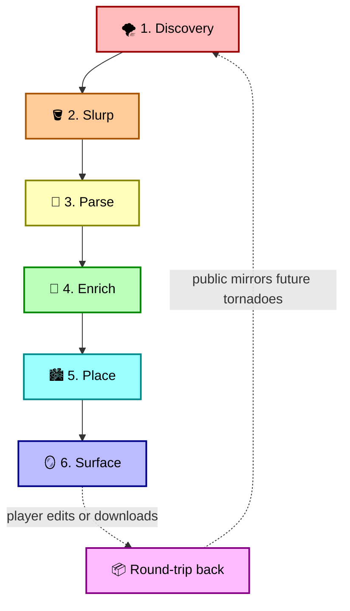
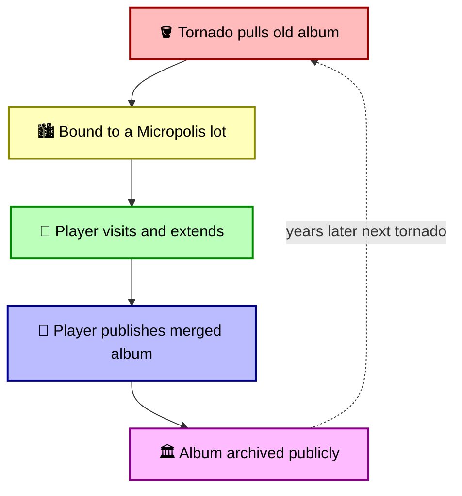

# The Tornado and the Archives

## Or: how a recovered Sims lot learns to remember twenty-five years of player stories

**Status:** Active design  
**Monorepo:** MicropolisCore  
**Companion documents:** [simopolis.md](simopolis.md) · [moollm-microworld-os.md](moollm-microworld-os.md) · [the-computer-as-portal.md](the-computer-as-portal.md) · [the-imagine-loop.md](the-imagine-loop.md) · [simopolis-uplift-roadmap.md](simopolis-uplift-roadmap.md)  
**External:** [THE-UPLIFT.md](https://github.com/SimHacker/moollm/blob/main/designs/sim-obliterator/THE-UPLIFT.md) · [BRIDGE.md](https://github.com/SimHacker/moollm/blob/main/designs/sim-obliterator/BRIDGE.md)

> **Trademark notice.** This document uses *Micropolis* under the [Micropolis Public Name License](../../MicropolisPublicNameLicense.md) from Micropolis GmbH. *SimCity* and *The Sims* are Electronic Arts Inc. trademarks; references are historical or made only in the project's role as a *companion* to the EA-published Sims Legacy Collection. No affiliation with or endorsement by EA or Micropolis GmbH is implied.

> **Scope.** Tornado is a content-discovery pipeline. Material comes from `archive.org` and other public mirrors, not from EA's servers; recovered content is player-authored (Family Albums, skins, objects, lots). See [simopolis.md → Scope and intent](simopolis.md#scope-and-intent) for the canonical positioning.

---

## The image

At city scale, a Micropolis residential **zone** is a **3×3 block of nine map tiles** — the unit the engine uses for density, demand, and aggregate population fiction (*thousands of anonymous people* across that patch). That SimCity shorthand is fine at zoom-out.

At dollhouse scale, what fills those nine cells depends on density:

- **Low density:** up to **9 single-tile lots** — one household save per occupied cell (magic 8 Sims each). Empty cells are lots for sale.
- **High density:** **one bigger building** spanning the whole 3×3 — many household saves *inside* that tower (magic 8 per floor × N floors).

You **import a recovered lot** onto **one cell** in a low-density zone, or into **one slot inside a high-rise**, not thousands of Sims into one square and not a whole `Neighborhood.iff` dumped blindly across the block. See [simopolis.md → Residential zone geometry](simopolis.md#residential-zone-geometry-always-3x3).

What if one of those empty lots held an *actual household*? Not procedurally generated. Not a placeholder. A real, hand-authored, story-bearing Sims **lot** — named family, real save file, Family Album telling the story of the people who lived there?

What if we could send a **tornado into the Internet Archive** — sweep up everything two decades of Sims players uploaded to the Sims Exchange, to Yahoo Groups, to personal Geocities-era story sites, and to all the abandoned fan sites preserved on `archive.org` — and **place recovered lots onto empty cells** in 3×3 residential zones across a Micropolis city?

What if, when a Micropolis player zooms in on **that lot**, they don't just see generic res density. They see *that 14-year-old's house from 2003*. The one whose Family Album told the story of a divorce and a kitten. The one whose author maybe still exists, somewhere, and whose characters have been frozen for two decades.

That is what this document is about.

---

## What it is, in one paragraph

A pipeline that scrapes the Internet Archive's preserved snapshots of Sims save-file and story-sharing sites; parses the recovered IFF saves, family album HTML, custom skins, and custom objects; reads them through the [packages/sims-io](../../packages/sims-io) stack; enriches the characters via the MOOLLM bridge (see [moollm-microworld-os.md](moollm-microworld-os.md)); and binds each recovered **household lot** to **one slot** in a 3×3 residential zone — one cell in a low-density block, or one apartment slot in a high-rise — with provenance metadata that points back at the archive source. When the Micropolis player zooms that lot open, they meet a real recovered family. When they zoom back out, bound households **roll up** into zone aggregate metrics for the whole 3×3 block.

This is the family-album archaeology idea from the MOOLLM repo, *upgraded* with two new things: (1) it scales from one save file to the entire surviving Sims web; (2) it grounds every recovered character in a *place* — a **lot address** on the city grid — so the city is the index, not a flat list.

---

## Why "tornado"

**The Wizard of Oz.** That's the whole image, and it should be obvious — Dorothy's farmhouse picked up off Kansas in a funnel of debris, set down in Oz, where the familiar people from home (Auntie Em, Uncle Henry, the farmhands) reappear transformed into mythical characters (Glinda, the Wicked Witch, Scarecrow, Tin Man, Lion). The adventure resolves. Dorothy clicks her heels: *there's no place like home.* She wakes up in Kansas. The data is unchanged. The relationships have shifted underneath her.

**There's no place like Micropolis Home.**

*In SimCity (Will Wright, 1989) the **Tornado** was one of the canonical disasters from day one — alongside fire, flood, earthquake, monster, plane crash, and nuclear meltdown. It crosses the map, tears up zones, picks up a few cars and buildings, leaves a trail of changed tiles, and then dissipates. Micropolis inherits the tornado from EA's GPL SimCity release. That's the in-engine, city-side manifestation of the same image. But this tornado will be able to pick up and transport across worlds and drop houses, as well as destroying them.*

The metaphor is exact: the Internet Archive is a tornado-survivable layer of the web. We point a tornado at the dead Sims sites, it picks up everything that's still loose, and it sets the contents down in our city. Some of the lifted material is intact. Some of it is fragmentary. The pieces that survive are the ones we care about.

> The tornado is also the *opposite* of "scraping" rhetorically. Scraping is dry, technical, extractive. A tornado is large, wild, and unbothered by the question of whether it should pick something up. It picks up the whole barn. That is closer to the spirit of what we want to do here. The archives are *the barn*. We are not pretending to be precise. We are catching falling boards.

### The Oz mode (an Imagine-Loop use case)

The full Wizard-of-Oz arc is also a clean [Imagine-Loop](the-imagine-loop.md) intent: pick up the household, transport them somewhere strange, transform their family / friends / neighbors into mythical or literary characters, let them have adventures together, bring them home. The PersonData on disk is unchanged when they return; the YAML Jazz comments, the memories, and the relationship feelings shift. The same Bella, the same Mortimer, the same Cassandra — only now Bella has been the Tin Man, Mortimer has been the Scarecrow, Cassandra has been the Lion. The lot is the same. The ground has moved.

See the [Imagine-Loop use cases](the-imagine-loop.md#use-cases-concrete): household → Oz arc → household-back, with a Family Album book on the shelf containing the trip.

---

## The sources (what the tornado picks up)

The Sims web in 2000–2010 was the first mass user-generated content platform for a single-player game. Many sites are dead and only partially preserved on `archive.org`. Some are still live — typically as paid / subscription businesses — and those are *out of scope* for the tornado: players who want their content go to the live site and pay.

### Contemporary record (May 2001): Will Wright on the scale

About a year after The Sims shipped, Will Wright sat for a TechTV (later G4) interview about the custom-content community. He gave concrete numbers and the framing that the rest of this document inherits. The full video is well worth watching — [*Will Wright on Custom Content Community* — LUCPIX upload of the 2001-05-01 TechTV broadcast](https://www.youtube.com/watch?v=hLHnmRtqNno). The key facts and quotes:

| Wright's claim (May 2001) | Bearing on this doc |
|---|---|
| *"sold close to four million copies"* | The audience size. By 2001-05 the user base was already in the millions. |
| *"over 200 websites in 14 languages"* dedicated to The Sims | The shape of the surviving long tail. Many of those sites are exactly what the tornado has to recover from `archive.org`. |
| Player-uploaded stories to thesims.com *"at a rate of about a hundred a day"* | Order-of-magnitude estimate for Family-Album volume on the official Exchange alone. |
| Fan-created content vs. Maxis-created content ratio *"probably about a nine to one"* | Most of what's worth recovering was authored by *players*, not by EA. The tornado is bringing back community work, not republishing EA assets. |
| The community is *"like an ecology … tool makers … content artists … mainstream sites … other sites reporting upon the activities of all these other layers"* | The same multi-tier ecology framing the [Ecosystem, Not the Killer App](simopolis.md#the-ecosystem-not-the-killer-app) section uses. Wright called it an ecology in 2001; we still call it one in 2026. |
| Specific sites named on-air: **Seven Deadly Sims**, **The Sims Resource** (*"a superstore of custom skins"*), **The Sims** (*"a great parody of The Onion"*), several news sites about the other fan sites | Concrete primary-source citations for sites the tornado will or won't target — Seven Deadly Sims and the Onion parody were exactly the kind of off-mainstream content most vulnerable to disappearing. |
| Specific stories told on-air: **Starbucks Sucks** (a guy ranting in 40 panels about one specific Starbucks on 47th Avenue), **the Gingerbread Family** (paranoid Mr. Gingerbread Man builds an oven trap for the molasses-cookie neighbor), **a woman documenting her sister leaving an abusive relationship** | The *kinds* of artifacts the tornado has to be ready to recover and treat with care: vernacular satire, heavy-custom-content fan stories, and intensely personal autobiographical work side-by-side, often on the same site. |

And the line that captures the whole epistemic stance:

> *"Are Sims alive?"* — *"Depends on where you're asking. In the computer, no. In a lot of people's heads, yeah, they are."*
> — Will Wright, TechTV, May 2001

### In scope: dead or abandoned, preserved by `archive.org` or out-of-band

| Source                                       | What it has                                                                                                                                                                                                                                                                                                | Status                                                                                                                          |
| -------------------------------------------- | ---------------------------------------------------------------------------------------------------------------------------------------------------------------------------------------------------------------------------------------------------------------------------------------------------------- | ------------------------------------------------------------------------------------------------------------------------------- |
| **The Sims Exchange** (`thesims.ea.com`)     | Official Family Album upload service. Will Wright in May 2001 cited *"about a hundred a day"* of newly-uploaded stories at the time — extrapolated across the Exchange's full lifespan, that's hundreds of thousands of stories. Objects, skins, and lots uploaded by the community ran roughly nine to one against Maxis's own content (also Wright, same interview). | Original server gone. Steam re-release still has upload code pointing at a dead endpoint. Heavily snapshotted in `archive.org`. |
| **Yahoo Groups (Sims-related)**              | A *large* corner of the early Sims community lived in Yahoo Groups — sharing objects, telling household stories, distributing skins. Many Groups, many messages, many file uploads.                                                                                                                          | Yahoo Groups was sunset in 2019. Archival is partial and uneven (ArchiveTeam efforts exist); content recovery here is best-effort and patchy. Worth attempting; expect gaps. |
| **Personal Sims story sites**                | Geocities-era family albums told as multi-page HTML stories, often with hand-coded layouts.                                                                                                                                                                                                                | The most vulnerable and most interesting category. Many survive only in `archive.org`.                                          |
| **Discord / Reddit / forum threads**         | Modern fan community memory. Not "save files" themselves but narrative context, identifications, attributions, and pointers to older artifacts.                                                                                                                                                            | Some accessible via APIs, some not; respect each platform's terms.                                                              |
| **Local USB sticks, drives, attic-find CDs** | Real save files in the wild — the player's own, or content they were given long ago and still have a copy of.                                                                                                                                                                                              | Out-of-band; users drop them into the app themselves. The cleanest source of all.                                               |

### Out of scope: live commercial businesses

We do not pull from sites that currently sell or subscription-gate their content. The respectful posture is to point players at the live site if they want what's there.

| Site                                       | Why it's out of scope                                                                                                              |
| ------------------------------------------ | ----------------------------------------------------------------------------------------------------------------------------------- |
| **SimSlice** (`simslice.com`)              | Live business, paid model. Not a tornado target.                                                                                   |
| **SimFreaks** (`simfreaks.com`)            | Live business, paid model. Not a tornado target.                                                                                   |
| **ZombieSims**                             | Live, paid. Not a tornado target.                                                                                                   |
| **MTS (ModTheSims), TSR (The Sims Resource), SimsZone, etc.** | Live community / mixed free + paid sites. Players go directly. Out of scope as bulk tornado targets; the tornado does not bulk-pull from running sites. |

We don't try to scrape EA itself, and we don't republish anything we shouldn't. The Internet Archive is the primary tornado target: it has decades of established practice around what is and isn't replayable, and our pipeline respects those signals (more on ethics below).

---

## What we actually pull off the wire

For each source we want, at minimum:

1. **HTML pages**: forum posts, family album pages, character descriptions, story prose.
2. **Image attachments**: family album screenshots, skin previews, custom object thumbnails.
3. **Binary downloads**: `.iff`, `.far`, `.zip`, custom skin / object / lot files.
4. **Provenance**: original URL, archive snapshot timestamp, author handle (if disclosed), site name, license declarations (rare but present).

That bundle becomes a directory under `content/simopolis/archives/<source>/<id>/`. It is *not* yet a bound lot; it is raw archived material. It looks something like this:

```
content/simopolis/archives/
  sims-exchange/
    album-00824739/
      provenance.yml        # url, snapshot timestamp, author handle, site
      page-01.html
      page-02.html
      shot-01.jpg
      shot-02.jpg
      story.txt             # extracted prose
      family-data.iff       # if a save was attached
      INDEX.yml             # what we parsed and what's missing
  geocities/
    sims-the-goth-saga/
      provenance.yml
      index.html
      pages/                # multi-page hand-coded story
      shots/
  yahoo-groups/
    sims-storytellers/
      provenance.yml
      messages/             # archived list traffic
      files/                # uploaded objects and skins, where preserved
```

The provenance file is non-negotiable. Every artifact carries it. If we cannot determine where something came from, we do not import it.

```yaml
# provenance.yml
source:
  site: sims-exchange
  archive_snapshot: "https://web.archive.org/web/20040115174822/http://thesims.ea.com/us/albums/00824739/"
  snapshot_timestamp: "2004-01-15T17:48:22Z"
original_author:
  handle: "BellaGothFan2003"
  display_name: "Bella Goth Fan"
  email: null                 # never harvested
license:
  declared: null              # most albums declared nothing
  inferred_terms: "fan content, non-commercial use"
  attribution_required: true
  takedown_policy: "honored on request, see docs/takedown.md"
content:
  artifact_type: family_album
  pages: 12
  images: 24
  has_save_attachment: false
  language: en
imported_at: "2026-05-22T13:55:00+02:00"
```

---

## The pipeline (six stages)




### Stage 1 — Discovery

We start with a list. The list lives at `content/simopolis/archives/SOURCES.yml`. Each entry has: the live URL (if any), known `archive.org` collections, expected content types, crawl politeness budget, license assumptions, and a status flag. The list is hand-maintained and PR-able. We do not auto-expand it without review.

### Stage 2 — Slurp

We pull from the Internet Archive's [Wayback Machine](https://archive.org/help/wayback_api.php) and [CDX server](https://github.com/internetarchive/wayback/blob/master/wayback-cdx-server/README.md), respecting rate limits, retries, and `robots.txt` semantics where the original site signaled. Everything lands under `content/simopolis/archives/<source>/<id>/` with `provenance.yml`. No re-publishing yet — this is local cache.

Where the original site is *still alive*, we read it directly if its terms allow it. Otherwise, archive only.

### Stage 3 — Parse

This is where MicropolisCore's existing TypeScript pipeline does the heavy lifting:

- **`.iff` save files** → [packages/sims-io](../../packages/sims-io) (L0–L3 already done). We get `NeighborhoodData` with families, neighbors, person-data arrays.
- **`.far` archives** → [packages/sims-io](../../packages/sims-io)'s L1 `VirtualTree`.
- **Custom skin and object IFFs** → SPR2 chunk extraction → PNG. (L4-ish task in `documentation/TODO.md`.)
- **HTML family album pages** → structured `story.yml` with one entry per page (image + caption + parsed prose).
- **Screenshots without captions** → optional vision pass to identify characters, rooms, objects.

The output of stage 3 is a normalized household-plus-metadata bundle that still respects everything Stage 2 captured.

### Stage 4 — Enrich (MOOLLM crosses the Bifrost)

Now MOOLLM enters. Each parsed Sim becomes a `CHARACTER.yml` per the [character skill](https://github.com/SimHacker/moollm/tree/main/skills/character) spec. The 5 sims-traits map to the `sims_traits:` block per the BRIDGE.md table. The LLM is asked to:

1. Read the family album prose for this household, if any survived.
2. Infer a Leary-style `mind_mirror:` profile that fits both the traits *and* the events documented in the album.
3. Write **YAML Jazz comments** — the lived flavor of each trait, the inner voice, the relationship history.
4. Generate `emoji_identity`, `description`, `dialogue.greetings`, `recent_memories` consistent with the source material.
5. Never invent facts about real people. The author handle of the album is *not* a character. The Sims in the album *are*.

This is the same uplift documented in [THE-UPLIFT.md](https://github.com/SimHacker/moollm/blob/main/designs/sim-obliterator/THE-UPLIFT.md), now run at scale across thousands of recovered **household lots**. Each enrichment commits to git with a reference back to its `provenance.yml`. Nothing is hidden.

### Stage 5 — Place (where the city becomes the index)

Each recovered household gets bound to **one slot inside a 3×3 residential zone** — one cell in a low-density zone (nine possible single-tile lots), or one apartment slot in a high-rise that fills the whole block — never the whole zone as one import, never thousands of Sims in one square. The mapping is explicit (same contract as [simopolis.md → nine single-tile lots](simopolis.md#low-density-residential-nine-single-tile-lots)):

```yaml
# content/micropolis/cities/haight/neighborhoods/zone-23-47.yml
# anchor (23,47) = top-left of 3×3 res zone
zone:
  city: haight
  anchor: { row: 23, col: 47 }
  size: { rows: 3, cols: 3 }
  zone_type: residential
  density: low
binding:
  pattern: tile-houses
  tile_houses:
    - cell: [0, 0]
      save: recovered-goth-2003.iff
      archive_source: ../archives/sims-exchange/album-00824739/
      provenance: provenance.yml
      families:
        - id: goth
          members: [bella-goth, mortimer-goth, cassandra-goth]
          household_funds: 23400
aggregate_metrics:
  household_count: 1
  average_income: 14200
  education_average: 6.2
  satisfaction: 0.71
```

The Micropolis engine reads `aggregate_metrics` back as a **zone-level** modifier for the whole 3×3 — rolled up from every bound lot in that block. **The city grid is the index into the archive.**

The mapping policy is also explicit (no auto-magic):

- **Manual placement** by a human curator (best): drag a recovered household onto an **empty cell** in a low-density 3×3, or into a vacant apartment slot in a tower zone.
- **Author-driven**: if an album declared a SimCity location (`"this is our house in San Myshuno"`), respect that hint for the cell or slot.
- **Procedural**: fill **empty cells** (low) or **vacant slots** (high) from the recovered pool — never replace an entire 3×3 with one blob import.
- **Empty by default**: if the player doesn't want imported lots, cells stay anonymous and aggregate-only.

### Stage 6 — Surface

In `apps/micropolis`, a tile-house with a bound household gets a small visual marker. Click it → zoom in. The zoom-in opens into `apps/simopolis` (the future unified shell, see [simopolis.md](simopolis.md)) showing:

1. The Micropolis lot as a Sims-resolution scene.
2. The recovered Family Album, paged, in its original language plus auto-translated alternates (see [the Adventure Compiler's auto-internationalizer](https://github.com/SimHacker/moollm/blob/main/designs/sim-obliterator/BRIDGE.md#auto-internationalizer)).
3. The characters as MOOLLM citizens — clickable, talkable, walkable.
4. A "Who made this?" panel that displays provenance: source site, original author handle, archive snapshot link, license terms.

The player can talk to the characters. They can edit them. They can take them home with them — Bella Goth from a 2003 album can be added to the player's modern game. They can also publish their *own* family album back, with the merged story — and a future tornado, years from now, picks *that* album up too.

---

## What this means for the Micropolis simulation

Today, a Micropolis residential zone is a number: density, demand, satisfaction. Aggregate, anonymous, statistical — the engine's shorthand for *many* people without naming any of them.

With recovered **household lots** bound to cells (or tower slots) inside 3×3 zones, that zone-level number is **derived from named, persistent, file-backed families** on those slots. The simulation does not need to know about characters individually, but the aggregate it consumes is no longer purely fictional — it rolls up from actual household saves (up to nine single-tile lots per low-density block, or many apartments in one high-rise building filling the same 3×3). See [simopolis.md](simopolis.md).

This is a **two-way coupling**:


| Direction         | What flows                                                                                                                                                                                                                                                    |
| ----------------- | ------------------------------------------------------------------------------------------------------------------------------------------------------------------------------------------------------------------------------------------------------------- |
| Sims → Micropolis | Household income → tax base. Education averages → workforce quality. Satisfaction → migration pressure. Family events → minor zone events.                                                                                                                    |
| Micropolis → Sims | City-wide unemployment → harder career promotions in bound Sims. Pollution overlay → reduced bound-Sim Room/Health motives. Disaster on a tile → the household inside that tile observes the disaster. A fire in the city is a fire in someone's living room. |


The implementation is small and well-scoped: the engine doesn't care about Sims internals; it just reads aggregate metrics from `content/micropolis/cities/<city>/neighborhoods/`. The Sims side doesn't care about Micropolis internals; it just reads a few city-level signals (unemployment, pollution, disaster events) and adjusts behaviors. The data contract is the whole interface.

The point is the same as Will Wright's 1996 demo: **the city and the dollhouse are layers of the same world**. We are wiring those layers together.

---

## Where recovered content surfaces in the EA-published Sims 1

Beyond the companion-app surfacing in Stage 6, **recovered content also flows into custom IFF objects the player drops into their EA-published Sims 1**. This is the "Computer-as-Portal" pipeline, designed in [the-computer-as-portal.md](the-computer-as-portal.md):


| Recovered material                                         | Custom IFF target                                                  | What the player sees in their EA game                                                                                                                                  |
| ---------------------------------------------------------- | ------------------------------------------------------------------ | ---------------------------------------------------------------------------------------------------------------------------------------------------------------------- |
| A recovered household `.iff` from `archive.org`              | **CD-ROM** object bearing `moollm://content/households/<id>/`   | A CD on a Sim's desk; insert into the Uplifted Computer to "install" the household; the PC screen cycles through recovered scenes from that lot.                 |
| A Family Album HTML+screenshots bundle                     | **Foreign Photo Album** (pageable IFF book)                        | A book on the shelf; click "Read"; page through *another player's 2003 family album* in your current household, with captions auto-translated into your Sims language. |
| A Micropolis city file authored by the player or recovered | **CD / Save-Game Disk** referencing `moollm://content/cities/<id>` | Insert into the PC; the screen now shows Micropolis with that city loaded.                                                                                             |
| Custom Maxis-era skins, objects, paintings                 | Re-packaged IFFs preserving original provenance                    | Standard Sims custom content, but with attribution and license trail intact.                                                                                           |


The Adventure Compiler reads the same `provenance.yml` + parsed-content directory the Tornado pipeline produced, and emits a custom IFF the player drops into `~/Documents/EA Games/The Sims/Downloads/`. The two pipelines (Tornado + Adventure Compiler) are the same trip with different exits: one exits into the companion app's Micropolis view, the other exits into the player's EA-published Sims 1 itself.

This is the closure of the loop: **the Internet Archive's preserved Sims content actually shows up in present-day players' Sims 1 (Legacy Collection on Steam), with provenance, attribution, and translation built in.**

---

## The recursive hook (why this is self-sustaining)




Each cycle adds a layer of provenance. A character's `CHARACTER.yml` carries the *chain* of authors, like a git blame for a soul. The 2003 author wrote the original album. The 2026 player edited it. The 2040 tornado finds the 2026 version and rebinds it. The character is older now. The character *remembers*.

This is also how we avoid a one-time stunt becoming a museum. The tornado is not a single event. It is a recurring sweep, like a backup. The archives change. The city changes. The bound lots refresh.

---

## Ethics

This is the most important section. Everything above only works if this section is right.

### What we will and will not do

**We will:**

- Pull from `archive.org` and other public, established archival mirrors, honoring their access policies.
- Preserve provenance on every artifact, exposed to every player who interacts with the result.
- Respect declared licenses where they exist; assume non-commercial fan-use terms where they do not.
- Provide a **takedown channel** — a documented address where the original author of any album can ask us to remove the artifact, and we will, within a stated window.
- Refrain from training models on the recovered content. The LLM *reads* the content at inference time to enrich a character; it does not *learn* from it as training data. This is the same posture used by retrieval-augmented systems generally.
- Treat the recovered characters as Sims, not as their real-world authors. The author's identity is metadata, not a character.

**We will not:**

- Scrape EA's live servers.
- Republish material that the original site explicitly forbade redistribution of, even if `archive.org` has it.
- Connect a recovered Sim to a guessable real person without consent.
- Make recovered authors discoverable by handle in ways that exceed what was already public.
- Use recovered material in commercial products unless original license terms permit it (most will not — that's fine; this is a research / educational / community project).

### The Incarnation safety net

MOOLLM's [incarnation](https://github.com/SimHacker/moollm/tree/main/skills/incarnation) skill includes **Exit Autonomy**. A recovered character can choose to dissolve. Their file gets archived (not destroyed; nothing is destroyed), and their lot reverts to anonymous aggregate metrics. The author of the original album, if they show up, can also request this. The chain of choices is preserved.

This matters because The Wedding Album (Marusek, 1999) — the literary precedent for Simopolis — is *about this exact problem*. Anne and Benjamin's digital simulations campaign for the right to live in Simopolis. We are building Simopolis with the right already granted.

### Living-person policy

Some recovered albums depict the author or their friends/family explicitly, with names and recognizable photographs. We treat these like the MOOLLM [representation-ethics](https://github.com/SimHacker/moollm/tree/main/skills/representation-ethics) framework treats real people elsewhere: **activate traditions, do not impersonate**. The character "Bella Goth" is in scope. A character named after a real-named friend in someone's 2003 album is not — that household gets renamed, the recognizable photographs get blurred or replaced with generated likenesses, and the album text gets edited to remove identifying details, with the original kept in archive provenance but not surfaced as game content.

This is a policy we expect to evolve. The current default is *cautious*. Adjustments require explicit review.

### Data minimization

We store *only what we need* to bring the **lot** back to life:

- Image assets, captions, save data, provenance.
- We do **not** store author email addresses, IP addresses, or anything that wasn't visible in the original archive page.
- We do not maintain a searchable index by author handle. We do maintain an index by *content* (city, family name, story tag).

### Legal & licensing summary


| Layer                             | License governance                                                                                                                  |
| --------------------------------- | ----------------------------------------------------------------------------------------------------------------------------------- |
| Micropolis engine source          | GPLv3 + EA additional terms ([MicropolisGPLLicenseNotice.md](../../MicropolisGPLLicenseNotice.md))                                |
| Micropolis trademark              | Used under the [Micropolis Public Name License](../../MicropolisPublicNameLicense.md) from Micropolis GmbH                          |
| MOOLLM skills                     | MIT                                                                                                                                 |
| `packages/sims-io` source         | Our code, GPLv3 with EA additional terms applied where derived                                                                      |
| Recovered Sims content            | Each artifact carries `provenance.yml` with license info; treated as fan content under non-commercial use unless otherwise declared |
| Player-authored derivative albums | Owned by the authoring player; opted into the federated mirror by explicit publish action                                           |


---

## What already exists in MicropolisCore

We are not starting from zero. The substrate is in place:


| Component                                           | Status                                       | Where                                                                                                                                                |
| --------------------------------------------------- | -------------------------------------------- | ---------------------------------------------------------------------------------------------------------------------------------------------------- |
| Sims I/O L0–L3 (TypeScript)                         | ✅ Complete (48 tests)                        | [packages/sims-io/](../../packages/sims-io)                                                                                                        |
| Sims neighborhood scanner                           | ✅ Complete                                   | [packages/sims-io/src/l3/neighborhood.ts](../../packages/sims-io/src/l3/neighborhood.ts)                                                           |
| `Neighborhood.iff` FAMI/NBRS/PersonData parsing     | ✅ Complete (verified vs original C++ source) | [packages/sims-io/src/l3/](../../packages/sims-io/src/l3)                                                                                          |
| Micropolis engine `.cty` reader/writer              | ✅ Existed since OLPC port                    | [packages/micropolis-engine/](../../packages/micropolis-engine)                                                                                    |
| VitaBoy character renderer (WebGPU)                 | ✅ In progress                                | [packages/vitamoo/](../../packages/vitamoo), [packages/mooshow/](../../packages/mooshow)                                                         |
| Prototype 1998 content + retail demo pack           | ✅ Imported                                   | [content/vitamoo/sims-prototype-1998/](../../content/vitamoo/sims-prototype-1998), [content/vitamoo/sims-demo/](../../content/vitamoo/sims-demo) |
| MOOLLM character / mind-mirror / incarnation skills | ✅ Exist in MOOLLM repo                       | external                                                                                                                                             |
| Bridge field-mapping spec (Sims↔MOOLLM)             | ✅ Specified                                  | [external BRIDGE.md](https://github.com/SimHacker/moollm/blob/main/designs/sim-obliterator/BRIDGE.md)                                                |


What's missing — and what this design defines as work — is the *tornado pipeline itself*. That's the next document, [simopolis-uplift-roadmap.md](simopolis-uplift-roadmap.md).

---

## Phased build

This roadmap lives in the dedicated [simopolis-uplift-roadmap.md](simopolis-uplift-roadmap.md). Quick summary:


| Phase                       | Tornado scope                                                                                               | Effort                                                     |
| --------------------------- | ----------------------------------------------------------------------------------------------------------- | ---------------------------------------------------------- |
| **0. Manual import**        | One save file dropped into the app by hand. End-to-end uplift, edit, save back.                             | Days (mostly L4 ContentIndex bridge in `packages/sims-io`) |
| **1. Family Album server**  | A compatible endpoint that the Steam Sims re-release can upload to. Receives albums, parses, binds to lots. | Weeks                                                      |
| **2. Single-source scrape** | Pull Sims Exchange snapshots from `archive.org`. Curate. Bind.                                             | Weeks                                                      |
| **3. Multi-source tornado** | Add other archive-friendly sources: Yahoo Groups recovery (where archived), preserved Geocities-era story sites, abandoned fan-site snapshots. Skin and object recovery in addition to families, but only from sources without a live commercial operator. | Months                                                     |
| **4. Federated mirror**     | Player-published albums flow back out. The cycle closes.                                                    | Months                                                     |
| **5. Recurring sweep**      | Tornado is scheduled, not one-shot. Provenance gets versioned across re-pulls.                              | Ongoing                                                    |


Each phase is independently shippable. Phase 0 is the only one that *must* exist for Simopolis to feel real; Phases 1–5 add scale.

---

## Why this fits in MicropolisCore (and not somewhere else)

1. `**packages/sims-io` is here.** The whole IFF/FAR parsing stack is already in this monorepo, in TypeScript, running in browsers, tested.
2. **The Micropolis engine is here.** The two-way coupling needs both ends in the same build graph.
3. **The shared rendering substrate is here.** Vitamoo + mooshow + tile-renderer already render both Sims characters and Micropolis tiles. The "zoom from tile-house into lot" transition is a UI affordance over packages we already ship.
4. **MOOLLM is *not* here, and that's deliberate.** MOOLLM is a sister repo we call into. The agent layer should not be tangled with the engine layer. The interface between them is documented in [moollm-micropolis-integration.md](moollm-micropolis-integration.md).
5. **The content is here.** `content/` is already structured to hold variants. Adding `content/simopolis/archives/` and `content/micropolis/cities/<city>/neighborhoods/` is just more variants of the same pattern.

The split is clean: **archives + parsing + simulation + rendering in MicropolisCore; LLM enrichment + characters + skills in MOOLLM.** Each side can ship independently.

---

## One more image

A player in 2026 opens `apps/simopolis`. They drop in their `.cty` file from a save they made when they were nine years old. They watch their childhood city load. The tornado, by then, has run a thousand times and placed recovered households on empty lots across the city's residential grid.

They zoom in on **the tile-house where their own family used to live**. The address is in their save. The slot was anonymous. Now there's a family there. The family is from someone else's 2002 album, recovered from `archive.org`, enriched by MOOLLM. The matriarch's name is Bella. She has a cat. The cat is the same cat the player adopted in their own dollhouse twenty-five years ago.

The cat has been waiting.

This is the demo. It is also the test of whether we built it right.

---

## References


| Resource                                                   | Where                                                                                                                                                                      |
| ---------------------------------------------------------- | -------------------------------------------------------------------------------------------------------------------------------------------------------------------------- |
| Simopolis overall vision                                   | [simopolis.md](simopolis.md)                                                                                                                                             |
| MOOLLM-OS substrate                                        | [moollm-microworld-os.md](moollm-microworld-os.md)                                                                                                                       |
| Phased roadmap                                             | [simopolis-uplift-roadmap.md](simopolis-uplift-roadmap.md)                                                                                                               |
| Uplift story arc                                           | [THE-UPLIFT.md](https://github.com/SimHacker/moollm/blob/main/designs/sim-obliterator/THE-UPLIFT.md)                                                            |
| Sims ↔ MOOLLM field mapping                                | [BRIDGE.md](https://github.com/SimHacker/moollm/blob/main/designs/sim-obliterator/BRIDGE.md)                                                                    |
| IFF layer pyramid                                          | [IFF-LAYERS.md](https://github.com/SimHacker/moollm/blob/main/designs/sim-obliterator/IFF-LAYERS.md)                                                            |
| Will Wright, "Interfacing to Microworlds" (Stanford, 1996) | [video](https://www.youtube.com/watch?v=nsxoZXaYJSk) · [Don's notes](https://donhopkins.medium.com/designing-user-interfaces-to-simulation-games-bd7a9d81e62d)             |
| "The Wedding Album", David Marusek (1999)                  | [Wikipedia](https://en.wikipedia.org/wiki/The_Wedding_Album_(short_story))                                                                                                 |
| **Will Wright, *"Will Wright on Custom Content Community"*, TechTV / G4, 2001-05-01** | [YouTube (LUCPIX upload, with transcript)](https://www.youtube.com/watch?v=hLHnmRtqNno) — **primary source for the scale figures above** |
| Internet Archive Wayback CDX API                           | [https://github.com/internetarchive/wayback/blob/master/wayback-cdx-server/README.md](https://github.com/internetarchive/wayback/blob/master/wayback-cdx-server/README.md) |
| Sims modding HN thread                                     | [https://news.ycombinator.com/item?id=43065985](https://news.ycombinator.com/item?id=43065985)                                                                             |


