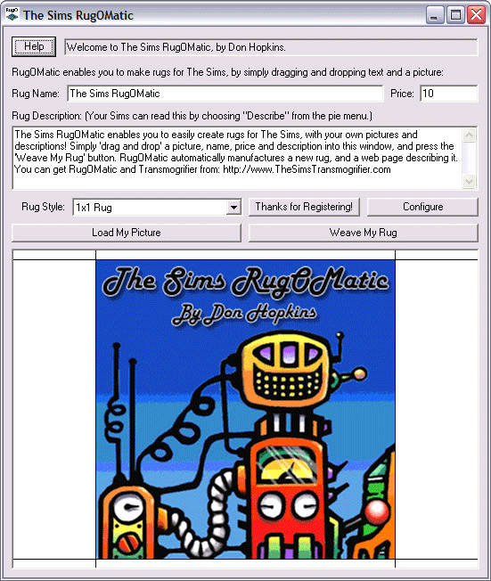
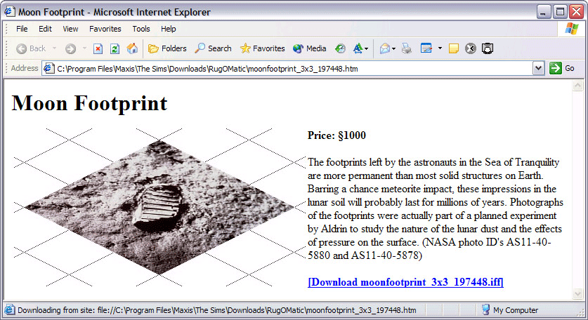
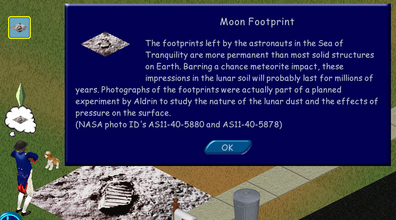

# RugOMatic Documentation and Tutorial: Drag-and-Drop Sims Objects

*Wednesday, January 21, 2004*

Documentation landing (Wayback): https://web.archive.org/web/20040317155006/http://www.thesimstransmogrifier.com/RugOMaticDocumentation  

I've written some [documentation and a tutorial](https://web.archive.org/web/20040317155006/http://www.thesimstransmogrifier.com/RugOMaticDocumentation) for [RugOMatic](https://web.archive.org/web/20040317155006/http://www.thesimstransmogrifier.com/RugOMatic)!

RugOMatic uses another tool called [The Sims Transmogrifier 2.0](https://web.archive.org/web/20040317155006/http://www.thesimstransmogrifier.com/) to create Sims objects. It's a lot easier than using Transmogrifier directly — you just drag and drop images and text, and press a button! Soon I'll release RugOMatic along with The Sims Transmogrifier 2.0, as soon as Maxis's legal department finishes reviewing it (soon now, I hope).

The Sims RugOMatic lets you quickly and easily create rugs for The Sims, with your own pictures and descriptions! Simply “drag and drop” a picture, name, price and description into RugOMatic, and press the “Weave My Rug” button. RugOMatic automatically manufactures a new rug, with a text description that you can read in the game!

RugOMatic also writes a web page describing your rug, including the name, price, description, a picture preview, and a link to the downloadable “iff” object file, to help you keep track of your objects, and share them with other people on the web.

---

## Source

- Blog permalink: `http://www.donhopkins.com/categories/gameDesign/2004/01/21.html#a51`  
- Wayback category page: https://web.archive.org/web/20040317155006/http://www.donhopkins.com/blog/categories/gameDesign/
