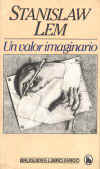
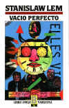

# AIML: Artificial Intelligence Marketing Language

*Saturday, February 7, 2004*

Primary archive copy of the satirical article: https://web.archive.org/web/20040317155006/http://catalog.com/hopkins/text/aiml.html  

Stanislaw Lem writes wonderful [satirical introductions and reviews of imaginary books](https://web.archive.org/web/20040317155006/http://world.std.com/~mmcirvin/imaginary.html) in his real book [*Imaginary Magnitude*](https://web.archive.org/web/20040317155006/http://www.amazon.com/exec/obidos/tg/detail/-/0156441802/002-5543201-9022432?v=glance). Here's an actual review of a fictional introduction of an imaginary book that I'd really love to read, **A History of Bitic Literature**:

> The introduction to *A History of Bitic Literature* brims over with startling ideas. The work introduced is a multi-volume survey of literature written by artificial intelligences, such as an extrapolated work of Dostoevsky's that Dostoevsky never dared to write himself, revolutionary books on physics (in this case the content is, I am afraid, rather less shocking than Lem intended it to be--I've read weirder things in orthodox textbooks--the last chapter of Misner, Thorne, and Wheeler's *Gravitation* comes to mind), and a mathematical work revealing that "the concept of a natural number is internally contradictory." Mentioned in passing is **a procedure that can transform great philosophical systems into graphical representations that ultimately end up sold as mass-produced knickknacks**.

Here's an actual [review](https://web.archive.org/web/20040317155006/http://catalog.com/hopkins/lem/Lem.html#aperfectvacuum) of Lem's real book, [*A Perfect Vacuum*](https://web.archive.org/web/20040317155006/http://www.amazon.com/exec/obidos/tg/detail/-/0156716860/qid=1076209188//ref=sr_8_xs_ap_i1_xgl14/002-5543201-9022432?v=glance&s=books&n=507846), which fictionally reviews the imaginary book, **Non Serviam**:

> The best two pieces, though, are the last, "[Non Serviam](#)", and "The New Cosmogony". "Non Serviam" was reprinted in Hofstadter and Dennett's book "The Mind's I". It is supposed to be a paper by a researcher into **"personetics", the science of creating artificial personalities inside worlds inside the computer.** The researcher has absolute power over his creations; he can bring them into existence, destroy them, and change their world at will. He is to these creatures as God would be to us. His main interest in them, therefore, is having them argue theology. Most of the paper is a debate among the personoids on what should be their proper attitude towards their creator. Their conclusion: "**we shall not serve**".

Stanislaw Lem inspired me to write some parodies of web pages promoting XML applications that didn't exist at the time. But now they actually do exist, by one definition or another: [AIML](https://web.archive.org/web/20040317155006/http://alice.sunlitsurf.com/alice/aiml.html) and [BSML](https://web.archive.org/web/20040317155006/http://www.bsml.org/)!

At the time, I was just making fun of VRML, and the people who push and hype useless standards for questionable political reasons instead of practical technical reasons. But as I read through the contraversy surrounding RSS, RDF, Atom and other syndication formats, somehow I'm reminded of AIML and BSML...

---

## AIML (full satirical article)

The blog post reproduced the long **AIML: Artificial Intelligence Marketing Language** spoof (purported magazine excerpts, “AI Labratories”, Virtual Head Space Builder, HeadServer, **“AIML for Lisp Programmers”**, etc.). That full text is easiest to read on the archived **`catalog.com`** page:

- https://web.archive.org/web/20040317155006/http://catalog.com/hopkins/text/aiml.html  

Companion pieces linked from the original ecosystem of jokes:

- https://web.archive.org/web/20040317155006/http://catalog.com/hopkins/text/AILabratories.html  
- https://web.archive.org/web/20040317155006/http://catalog.com/hopkins/text/head.html  
- https://web.archive.org/web/20040317155006/http://catalog.com/hopkins/text/brain-damage.html  
- https://web.archive.org/web/20040317155006/http://catalog.com/hopkins/text/AIML4Lisp.html  
- https://web.archive.org/web/20040317155006/http://catalog.com/hopkins/text/head-shop.html  

---

## Source

- Blog permalink: `http://www.donhopkins.com/categories/gameDesign/2004/02/07.html#a80`  
- Wayback category page: https://web.archive.org/web/20040317155006/http://www.donhopkins.com/blog/categories/gameDesign/
