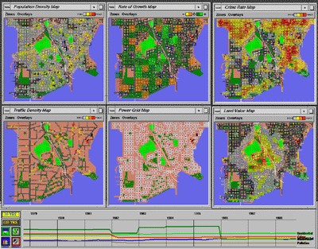
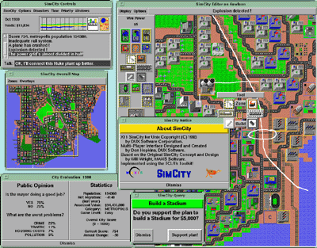
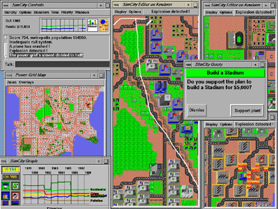
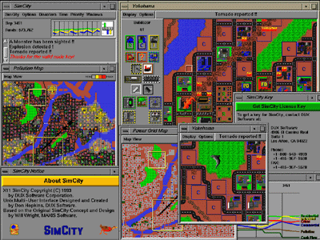

# Educational Multi Player SimCity for Linux Proposal

*Saturday, February 7, 2004*

Linked proposal page (historical): https://web.archive.org/web/20040317155006/http://catalog.com/hopkins/simcity/index.html  

Back in March 2002, Maxis told me they were interested in supporting the educational use of products like SimCity. Earlier, I had developed a multi player version of SimCity, which runs on Linux/X11, and was scriptable in TCL. Educators and researchers from Columbia University, MIT, IBM, Xerox and other educational and commercial institutions were excited about gaining access to this version of SimCity, and adapting it to teach and stimulate students' interest in urban planning, computer simulation and game programming.

So I wrote this proposal and presented it to Maxis. Maxis was quite enthusiastic about the idea, invited me in to discuss it, and said they would write up a contract which enabled me to distribute Multi Player SimCity for Linux, and adapt it to the needs of our educational users.

Unfortunately, it's been almost two years since I sent the proposal, and I have never heard anything back from Maxis about this project. The software still exists, works very well, and is ready to distribute. But I can't distribute this Educationally Oriented Multi Player SimCity for Linux, until I hear back from Maxis about the contract. Despite my repeated email and phone messages asking about the status, Maxis never got back to me about this, or offered any explaination. So as far as I know, it's still tied up at EA Legal. I still wonder if they dropped the ball, or if they will finally come through after two years.

## SimCity.edu Proposal to Maxis (summary)

Don Hopkins ported SimCity to Unix in 1991, working as a contractor for DUX Software, who licensed it from Maxis for a ten-year duration. He developed a cooperative networked multi player version of SimCity, released in 1993. He subsequently worked with Will Wright for Maxis/EA, developing The Sims character animation system, content pipeline, programming tools and user interface. Hopkins ported SimCity to Linux and optimized it, so it's a viable product as well as an engaging educational tool.

Hopkins has demonstrated Multi Player SimCity at ACM's InterCHI Conference, IBM's New Paradigms Workshop, the Exploratorium's Multimedia Playground, Interval's Electric Carnival, BayCHI at Xerox PARC, and MIT Media Lab's corporate sponsors meeting. Audiences are consistently excited about the possibilities of using SimCity educationally.

The ten-year contract between Maxis and DUX Software to distribute the Unix version of SimCity has expired, so it's not currently available as a product. Hopkins would like to license the rights from Maxis/EA directly, to develop an educational version of SimCity Classic. It can be distributed and played over the Internet like the popular ActiveX SimCity Classic, and extended to support educational uses.

Columbia University uses SimCity and SimEarth to help teach Civil and Environmental Engineering. They are actively redesigning the curriculum to incorporate simulation games like SimCity and SimEarth, as well as developing a new simulation platform. Professor Upmanu Lall has applied for an NFS grant to develop an open system called OPTIMUS (Open Platform for Teaching Integrated Modeling and Urban Simulation). Don Hopkins is collaborating with Columbia University to develop simulation tools for education and research.

The educators at Columbia University are excited about and willing to financially support the development of educational versions of SimCity and SimEarth. Hopkins hopes to make Multi Player SimCity for Linux available at low cost for educational use, while also selling it commercially to the small but enthusiastic Linux gaming community. The NFS grant can fund the development of the current Multi Player SimCity Classic into an educational tool, for Columbia and other universities to use in their Civil and Environmental Engineering curricula.

This project doesn't require funding or work from Maxis/EA, and will support itself by generating a positive stream of royalties from commercial sales. The long-term benefits to Maxis, EA and society are quite positive: Columbia University will measure the effect of SimCity and other simulation tools on their goals of improving student enrolment and test scores. They will publish the results at conferences and in research papers, and make them available for other schools to use.

Maxis's intellectual property and time will be protected, because Hopkins will insulate Columbia from the SimCity source code, and will also insulate Maxis from supporting the educational version of SimCity. Multi Player SimCity is already extensible through the TCL/Tk scripting language, and Hopkins will provide the hooks necessary for Columbia to use SimCity educationally, though scripting languages and component technology, without releasing any proprietary Maxis source code.

The initial proposal is for Hopkins and Maxis/EA to enter into a contract granting Hopkins the right to commercially develop and distribute SimCity Classic, and also possibly SimEarth. Hopkins will further develop the software for Columbia University's educational use (at no expense to Maxis or EA), with the overall design subject to the approval of Maxis and EA. Maxis/EA will receive royalties on all sales of the product, and will also receive proper credit for its educational uses. This proposal is a rough draft, to start a dialog toward an agreement that will benefit everyone.

Don Hopkins

---

## Source

- Blog permalink: `http://www.donhopkins.com/categories/gameDesign/2004/02/07.html#a78`  
- Wayback category page: https://web.archive.org/web/20040317155006/http://www.donhopkins.com/blog/categories/gameDesign/
