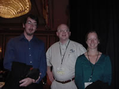

# Sims Designer Chris Trottier on Tuned Emergence and Design by Accretion

*Saturday, February 21, 2004*

[The Armchair Empire interviewed Chris Trottier](https://web.archive.org/web/20040317155006/http://www.armchairempire.com/Interviews/chris-trottier-the-sims.htm), one of the designers of *The Sims* and *The Sims Online*. She touches on some important ideas, including **Tuned Emergence** and **Design by Accretion**.

Chris’ honest analysis of how and why “the gameplay didn’t come together until the months before the ship” is right on the mark, and that’s the secret to the success of games like *The Sims* and *SimCity*.

The essential element that was missing until the last minute was **tuning**: The approach to game design that Maxis brought to the table is called **Tuned Emergence** and **Design by Accretion**. Before it was tuned, *The Sims* wasn’t missing any structure or content, but it just wasn’t balanced yet. But it’s OK, because that’s how it’s supposed to work!

In justifying their approach to *The Sims*, Maxis had to explain to EA that *SimCity 2000* was not fun until 6 weeks before it shipped. But EA was not comfortable with that approach, which went against every rule in their play book. It required Will Wright’s tremendous stamina to convince EA not to cancel *The Sims*, because according to EA’s formula, it would never work.

If a game isn’t tuned, it’s a drag, and you can’t stand to play it for an hour. *The Sims* and *SimCity* were **designed by accretion**: incrementally assembled together out of “a mass of separate components”, like a planet forming out of a cloud of dust orbiting around a star. They had to reach critical mass first, before they could even start down the road towards **Tuned Emergence**, like life finally taking hold on the planet surface. Even then, they weren’t fun until they were carefully tuned just before they shipped, like the renaissance of civilization suddenly developing science and technology. Before it was properly tuned, *The Sims* was called “the toilet game”, for the obvious reason that there wasn’t much else to do!

Here are some questions and answers from the interview with The Sims designer Chris Trottier:

[...]

**Q: On paper, a game where you simulate daily life doesnt sound that interesting. Yet The Sims is really fun to play, so much so that it is now the biggest-selling PC game ever. Although any development team working with Will Wright has to feel confident in the product they are creating, has the unbelievable popularity of the franchise shocked even the development team?**

**A:** Absolutely. When I was first assigned to The Sims, it was not-very-affectionately-known within the company as “the toilet game.” Will Wright had tremendous stamina for the risk involved with trying something very new, but there were certainly a lot of head-scratchers both on the team and outside of it. In all honesty, the gameplay didn’t start to really come together until a couple of months before ship. Being involved in that tuning process, and seeing the game take shape from what had previously been a mass of separate components, was one of the most powerful experiences of my career.

**Q: What makes The Sims massively popular with female gamers, who traditionally dont make up a big number of gameplayers?**

**A:** It's so hard to answer that question without making broad, sweeping statements that anyone of my gender would probably resent. But... I can say that there are several untraditional forms of gameplay in The Sims. For instance, there are many people who spend most of their time decorating and redecorating their homes. Since there's so much user-created content being posted on websites, they spend a lot of time collecting more looks to add to the game. There are also a lot of people who enjoy having a fantasy life where they get to call the shots... for good or for bad. I've heard a lot of stories of people creating their own family in the game and then making it do what they want. Or "marrying" a crush in-game, etc.

[...]

**Q: The Sims has received its fair share of expansion packs. Will we see the same with The Sims Online? Or will new material just be added on a continuous basis? (Like theme weeks, super powers, etc.).**

**A:** Yes, that's my favorite thing about working on The Sims Online: the fact that we'll get to make it better and better as we go. At the moment, we've got maybe 2-3 years worth of updates that we know we want to do. As much as possible, those improvements will just be included in weekly patches. There's no current plan for bundling updates into an expansion pack.

[...]

**Q: After a slow selling start (due to an early problem getting the game into stores), has the development team been pleased with the growing success (and sales) of The Sims Online?**

**A:** As a designer, I'm more focused on the in-game experience than the numbers. I've seen this development team pick up tremendous momentum behind adding new features to the game. Now that we have basic architecture, scaling issues, and stability in place, it allows us to focus primarily on making the game better. So I'm personally very rewarded to see some of the coolest features coming into the game, with many others right around the corner.

---

## Source

- Interview: https://web.archive.org/web/20040317155006/http://www.armchairempire.com/Interviews/chris-trottier-the-sims.htm  
- Blog permalink: `http://www.donhopkins.com/categories/gameDesign/2004/02/21.html#a85`  
- Wayback category page: https://web.archive.org/web/20040317155006/http://www.donhopkins.com/blog/categories/gameDesign/
