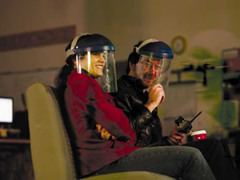

# Software Development Magazine: Inside the Stupid Fun Club

*Sunday, February 22, 2004*

Software Development Magazine ran [**Inside the Stupid Fun Club**](https://web.archive.org/web/20040317155006/http://www.sdmagazine.com/documents/s=9058/sdm0403b/sdm0403b.html?temp=EjREzh5qoM) (registration required at the time).

The author, Alexandra Weber Morales, unexpectedly encountered the Sad Robot, broken down and crying for help on the streets of Oakland.

We were shooting a couple of hidden camera reality TV “[One Minute Movies](https://web.archive.org/web/20040317155006/http://www.wnyc.org/onthemedia/transcripts/transcripts_080803_shorts.html)” for NBC: one of a Sad Robot torn apart into pieces and pleading for help from passers by, and the other of a Robot Waiter taking orders, serving food and bantering for a tip in a barbecue restaurant.

I developed the custom “robot brain” software for Will Wright’s [Stupid Fun Club](https://web.archive.org/web/20040317155006/http://www.stupidfunclub.com/), mostly in Python. It involved writing lots of high level Python code and XML data, and integrating all kinds of different software components together with SWIG, C++, ActiveX, Java, IRC, HTTP and WiFi. The robot features 3D facial animation, speech synthesis and recognition, conversational scripting, artificial intelligence, personality simulation, telerobotic remote control via wireless networking, with an interactive web interface for controlling its behavior in real time.

For another Stupid Fun Club project, I also used Python to develop expressive synthetic speech authoring tools (audio speech phonoscoping, like visual animation rotoscoping), and talking toy simulations.

Python is ideally suited for brainstorming and prototyping new product ideas, as well as developing custom real-time robotic software for supporting creative Stupid Fun Club projects like reality TV production.

Eventually, Alexandra Weber Morales tracked down the person responsible, Will Wright, at his private production company, the Stupid Fun Club. She asked Will about the Sad Robot: *[I’ve added my own comments like this. —Don]*

**Uh, OK. So, what kinds of reactions did people have to Sad Robot?**

> **Wright:** A lot of people were talking directly to it. Most of the women who were walking alone just sped up like they were spooked by it. Most of the single men would stop and start stripping it for parts, ignoring that the robot was talking to them. And it was mostly the couples who would actually interact with it and try to help it. Some would have long conversations, pushing the buttons.
>
> We had a whole sort of troubleshooting thing, and we wanted to see how far people would go to help it. It was sort of a Good Samaritan experiment.

She also asked about the software we developed to control the robot, simulate its personality, animate its face, and listen and talk with people.

**Have you heard of an AI knowledge base called Cyc?**

> For the conversational side of it, were using something similar to Cyc—in fact, we were looking at Cyc. Theres so many different layers. First of all, theres the voice recognition, which is getting much better but is still pretty limited. Then, once you have the voice, you go into the conversation engine, and then its doing something like Cyc or Alice or Eliza: trying to give an appropriate response to what your input was. One of the projects were working on here is this toy design where we have these toys that converse with each other via infrared text-to-speech.
>
> There are all these different approaches to AI. Some of them are more brute force, like Cyc. Theres also artificial life, an attempt to evolve systems rather than build them from the ground up.

**Wheres this work being done?**

> The Santa Fe Institute is one place. Theres genetic programming, or adaptive systems, to give computers a way to learn and get feedback. That looks like a more promising approach.
>
> Back in the 60s, when computers were first being used in business, everybody assumed wed have artificial intelligence in 10 years. When 2001 came out, in 1967, and people came out of that movie saying, I cant believe that a computer will be able to play chess that well. But they took the conversation with HAL for granted. In fact, it was the opposite: Chess turned out to be the easy part; natural conversation turned out to be the hard part. Within 20 years, were going to have machines like this that have full autonomy and pretty good conversational ability. We could build a stove that would have a long conversation with you. So the real interesting question for me now is, whats going to happen when our world is surrounding us with intelligent machines? These are going to be the first aliens we meet.

**Describe the software running this thing.**

> 
>
> The conversational chatbot is Alice. It takes input and you give it a dictionary to define what it knows about. **[ALICE is written in Java, so Python talks to it through an IRC server running on the robot. We can connect to the same IRC channel over the wireless network, watch the messages going between ALICE and the brain, interject text to speak and think, switch moods, play facial animations, tweak the personality, execute commands, etc. Later I developed a more powerful web based “[Homunculus](https://web.archive.org/web/20040317155006/http://psychology.unn.ac.uk/mark/PY014/Homunculus/HomLinks.htm)” interface, for operating the robot in real time, with a web browser on a remote laptop or handheld. —Don]**
>
> **Winter:** Thats connected to Microsoft speech recognition, which is fantastic. **[I wouldn’t go that far. It doesn’t suck, but “fantastic” is a stretch. —Don]** And some simple AI, since Alice may or may not understand what youre talking about. **[In other words, Alice is like the mad old aunt with Tourette’s Syndrome you keep locked away in the attic. Alice is only used as a backstop, when the Python/XML/AI layer of the robot brain can’t think of anything to say. But it’s turned off when we don’t want the robot to seem insane. —Don]**
>
> **Winter:** The most intelligent thing it ever did is we had an opera singer in here singing to the robot, but the robot didnt like it. So she said, maybe I should explain the story, and after the singer finished, the robot paraphrased the whole thing back to her. It was about the most amazing thing wed ever seen; we all just about started believing in robots at that moment.
>
> **[What’s really interesting is abusing the speech recognizer, by putting the robot brain into a mode where it listens to itself (and anyone else) talk! It’s like the mutating telephone gossip game, or the news media echo chamber: The robot repeats what it thinks it heard itself say, which it then mis-recognizes and distorts again and again, in a feedback loop of quasi-coherent rhyming speech! Any words you interject get mixed in and distorted in the speech recognition/synthesis feedback loop. It naturally finds and converges on extremely strange attractors in the recognizer’s hidden markov models of the English language, chanting and mutating gramatically plausible but semantically ridiculous phrases, in response to whatever it thinks it hears. When properly configured, the robot can actually compose live performances of original surrealistic beat robopoetry, responding to the audience in real time! Stanislaw Lem calls that “[Bitic Literature](https://web.archive.org/web/20040317155006/http://www.donhopkins.com/2004/02/07.html#a80)”. —Don]**
>
> When we take these in public, it seems like the people who are less technical savvy are the ones who interact with it, whereas the people with technical backgrounds are standing there reverse-engineering it.

**Are you following what MIT has done with humanoid robots such as Kismet?**

> **Wright:** There are lots of research labs around the country building these types of robots, but they never take them out into the public. We drive them into a laundromat or a restaurant and see what the response is.
>
> When we filmed Sad Robot, we also filmed a scene in a restaurant with a robot waiter. It was interesting how many people totally bought it. Usually within three or four minutes, they were completely normal about it. People kind of expect that there will be robots in the future; its just a matter of when.
>
> **[The Sad Robot: A pitiful broken down female robot is crying for help, bent out of shape and fallen on its side with a mangled tractor tread, next to a stinky garbage dumpster, begging reluctant passers by to turn it upright, describe its condition, press its big red reset button, adjust its controls, step away before it explodes, and call a mysterious professor on their cell phone. —Don]**
>
> **[The Robot Waiter: An earnest robot waiter, just trying to do its job taking orders, delivering food to tables, telling jokes and bantering for tips, and collecting dirty dishes. Afterwards submits itself to a Robot Waiter Performance Evaluation Survey, and begs the human to give it good marks, otherwise it might lose its job. —Don]**
>
> **Robot:** If you could have any kind of robot, what would it be? The goal is elimination of crime, combined with rehabilitation of criminals Yes, it seems very long to me, too.

**What do you use for automated testing?**

> Our own suites. Most of our stuff is in C++ **[also Python and XML —Don]**, but we have a proprietary visual scripting language I designed, called Edith, for the behavioral code for the Sims. Its totally geared to AI and the Sims. **[But Edith doesn’t run on the robot, it’s for programming The Sims. —Don]**
>
> **Winter:** I think its time for the Christmas robot.
>
> **Wright:** Are you running that weapon? I dont know if we want to sit here. [A dancing snowman on a wheeled platform with a circular saw mounted on its front bumper approaches a plastic toy-store robot.]
>
> **Winter:** No, you would die. Youd better take cover.
>
> [The interview ends.]
>
> The snowman quickly demolishes the toy, shooting debris throughout the warehouse. With Winters encouragement, I spend 10 minutes in a nonsensical conversation with the robot. He also shows me the *Minute Movie* that have been made for NBC—and theyre hilarious.
>
> I leave this unconventional interview impressed with the way the Stupid Fun Club has turned a fascination with robots and toys into a lucrative and wholly entertaining enterprise. Meanwhile, the larger concerns about the technical strengths, limitations and implications of these semiautonomous machines go mostly unanswered. Wright and Winter seem firmly on the side of presentation, and somewhat unwilling to delve deeply into how their toys work—as if to say, Wheres the fun in asking all these questions? Just talk to the robot.

I’m certainly interested in delving deeply into how the robot brain works myself, but not everyone else is. So I used Python to develop a high-level XML based AI and wireless web remote control system, which enables creative writers and designers like Will Wright to script and control the robot behavior, and reconfigure it for different scenarios, without needing to deal with Python, C++ or the other software components that went into building it.

---

## Source

- Category listing (Wayback, 2004-03-17): https://web.archive.org/web/20040317155006/http://www.donhopkins.com/blog/categories/gameDesign/
- Original permalink pattern: `http://www.donhopkins.com/categories/gameDesign/2004/02/22.html#a86`
